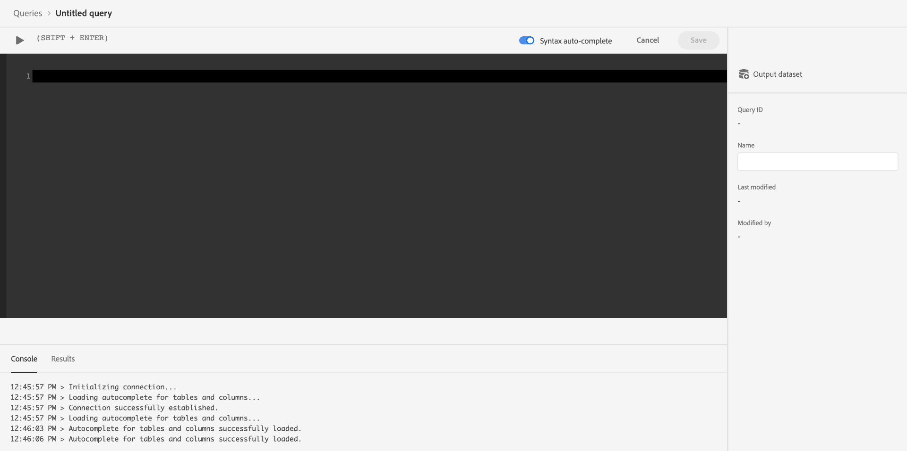

# Verbinden von Commerce-Daten mit Adobe Experience Platform

Wenn Sie die Erweiterung [!DNL Data Connection] installieren, werden im Menü **System** unter **Dienste** in der Commerce _Admin_ zwei neue Konfigurationsseiten angezeigt.

- Commerce Services Connector
- [!DNL Data Connection]

Um Ihre Adobe Commerce-Instanz mit der Adobe Experience Platform zu verbinden, müssen Sie beide Connectoren konfigurieren, beginnend mit dem Commerce Services-Connector und schließlich mit der Erweiterung [!DNL Data Connection] .

## Konfigurieren des Commerce Services-Connectors

Wenn Sie zuvor einen Adobe Commerce-Dienst installiert haben, haben Sie wahrscheinlich bereits den Commerce Services-Connector konfiguriert. Andernfalls müssen Sie die folgenden Aufgaben auf der Seite [Commerce Services Connector](../landing/saas.md) ausführen:

1. Melden Sie sich bei Ihrem Commerce-Konto an, um [Ihre Produktions- und Sandbox-API-Schlüssel abzurufen](../landing/saas.md#credentials).
1. Wählen Sie einen [SaaS-Datenraum](../landing/saas.md#saas-configuration) aus.
1. Melden Sie sich bei Ihrem Adobe-Konto an, um [Ihre Organisations-ID abzurufen](../landing/saas.md#ims-organization-optional).

Nachdem Sie den Commerce Services-Connector konfiguriert haben, konfigurieren Sie die Erweiterung &quot;[!DNL Data Connection]&quot;.

## Konfigurieren der Erweiterung [!DNL Data Connection]

In diesem Abschnitt erfahren Sie, wie Sie die Erweiterung [!DNL Data Connection] konfigurieren.

### Hinzufügen von Dienstkonto- und Berechtigungsdetails

Wenn Sie planen, [historische Bestelldaten](#send-historical-order-data) oder [Kundenprofildaten](#send-customer-profile-data) zu erfassen und zu senden, müssen Sie Dienstkonto- und Berechtigungsdetails hinzufügen. Wenn Sie die Erweiterung [Audience Activation](https://experienceleague.adobe.com/docs/commerce-admin/customers/audience-activation.html) konfigurieren, müssen Sie diese Schritte ausführen.

Wenn Sie nur Storefront- oder Backoffice-Daten erfassen und senden, können Sie zum Abschnitt [general](#general) springen.

#### Schritt 1: Erstellen eines Projekts in Adobe Developer Console

Erstellen Sie ein Projekt in der Adobe Developer Console, das Commerce authentifiziert, damit es Experience Platform-API-Aufrufe durchführen kann.

Um das Projekt zu erstellen, führen Sie die im Tutorial [Authentifizierung und Zugriff auf Experience Platform-APIs](https://experienceleague.adobe.com/docs/experience-platform/landing/platform-apis/api-authentication.html) beschriebenen Schritte aus.

Wenn Sie das Tutorial durchlaufen, stellen Sie sicher, dass Ihr Projekt Folgendes enthält:

- Zugriff auf die folgenden [Produktprofile](https://experienceleague.adobe.com/docs/experience-platform/landing/platform-apis/api-authentication.html#select-product-profiles): **Standardproduktion für alle Zugriffe auf** und **AEP Standard für alle Zugriffe**.
- Die richtigen [Rollen und Berechtigungen sind ](https://experienceleague.adobe.com/docs/experience-platform/landing/platform-apis/api-authentication.html#assign-api-to-a-role) konfiguriert.
- Wenn Sie JSON Web Tokens (JWT) als Authentifizierungsmethode für Server-zu-Server verwenden möchten, müssen Sie auch einen privaten Schlüssel hochladen.

Das Ergebnis dieses Schritts erstellt eine Konfigurationsdatei, die Sie im nächsten Schritt verwenden.

#### Schritt 2: Herunterladen der Konfigurationsdatei

Laden Sie die [Workspace-Konfigurationsdatei](https://developer.adobe.com/commerce/extensibility/events/project-setup/#download-the-workspace-configuration-file) herunter. Kopieren Sie den Inhalt dieser Datei und fügen Sie ihn in die Seite **Dienstkonto/Berechtigungsdetails** des Commerce-Administrators ein.

1. Navigieren Sie in Commerce Admin zu &quot;**Stores**&quot;> &quot;Einstellungen&quot;> &quot;**Konfiguration**&quot;> &quot;**Dienste**&quot;> &quot;**[!DNL Data Connection]**&quot;.

1. Wählen Sie im Menü **Adobe Developer-Autorisierungstyp** die von Ihnen implementierte Server-zu-Server-Autorisierungsmethode aus. Adobe empfiehlt die Verwendung von OAuth. JWT ist veraltet. [Weitere Infos](https://developer.adobe.com/developer-console/docs/guides/authentication/ServerToServerAuthentication/migration/).

1. (Nur JWT) Kopieren Sie den Inhalt Ihrer `private.key`-Datei und fügen Sie ihn in das Feld **Geheimer Client-Schlüssel** ein. Verwenden Sie den folgenden Befehl, um den Inhalt zu kopieren.

   ```bash
   cat config/private.key | pbcopy
   ```

   Weitere Informationen zur Datei `private.key` finden Sie unter [JWT-Authentifizierung (Service Account)](https://developer.adobe.com/developer-console/docs/guides/authentication/JWT/) .

1. Kopieren Sie den Inhalt der Datei `<workspace-name>.json` in das Feld **Details zu Dienstkonten/Berechtigungen** .

   ![[!DNL Data Connection] Admin-Konfiguration](./assets/epc-admin-config.png){width="700" zoomable="yes"}

1. Klicken Sie auf **Konfiguration speichern**.

### Allgemein

1. Wechseln Sie im Admin zu **System** > Dienste > **[!DNL Data Connection]**.

1. Überprüfen Sie auf der Registerkarte **Einstellungen** unter **Allgemein** die Ihrem Adobe Experience Platform-Konto zugeordnete ID, wie im Abschnitt [Commerce Services Connector](../landing/saas.md#organizationid) konfiguriert. Die Organisations-ID ist global. Pro Adobe Commerce-Instanz kann nur eine Organisations-ID zugeordnet werden.

1. Legen Sie in der Dropdown-Liste **Umfang** den Kontext auf **Website** fest.

1. (Optional) Wenn Sie bereits ein [AEP Web SDK (Legierung)](https://experienceleague.adobe.com/docs/experience-platform/edge/home.html) für Ihre Site bereitgestellt haben, aktivieren Sie das Kontrollkästchen und fügen Sie den Namen Ihres AEP Web SDK hinzu. Lassen Sie diese Felder andernfalls leer, und die Erweiterung [!DNL Data Connection] stellt eines für Sie bereit.

   >[!NOTE]
   >
   >Wenn Sie Ihr eigenes AEP Web SDK angeben, verwendet die Erweiterung [!DNL Data Connection] die mit diesem SDK verknüpfte Datastraam-ID und nicht die auf dieser Seite angegebene Datastraam-ID (falls vorhanden).

### Datenerfassung

In diesem Abschnitt geben Sie den Datentyp an, den Sie erfassen und an den Experience Platform-Edge senden möchten. Es gibt drei Datentypen:

- **Verhaltensdaten** (clientseitige Daten) sind Daten, die in der Storefront erfasst werden. Dazu gehören Interaktionen mit Käufern wie `View Page`, `View Product`, `Add to Cart` und [Beschreibungsliste](events.md#b2b-events) (für B2B-Händler).

- **Back Office** (Server-seitige Daten) sind Daten, die auf den Commerce-Servern erfasst werden. Dazu gehören Informationen über den Status einer Bestellung, z. B. ob eine Bestellung aufgegeben, storniert, rückerstattet, versandt oder abgeschlossen wurde. Sie enthält auch [historische Bestelldaten](#send-historical-order-data).

- **Profil (Beta)** sind Daten, die sich auf die Profilinformationen Ihres Käufers beziehen. Lernen Sie [mehr](#send-customer-profile-data).

Um sicherzustellen, dass Ihre Adobe Commerce-Instanz mit der Datenerfassung beginnen kann, überprüfen Sie die [Voraussetzungen](overview.md#prerequisites).

Weitere Informationen zu den Ereignissen [storefront](events.md#storefront-events), [back office](events-backoffice.md) und [profile](events-backoffice.md#customer-profile-events-server-side) finden Sie im Ereignisthema .

>[!NOTE]
>
>Alle Felder im Abschnitt **Datenerfassung** gelten für den Bereich **Website** oder höher.

1. Wählen Sie **Storefront-Ereignisse** aus, wenn Sie Storefront-Verhaltensdaten senden möchten.

1. Wählen Sie **Backoffice-Ereignisse** aus, wenn Sie Bestellstatusinformationen senden möchten, z. B. wenn eine Bestellung aufgegeben, storniert, zurückerstattet oder versandt wurde.

   >[!NOTE]
   >
   >Wenn Sie **Backoffice-Ereignisse** auswählen, werden alle Back-Office-Daten an die Experience Platform-Kante gesendet. Wenn sich ein Kunde dafür entscheidet, die Datenerfassung abzuwählen, müssen Sie die Datenschutzeinstellung des Käufers explizit auf der Experience Platform festlegen. Dies unterscheidet sich von Storefront-Ereignissen, bei denen der Sammler die Zustimmung bereits auf der Grundlage der Kundeneinstellungen verarbeitet. Erfahren Sie [mehr](https://experienceleague.adobe.com/docs/experience-platform/landing/governance-privacy-security/consent/adobe/dataset.html) darüber, wie Sie die Datenschutzeinstellungen eines Käufers auf der Experience Platform festlegen.

1. (Überspringen Sie diesen Schritt, wenn Sie Ihr eigenes AEP Web SDK verwenden.) [Erstellen Sie einen Datastream in der Adobe Experience Platform oder wählen Sie einen vorhandenen Datastream aus, den Sie für die Erfassung verwenden möchten. ](https://experienceleague.adobe.com/docs/experience-platform/datastreams/configure.html#create) Geben Sie diese Datastream-ID in das Feld **Datastream-ID** ein.

1. Geben Sie die **Datensatz-ID** ein, die Ihre Commerce-Daten enthalten soll. So suchen Sie die Datensatz-ID:

   1. Öffnen Sie die Experience Platform-Benutzeroberfläche und wählen Sie im linken Navigationsbereich **Datensätze** aus, um das Dashboard **Datensätze** zu öffnen. Das Dashboard listet alle verfügbaren Datensätze für Ihre Organisation auf. Details werden für jeden aufgelisteten Datensatz angezeigt, einschließlich seines Namens, des Schemas, dem der Datensatz entspricht, und des Status des letzten Erfassungslaufs.
   1. Öffnen Sie den Datensatz, der Ihrem Datastream zugeordnet ist.
   1. Zeigen Sie im rechten Bereich die Details zum Datensatz an. Kopieren Sie die Datensatz-ID.

1. Um sicherzustellen, dass Back-Office-Ereignisdaten basierend auf einem Zeitplan gemäß einem [cron](https://experienceleague.adobe.com/docs/commerce-admin/systems/tools/cron.html) -Auftrag aktualisiert werden, müssen Sie den `Sales Orders Feed` -Index in `Update by Schedule` ändern.

   1. Wechseln Sie in der Seitenleiste _Admin_ zu **[!UICONTROL System]** > _[!UICONTROL Tools]_>**[!UICONTROL Index Management]**.

   1. Aktivieren Sie das Kontrollkästchen für den `Sales Orders Feed`-Indexer.

   1. Setzen Sie **[!UICONTROL Actions]** auf `Update by Schedule`.

   1. Wenn Sie zum ersten Mal Backoffice-Daten aktivieren, führen Sie die folgenden Befehle aus, um eine Neusynchronisierung neu zu indizieren und Trigger. Nachfolgende Neusynchronisierungen treten automatisch auf, solange der [cron](https://experienceleague.adobe.com/docs/commerce-admin/systems/tools/cron.html) -Auftrag ordnungsgemäß eingerichtet ist.

      ```bash
      bin/magento index:reindex sales_order_data_exporter_v2
      ```

      ```bash
      bin/magento saas:resync --feed orders
      ```

#### Feldbeschreibungen

| Feld | Beschreibung |
|--- |--- |
| Anwendungsbereich | Bestimmte Website, auf die die Konfigurationseinstellungen angewendet werden sollen. |
| Organisations-ID (global) | ID, die zu der Organisation gehört, die das Adobe DX-Produkt erworben hat. Diese ID verknüpft Ihre Adobe Commerce-Instanz mit Adobe Experience Platform. |
| Ist das AEP Web SDK bereits auf Ihrer Site bereitgestellt? | Aktivieren Sie dieses Kontrollkästchen, wenn Sie Ihr eigenes AEP Web SDK auf Ihrer Site bereitgestellt haben. |
| AEP Web SDK Name (global) | Wenn Sie bereits ein Experience Platform Web SDK auf Ihrer Site bereitgestellt haben, geben Sie den Namen dieses SDK in dieses Feld ein. Dadurch kann der Storefront Event Collector und das Storefront Event SDK Ihr Experience Platform Web SDK anstelle der von der [!DNL Data Connection] -Erweiterung bereitgestellten Version verwenden. Wenn auf Ihrer Site kein Experience Platform Web SDK bereitgestellt ist, lassen Sie dieses Feld leer, und die [!DNL Data Connection]-Erweiterung stellt eines für Sie bereit. |
| Storefront-Ereignisse | Ist standardmäßig aktiviert, solange die Organisations-ID und die Datenspeicher-ID gültig sind. Storefront-Ereignisse erfassen anonymisierte Verhaltensdaten von Ihren Käufern beim Durchsuchen Ihrer Site. |
| Back-Office-Ereignisse | Wenn diese Option aktiviert ist, enthält die Ereignis-Payload anonymisierte Bestellstatusinformationen, z. B. ob eine Bestellung aufgegeben, storniert, zurückerstattet oder versandt wurde. |
| Datastream-ID (Website) | ID, die den Datenfluss von Adobe Experience Platform zu anderen Adobe DX-Produkten ermöglicht. Diese ID muss mit einer bestimmten Website in Ihrer jeweiligen Adobe Commerce-Instanz verknüpft sein. Wenn Sie Ihr eigenes Experience Platform Web SDK angeben, geben Sie in diesem Feld keine Datastream-ID an. Die Erweiterung [!DNL Data Connection] verwendet die mit diesem SDK verknüpfte Datastream-ID und ignoriert alle in diesem Feld angegebenen Datastream-ID (sofern vorhanden). |
| Datensatz-ID (Website) | Kennung des Datensatzes, der Ihre Commerce-Daten enthält. Dieses Feld ist erforderlich, es sei denn, Sie haben die Kontrollkästchen **Storefront-Ereignisse** oder **Backoffice-Ereignisse** deaktiviert. Wenn Sie außerdem Ihr eigenes Experience Platform Web SDK verwenden und daher keine Datastream-ID angegeben haben, müssen Sie dennoch die Datensatz-ID hinzufügen, die Ihrem Datastream zugeordnet ist. Andernfalls können Sie dieses Formular nicht speichern. |

Nach dem Onboarding fließen die Storefront-Daten an den Experience Platform-Edge. Es dauert etwa fünf Minuten, bis die Daten des Back Office am Rand angezeigt werden. Nachfolgende Aktualisierungen sind am Rand basierend auf dem Cron-Zeitplan sichtbar.

### Senden von Kundenprofildaten

>[!IMPORTANT]
>
>Diese Funktion befindet sich in der Beta-Phase.

Es gibt zwei Arten von Profildaten, die Sie an die Experience Platform senden können: Profildatensätze und Zeitreihenprofilereignisse.

Ein Profildatensatz enthält Daten, die gespeichert werden, wenn ein Käufer ein Profil in Ihrer Commerce-Instanz erstellt, z. B. den Namen des Käufers. Wenn Ihr Schema und Ihr Datensatz [ordnungsgemäß konfiguriert sind](profile-data.md), wird ein Profildatensatz an die Experience Platform gesendet und an den Adobe-Profilverwaltungsdienst und den Segmentierungsdienst weitergeleitet: [Real-Time CDP](https://experienceleague.adobe.com/docs/experience-platform/rtcdp/intro/rtcdp-intro/overview.html?lang=de).

Zeitreihenprofilereignisse enthalten Daten zu den Profilinformationen Ihres Käufers, z. B. ob er ein Konto auf Ihrer Site erstellt, bearbeitet oder löscht. Wenn Profilereignisdaten an die Experience Platform gesendet werden, befinden sie sich in einem Datensatz, in dem sie von anderen DX-Produkten verwendet werden können.

1. Vergewissern Sie sich, dass Sie über das Dienstkonto und die Anmeldeinformationen für [bereitgestellt haben.](#add-service-account-and-credential-details)

1. Stellen Sie sicher, dass Sie ein Schema und einen Datensatz für die Erfassung von [Profildatensatzdaten](profile-data.md) und [ Erfassung von Zeitreihenereignisdaten](update-xdm.md#time-series-profile-event-data) angegeben haben.

1. Aktivieren Sie das Kontrollkästchen **Kundenprofile** , wenn Sie Profildaten an die Experience Platform senden möchten.

1. Geben Sie die **Profildatensatz-ID** ein.

   Profildatensatzdaten müssen einen anderen Datensatz verwenden als den, den Sie derzeit für Verhaltens- und Back-Office-Ereignisdaten verwenden.

1. Wenn Sie Profilereignisse nicht über dieselbe Datenspeicher-ID streamen möchten, die Sie für Verhaltens- und Backoffice-Daten verwenden, entfernen Sie das Häkchen aus den **Stream-Kundenprofilen über dieselbe Datastream-ID** und geben Sie die Datastream-ID ein, die Sie stattdessen verwenden möchten.

Es kann etwa 10 Minuten dauern, bis ein Profildatensatz in Real-Time CDP verfügbar ist. Profilereignisse beginnen sofort mit dem Streaming.

>[!TIP]
>
>Wenn keine Profildaten auf der Experience Platform angezeigt werden, finden Sie in der [Commerce KnowledgeBase](https://experienceleague.adobe.com/en/docs/commerce-knowledge-base/kb/troubleshooting/miscellaneous/data-connection-customer-profiles-not-exported) Empfehlungen zur Fehlerbehebung.

#### Feldbeschreibungen

| Feld | Beschreibung |
|--- |--- |
| Kundenprofile | Aktivieren Sie dieses Kontrollkästchen, wenn Sie Kundenprofildatensätze erfassen und senden möchten. |
| Profildatensatz-ID | Ein Profildatensatz muss einen anderen Datensatz als den Datensatz verwenden, der für Verhaltens- und Back-Office-Ereignisse verwendet wird. |
| Kundenprofile über dieselbe Datensatz-ID streamen | Entscheiden Sie, ob Sie denselben Datastream verwenden möchten, der derzeit für Ihre Verhaltens- und Backoffice-Ereignisse verwendet wird oder nicht. |
| Datenspeicher für Kundenprofile | Geben Sie den Datensatz-spezifischen Kundenprofildatensatz an. |

### Verlaufsreihendaten senden

Adobe Commerce erfasst bis zu fünf Jahre [historische Bestelldaten und -status](events-backoffice.md#back-office-events). Sie können die Erweiterung [!DNL Data Connection] verwenden, um diese historischen Daten an die Experience Platform zu senden, um Ihre Kundenprofile anzureichern und die Kundenerlebnisse anhand dieser früheren Bestellungen zu personalisieren. Die Daten werden in einem Datensatz innerhalb von Experience Platform gespeichert.

Commerce erfasst zwar bereits die historischen Bestelldaten, Sie müssen jedoch mehrere Schritte ausführen, um diese Daten an Experience Platform zu senden.

Sehen Sie sich dieses Video an, um mehr über historische Bestellungen zu erfahren, und führen Sie dann die folgenden Schritte aus, um die Erfassung historischer Bestellungen zu implementieren.

>[!VIDEO](https://video.tv.adobe.com/v/3424672)

#### Einrichten des Auftragssynchronisierungsdienstes

Der Synchronisierungsdienst für Aufträge verwendet das [Message Queue Framework](https://developer.adobe.com/commerce/php/development/components/message-queues/) und RabbitMQ. Nachdem Sie diese Schritte ausgeführt haben, können die Bestellstatusdaten mit SaaS synchronisiert werden, was erforderlich ist, bevor sie an Experience Platform gesendet werden.

1. Vergewissern Sie sich, dass Sie über das Dienstkonto und die Anmeldeinformationen für [bereitgestellt haben.](#add-service-account-and-credential-details)

1. [Aktivieren Sie ](https://experienceleague.adobe.com/docs/commerce-cloud-service/user-guide/configure/service/rabbitmq.html) RabbitMQ.

   >[!NOTE]
   >
   >RabbitMQ ist bereits für Commerce-Versionen 2.4.7 und höher eingerichtet, Sie müssen jedoch Verbraucher aktivieren.

1. Aktivieren Sie die Verbraucher in der Nachrichtenwarteschlange durch Cron-Auftrag in `.magento.env.yaml` mithilfe der Umgebungsvariablen `CRON_CONSUMERS_RUNNER` .

   ```yaml
      stage:
        deploy:
          CRON_CONSUMERS_RUNNER:
            cron_run: true
   ```

   >[!NOTE]
   >
   >Weitere Informationen zu allen verfügbaren Konfigurationsoptionen finden Sie in der Dokumentation zu [Variablen bereitstellen](https://experienceleague.adobe.com/docs/commerce-cloud-service/user-guide/configure/env/stage/variables-deploy.html#cron_consumers_runner) .

Wenn der Synchronisierungsdienst für Bestellungen aktiviert ist, können Sie dann den Datumsbereich für die historische Bestellung auf der Seite **[!UICONTROL [!DNL Data Connection]]** angeben.

#### Angeben des Datumsbereichs für den Auftragsverlauf

Geben Sie den Datumsbereich für die historischen Bestellungen an, die Sie an Experience Platform senden möchten.

1. Wechseln Sie im Admin zu **System** > Dienste > **[!DNL Data Connection]**.

1. Wählen Sie die Registerkarte **Auftragsverlauf** aus.

1. Unter **Auftragsverlauf-Synchronisation** ist das Kontrollkästchen **Datensatz-ID aus Einstellungen kopieren** bereits aktiviert. Dadurch wird sichergestellt, dass Sie denselben Datensatz verwenden, der auf der Registerkarte **Einstellungen** angegeben ist.

1. Geben Sie in den Feldern **Von** und **bis** den Datumsbereich für die historischen Bestelldaten an, die Sie senden möchten. Sie können keinen Datumsbereich auswählen, der fünf Jahre überschreitet.

1. Wählen Sie **[!UICONTROL Start Sync]** aus, um die Synchronisierung Trigger, die gestartet werden soll. Historische Bestelldaten sind Batch-Daten im Gegensatz zu Storefront- und Backoffice-Daten, die Streaming-Daten darstellen. Es dauert etwa 45 Minuten, bis die Batch-Daten in Experience Platform ankommen.

##### Feldbeschreibungen

| Feld | Beschreibung |
|--- |--- |
| Datensatz-ID aus Einstellungen kopieren | Kopiert die Datensatz-ID, die Sie auf der Registerkarte **Einstellungen** eingegeben haben. |
| Datensatz-ID (Website) | Kennung des Datensatzes, der Ihre Commerce-Daten enthält. Dieses Feld ist erforderlich, es sei denn, Sie haben die Kontrollkästchen **Storefront-Ereignisse** oder **Backoffice-Ereignisse** deaktiviert. Wenn Sie außerdem Ihr eigenes Experience Platform Web SDK verwenden und daher keine Datastream-ID angegeben haben, müssen Sie dennoch die Datensatz-ID hinzufügen, die Ihrem Datastream zugeordnet ist. Andernfalls können Sie dieses Formular nicht speichern. |
| Von | Datum, ab dem Sie mit der Erfassung von Auftragsverlaufsdaten beginnen möchten. |
| nach | Datum, ab dem die Erfassung von Auftragsverlaufsdaten beendet werden soll. |
| Synchronisierung starten | Beginnt die Synchronisierung der Auftragsverlaufsdaten mit dem Experience Platform Edge. Diese Schaltfläche ist deaktiviert, wenn das Feld **[!UICONTROL Dataset ID]** leer ist oder die Datensatz-ID ungültig ist. |

## Bestätigen der Erfassung von Ereignisdaten

Um sicherzustellen, dass Daten aus Ihrem Commerce-Store erfasst werden, verwenden Sie den [Adobe Experience Platform-Debugger](https://experienceleague.adobe.com/docs/experience-platform/debugger/home.html) , um Ihre Commerce-Site zu untersuchen. Nachdem Sie bestätigt haben, dass Daten erfasst werden, können Sie sicherstellen, dass Ihre Storefront- und Back-Office-Ereignisdaten am Edge angezeigt werden, indem Sie eine Abfrage ausführen, die Daten aus dem von Ihnen erstellten [Datensatz](overview.md#prerequisites) zurückgibt.

1. Wählen Sie **Abfragen** im linken Navigationsbereich von Experience Platform aus und klicken Sie auf [!UICONTROL Create Query].

   

1. Wenn der Abfrage-Editor geöffnet wird, geben Sie eine Abfrage ein, die Daten aus dem Datensatz auswählt.

   

   Ihre Abfrage könnte beispielsweise wie folgt aussehen:

   ```sql
   SELECT * from `your_dataset_name` ORDER by TIMESTAMP DESC
   ```

1. Nachdem die Abfrage ausgeführt wurde, werden die Ergebnisse auf der Registerkarte **Ergebnisse** neben der Registerkarte **Konsole** angezeigt. Diese Ansicht zeigt die tabellarische Ausgabe Ihrer Abfrage an.

   

In diesem Beispiel werden Ereignisdaten aus den [`commerce.productListAdds`](events.md#addtocart), [`commerce.productViews`](events.md#productpageview), [`web.webpagedetails.pageViews`](events.md#pageview) usw. angezeigt. Mit dieser Ansicht können Sie überprüfen, ob Ihre Commerce-Daten am -Edge angekommen sind.

Wenn die Ergebnisse nicht Ihren Erwartungen entsprechen, öffnen Sie den Datensatz und suchen Sie nach fehlgeschlagenen Batch-Importen. Erfahren Sie mehr über [Fehlerbehebung bei Batch-Importen](https://experienceleague.adobe.com/docs/experience-platform/ingestion/batch/troubleshooting.html).

### Überprüfen, ob die Profildaten auf der Experience Platform angezeigt werden

Wenn keine Profildaten auf der Experience Platform angezeigt werden, finden Sie in der [Commerce KnowledgeBase](https://experienceleague.adobe.com/en/docs/commerce-knowledge-base/kb/troubleshooting/miscellaneous/data-connection-customer-profiles-not-exported) Empfehlungen zur Fehlerbehebung.

## Nächste Schritte

Wenn Commerce-Daten an den Experience Platform-Edge gesendet werden, können andere Adobe Experience Cloud-Produkte wie Adobe Journey Optimizer diese Daten verwenden. Sie können beispielsweise Journey Optimizer so konfigurieren, dass bestimmte Ereignisse überwacht werden. Auf der Grundlage dieser Ereignisdaten können Sie eine E-Mail für einen Erstbenutzer oder einen Transaktionsabbruch erstellen. Erfahren Sie, wie Sie Ihre Commerce-Plattform erweitern können, indem Sie in Journey Optimizer [Kunden-Journey erstellen](using-ajo.md).
