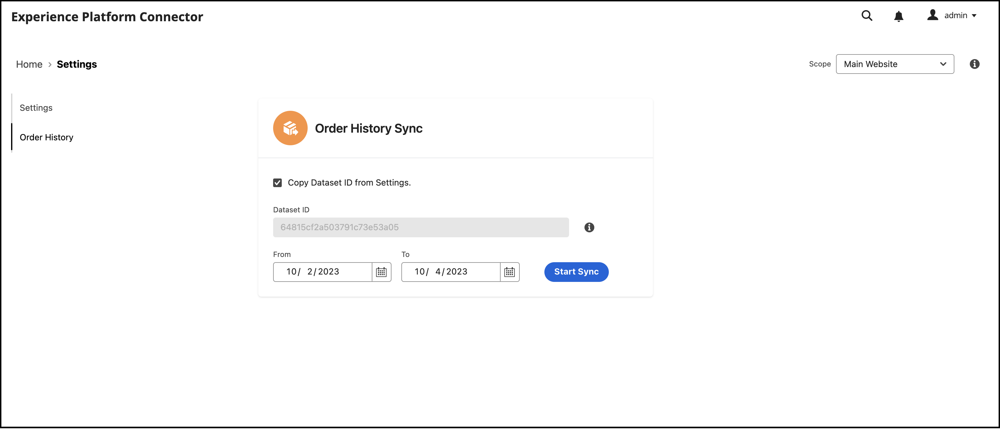

# Commerce-Daten mit Adobe Experience Platform verbinden

Wenn Sie den Experience Platform-Connector installieren, werden im **System** Menü unter **Dienste** im Handel _Admin_.

- Commerce Services Connector
- Experience Platform-Connector

Um Ihre Adobe Commerce-Instanz mit der Adobe Experience Platform zu verbinden, müssen Sie beide Connectoren konfigurieren, beginnend mit dem Commerce Services-Connector und schließlich mit dem Experience Platform-Connector.

## Connector für Commerce Services aktualisieren

Wenn Sie zuvor einen Adobe Commerce-Dienst installiert haben, haben Sie wahrscheinlich bereits den Commerce Services-Connector konfiguriert. Andernfalls müssen Sie die folgenden Aufgaben für die [Commerce Services-Connector](../landing/saas.md) Seite:

1. Melden Sie sich bei Ihrem Commerce-Konto bei [Produktions- und Sandbox-API-Schlüssel abrufen](../landing/saas.md#credentials).
1. Wählen Sie eine [SaaS-Datenraum](../landing/saas.md#saas-configuration).
1. Melden Sie sich bei Ihrem Adobe-Konto bei [Organisations-ID abrufen](../landing/saas.md#ims-organization-optional).

Nachdem Sie den Commerce Services-Connector konfiguriert haben, konfigurieren Sie den Experience Platform-Connector.

## Experience Platform-Connector aktualisieren

In diesem Abschnitt verbinden Sie Ihre Adobe Commerce-Instanz mit der Adobe Experience Platform mithilfe Ihrer Organisations-ID. Anschließend können Sie den Datentyp - Storefront und Backoffice - angeben, der an den Experience Platform-Edge gesendet werden soll.


## Allgemein

1. Navigieren Sie im Admin zu **System** > Dienste > **Experience Platform-Connector**.

1. Im **Einstellungen** Registerkarte unter **Allgemein**&#x200B;überprüfen Sie die mit Ihrem Adobe Experience Platform-Konto verknüpfte ID, wie in der [Commerce Services Connector](../landing/saas.md#organizationid). Die Organisations-ID ist global. Pro Adobe Commerce-Instanz kann nur eine Organisations-ID zugeordnet werden.

1. Im **Anwendungsbereich** Dropdown-Liste festlegen, setzen Sie den Kontext auf **Webseite**.

1. (Optional) Wenn Sie bereits über eine [AEP Web SDK (Legierung)](https://experienceleague.adobe.com/docs/experience-platform/edge/home.html) auf Ihrer Site bereitgestellt, aktivieren Sie das Kontrollkästchen und fügen Sie den Namen Ihres AEP Web SDK hinzu. Lassen Sie diese Felder andernfalls leer, und der Experience Platform-Connector stellt eines für Sie bereit.

   >[!NOTE]
   >
   >Wenn Sie Ihr eigenes AEP Web SDK angeben, verwendet der Experience Platform-Connector die mit diesem SDK verknüpfte Datastraam-ID und nicht die auf dieser Seite angegebene Datastream-ID (falls vorhanden).

## Datenerfassung

In diesem Abschnitt geben Sie den Datentyp an, den Sie an den Experience Platform-Edge senden möchten. Es gibt zwei Datentypen: Client-seitig und Server-seitig.

Client-seitige Daten sind Daten, die in der Storefront erfasst werden. Dazu gehören Interaktionen mit Käufern, z. B. `View Page`, `View Product`, `Add to Cart`, und [Anforderungsliste](events.md#b2b-events) Informationen (für B2B-Händler). Serverseitige Daten oder Back-Office-Daten sind Daten, die auf den Commerce-Servern erfasst werden. Dazu gehören Informationen über den Status einer Bestellung, z. B. ob eine Bestellung aufgegeben, storniert, rückerstattet, versandt oder abgeschlossen wurde.

Um sicherzustellen, dass Ihre Adobe Commerce-Instanz mit der Datenerfassung beginnen kann, lesen Sie das [Voraussetzungen](overview.md#prerequisites).

Weitere Informationen finden Sie unter Ereignisthema . [storefront](events.md#storefront-events) und [Backoffice](events.md#back-office-events) -Ereignisse.

>[!NOTE]
>
>Alle Felder im **Datenerfassung** -Abschnitt auf die **Webseite** Umfang oder höher.

1. Auswählen **Storefront-Ereignisse** , wenn Sie Verhaltensdaten zur Storefront senden möchten.

   >[!NOTE]
   >
   >Die **Storefront-Ereignisse** wird automatisch aktiviert, wenn das AEP Web SDK und die Organisations-ID gültig sind.

1. Auswählen **Back-Office-Ereignisse** wenn Sie Bestellstatusinformationen senden möchten, z. B. wenn eine Bestellung aufgegeben, storniert, rückerstattet oder versandt wurde.

   >[!NOTE]
   >
   >Wenn Sie **Back-Office-Ereignisse**, werden alle Backoffice-Daten an die Experience Platform-Edge gesendet. Wenn sich ein Kunde dafür entscheidet, die Datenerfassung abzuwählen, müssen Sie die Datenschutzeinstellung des Käufers explizit auf der Experience Platform festlegen. Dies unterscheidet sich von Storefront-Ereignissen, bei denen der Sammler die Zustimmung bereits auf der Grundlage der Kundeneinstellungen verarbeitet. [Weitere Infos](https://experienceleague.adobe.com/docs/experience-platform/landing/governance-privacy-security/consent/adobe/dataset.html) über die Festlegung der Datenschutzeinstellungen eines Käufers auf der Experience Platform.

1. So stellen Sie sicher, dass Back-Office-Ereignisdaten anhand eines Zeitplans gemäß [cron](https://experienceleague.adobe.com/docs/commerce-admin/systems/tools/cron.html) Auftrag, müssen Sie die `Sales Orders Feed` Index zu `Update by Schedule`.

   1. Im _Admin_ Seitenleiste, navigieren Sie zu **[!UICONTROL System]** > _[!UICONTROL Tools]_>**[!UICONTROL Index Management]**.

   1. Aktivieren Sie das Kontrollkästchen für die `Sales Orders Feed` Indexer.

   1. Satz **[!UICONTROL Actions]** nach `Update by Schedule`.

   1. Wenn Sie zum ersten Mal Backoffice-Daten aktivieren, führen Sie die folgenden Befehle aus, um eine Neusynchronisierung neu zu indizieren und Trigger. Nachfolgende Neusynchronisierungen treten automatisch auf, solange die Variable [cron](https://experienceleague.adobe.com/docs/commerce-admin/systems/tools/cron.html) Auftrag ordnungsgemäß eingerichtet ist.

      ```bash
      bin/magento index:reindex sales_order_data_exporter_v2
      ```

      ```bash
      bin/magento saas:resync --feed orders
      ```

1. (Überspringen Sie diesen Schritt, wenn Sie Ihr eigenes AEP Web SDK verwenden.) [Erstellen](https://experienceleague.adobe.com/docs/experience-platform/edge/datastreams/configure.html#create) einen Datastream in der Adobe Experience Platform oder wählen Sie einen vorhandenen Datastream aus, den Sie für die Erfassung verwenden möchten.

1. (Überspringen Sie diesen Schritt, wenn Sie Ihr eigenes AEP Web SDK verwenden.) Im **Datenspeicher-ID** -Feld die Kennung dieses neuen oder vorhandenen Datastreams ein.

## Feldbeschreibungen

| Feld | Beschreibung |
|--- |--- |
| Anwendungsbereich | Bestimmte Website, auf die die Konfigurationseinstellungen angewendet werden sollen. |
| Organisations-ID (global) | ID, die zu der Organisation gehört, die das Adobe DX-Produkt erworben hat. Diese ID verknüpft Ihre Adobe Commerce-Instanz mit Adobe Experience Platform. |
| Ist das AEP Web SDK bereits auf Ihrer Site bereitgestellt? | Aktivieren Sie dieses Kontrollkästchen, wenn Sie Ihr eigenes AEP Web SDK auf Ihrer Site bereitgestellt haben. |
| AEP Web SDK Name (Global) | Wenn Sie bereits ein Experience Platform Web SDK auf Ihrer Site bereitgestellt haben, geben Sie den Namen dieses SDK in dieses Feld ein. Dadurch kann das Storefront Event Collector und Storefront Event SDK Ihr Experience Platform Web SDK anstelle der vom Experience Platform-Connector bereitgestellten Version verwenden. Wenn auf Ihrer Site kein Experience Platform Web SDK bereitgestellt ist, lassen Sie dieses Feld leer, und der Experience Platform-Connector stellt eines für Sie bereit. |
| Storefront-Ereignisse | Ist standardmäßig aktiviert, solange die Organisations-ID und die Datenspeicher-ID gültig sind. Storefront-Ereignisse erfassen anonymisierte Verhaltensdaten von Ihren Käufern beim Durchsuchen Ihrer Site. |
| Back Office-Ereignisse | Wenn diese Option aktiviert ist, enthält die Ereignis-Payload anonymisierte Bestellstatusinformationen, z. B. ob eine Bestellung aufgegeben, storniert, zurückerstattet oder versandt wurde. |
| Datastream-ID (Website) | ID, die den Datenfluss von Adobe Experience Platform zu anderen Adobe DX-Produkten ermöglicht. Diese ID muss mit einer bestimmten Website in Ihrer jeweiligen Adobe Commerce-Instanz verknüpft sein. Wenn Sie Ihr eigenes Experience Platform Web SDK angeben, geben Sie in diesem Feld keine Datastream-ID an. Der Experience Platform-Connector verwendet die mit diesem SDK verknüpfte Datastream-ID und ignoriert alle in diesem Feld angegebenen Datastream-ID (sofern vorhanden). |

>[!NOTE]
>
>Nach dem Onboarding fließen die Storefront-Daten an den Experience Platform-Edge. Es dauert etwa fünf Minuten, bis die Daten des Back Office am Rand angezeigt werden. Nachfolgende Aktualisierungen sind am Rand basierend auf dem Cron-Zeitplan sichtbar.

## (Beta) Verlaufsordnungsdaten senden

>[!NOTE]
>
>Diese Funktion ist nur für Beta-Benutzer verfügbar. Sie können der Beta-Phase beitreten, indem Sie eine E-Mail an folgende Adresse senden: [dataconnection@adobe.com](mailto:dataconnection@adobe.com).

Adobe Commerce erfasst bis zu fünf Jahre historischer Bestelldaten und -status. Sie können den Experience Platform-Connector verwenden, um diese historischen Daten an die Experience Platform zu senden, um Ihre Kundenprofile auf der Grundlage dieser früheren Bestellungen anzureichern. Die Daten werden in einem Datensatz innerhalb von Experience Platform gespeichert.

Während Commerce bereits die historischen Bestelldaten erfasst, müssen Sie mehrere Aufgaben ausführen, um diese Daten an Experience Platform zu senden. Die folgenden Abschnitte führen Sie durch den Prozess.

### Beta für historische Bestellungen installieren

Um die Datenerfassung zu historischen Bestellungen für die Beta-Version zu aktivieren, müssen Sie den Stamm des Projekts aktualisieren [!DNL Composer] `.json` Datei wie folgt:

1. Öffnen Sie den Stamm `composer.json` Datei und suchen Sie nach `magento/experience-platform-connector`.

1. Im `require` aktualisieren Sie die Versionsnummer wie folgt:

   ```json
   "require": {
      ...
      "magento/experience-platform-connector": "^3.0.0-beta1",
      ...
    }
   ```

1. Für B2B-Händler aktualisieren Sie die `.json` Datei wie folgt:

   ```json
   "require": {
     ...
     "magento/experience-platform-connector-b2b": "^2.0.0-beta1"
     ...
   }
   ```

1. **Speichern** `composer.json`. Führen Sie dann Folgendes über die Befehlszeile aus:

   ```bash
   composer update magento/experience-platform-connector –-with-dependencies
   ```

   B2B-Händler:

   ```bash
   composer update magento/experience-platform-connector-b2b --with-dependencies
   ```

### Betaversion für historische Bestellungen konfigurieren

Um sicherzustellen, dass der Auftragsverlauf Ihrer Kunden an Experience Platform gesendet werden kann, müssen Sie Anmeldeinformationen angeben, die Ihre Commerce-Instanz mit Experience Platform verknüpfen. Wenn Sie bereits installiert und die [Audience Activation](https://experienceleague.adobe.com/docs/commerce-admin/customers/audience-activation.html) -Erweiterung, haben Sie bereits die erforderlichen Anmeldeinformationen angegeben und Sie können diesen Schritt überspringen. Wenn Sie die Audience Activation-Erweiterung noch nicht installiert und aktiviert haben, führen Sie die folgenden Schritte aus:

>[!NOTE]
>
>In diesem Abschnitt geben Sie Anmeldedaten aus der Entwicklerkonsole ein. Vergewissern Sie sich, dass Ihr Entwicklerkonsolenprojekt die richtige [konfigurierte Rollen und Berechtigungen](https://experienceleague.adobe.com/docs/experience-platform/landing/platform-apis/api-authentication.html#assign-api-to-a-role).

1. Im _Admin_ Seitenleiste, navigieren Sie zu **[!UICONTROL Stores]** > _[!UICONTROL Settings]_>**[!UICONTROL Configuration]**.

1. Erweitern **[!UICONTROL Services]** und wählen **[!UICONTROL Experience Platform Connector]**.

1. Geben Sie die Konfigurationsanmeldeinformationen ein, die sich im Abschnitt [Entwicklerkonsole](https://developer.adobe.com/console/home).

   {width="700" zoomable="yes"}

   >[!NOTE]
   >
   >Für die Beta-Version verwendet Commerce die JSON Web Tokens (JWT)-Anmeldeinformationen in der Entwicklerkonsole. Nach der Beta-Version verwendet Commerce OAuth 2.0 in der Entwicklerkonsole.

1. Klicks **Konfiguration speichern**.

### Einrichten des Auftragssynchronisierungsdienstes

Nachdem Sie Entwickleranmeldeinformationen eingegeben haben, können Sie den Dienst für die Auftragssynchronisierung einrichten. Der Synchronisierungsdienst für Aufträge verwendet die [Message Queue Framework](https://developer.adobe.com/commerce/php/development/components/message-queues/) und RabbitMQ. Nachdem Sie diese Schritte ausgeführt haben, können die Bestellstatusdaten mit SaaS synchronisiert werden, was erforderlich ist, bevor sie an Experience Platform gesendet werden.

1. [Aktivieren](https://experienceleague.adobe.com/docs/commerce-cloud-service/user-guide/configure/service/rabbitmq.html) RabbitMQ.

   >[!NOTE]
   >
   >RabbitMQ ist bereits für Commerce-Versionen 2.4.7 und höher eingerichtet, Sie müssen jedoch Verbraucher aktivieren.

1. Aktivieren von Verbrauchern in der Nachrichtenwarteschlange durch Cron-Auftrag in `.magento.env.yaml` using `CRON_CONSUMERS_RUNNER` Umgebungsvariable.

   ```yaml
      stage:
        deploy:
          CRON_CONSUMERS_RUNNER:
            cron_run: true
   ```

   >[!NOTE]
   >
   >Siehe [Dokumentation zu Implementierungsvariablen](https://experienceleague.adobe.com/docs/commerce-cloud-service/user-guide/configure/env/stage/variables-deploy.html#cron_consumers_runner) , um mehr über alle verfügbaren Konfigurationsoptionen zu erfahren.

Wenn der Synchronisierungsdienst für Bestellungen aktiviert ist, können Sie dann den Datumsbereich für die historische Bestellung auf der Experience Platform-Connector-Seite angeben.

### Angeben des Datumsbereichs für den Auftragsverlauf

In diesem Abschnitt geben Sie den Datumsbereich für die historischen Bestellungen an, die Sie an Experience Platform senden möchten.

{width="700" zoomable="yes"}

1. Navigieren Sie im Admin zu **System** > Dienste > **Experience Platform-Connector**.

1. Wählen Sie die **Auftragsverlauf** Registerkarte.

1. under **Bestellverlauf - Synchronisierung**, geben Sie die **Datensatz-ID**. Dieser Datensatz sollte mit dem Datensatz verknüpft sein, den Sie in der Variablen [Datenerfassung](#data-collection) Abschnitt weiter oben.

   1. Um auf die Datensatz-ID zuzugreifen, öffnen Sie die Experience Platform-Benutzeroberfläche und wählen Sie **Datensätze** im linken Navigationsbereich, um die **Datensätze** Dashboard. Das Dashboard listet alle verfügbaren Datensätze für Ihre Organisation auf. Details werden für jeden aufgelisteten Datensatz angezeigt, einschließlich seines Namens, des Schemas, dem der Datensatz entspricht, und des Status des letzten Erfassungslaufs.
   1. Öffnen Sie den Datensatz, der Ihrem Datastream zugeordnet ist.
   1. Im rechten Bereich werden Details zum Datensatz angezeigt. Kopieren Sie die Datensatz-ID.

   {width="700" zoomable="yes"}

1. Im **Von** und **nach** -Felder geben den Datenbereich für die historischen Bestelldaten an, die Sie senden möchten. Sie können keinen Datumsbereich auswählen, der fünf Jahre überschreitet.

1. Auswählen [!UICONTROL Start Sync] , um die Synchronisierung Trigger, die gestartet werden soll. Historische Bestelldaten sind Batch-Daten im Gegensatz zu Storefront- und Backoffice-Daten, die Streaming-Daten darstellen. Es dauert etwa 45 Minuten, bis die Batch-Daten in Experience Platform ankommen.

   >[!NOTE]
   >
   >Wenn Sie bei Beta eine Synchronisierung mehrmals im selben oder überlappenden Zeitraum Trigger haben, werden doppelte Ereignisse im Datensatz angezeigt.

## Bestätigen der Erfassung von Ereignisdaten

Um sicherzustellen, dass Daten aus Ihrem Commerce-Store erfasst werden, verwenden Sie die [Adobe Experience Platform Debugger](https://experienceleague.adobe.com/docs/experience-platform/debugger/home.html) , um Ihre Commerce-Site zu untersuchen. Nachdem Sie bestätigt haben, dass Daten erfasst werden, können Sie sicherstellen, dass Ihre Storefront- und Back-Office-Ereignisdaten am Edge angezeigt werden, indem Sie eine Abfrage ausführen, die Daten aus dem [von Ihnen erstellter Datensatz](overview.md#prerequisites).

1. Auswählen **Abfragen** im linken Navigationsbereich von Experience Platform und klicken Sie auf [!UICONTROL Create Query].

   

1. Wenn der Abfrage-Editor geöffnet wird, geben Sie eine Abfrage ein, die Daten aus dem Datensatz auswählt.

   

   Ihre Abfrage könnte beispielsweise wie folgt aussehen:

   ```sql
   SELECT * from `your_dataset_name` ORDER by TIMESTAMP DESC
   ```

1. Nach Ausführung der Abfrage werden die Ergebnisse im **Ergebnisse** neben dem **Konsole** Registerkarte. Diese Ansicht zeigt die tabellarische Ausgabe Ihrer Abfrage an.

   

In diesem Beispiel werden Ereignisdaten aus der [`commerce.productListAdds`](events.md#addtocart), [`commerce.productViews`](events.md#productpageview), [`web.webpagedetails.pageViews`](events.md#pageview)usw. Mit dieser Ansicht können Sie überprüfen, ob Ihre Commerce-Daten am Edge angekommen sind.

Wenn die Ergebnisse nicht Ihren Erwartungen entsprechen, öffnen Sie den Datensatz und suchen Sie nach fehlgeschlagenen Batch-Importen. Weitere Informationen [Fehlerbehebung bei Batch-Importen](https://experienceleague.adobe.com/docs/experience-platform/ingestion/batch/troubleshooting.html).
