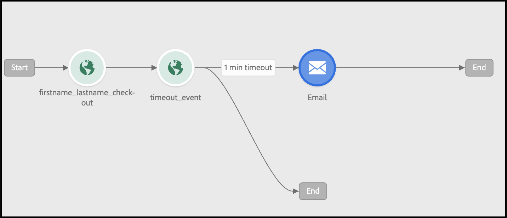

# Verwenden von Adobe Journey Optimizer zum Senden einer E-Mail zum abgebrochenen Warenkorb

[Adobe Journey Optimizer](https://experienceleague.adobe.com/docs/journey-optimizer/using/get-started/get-started.html) hilft Ihnen bei der Personalisierung des Commerce-Erlebnisses für Ihre Kunden. Sie können beispielsweise Journey Optimizer verwenden, um geplante Marketingkampagnen zu erstellen und bereitzustellen, z. B. wöchentliche Promotions für einen Einzelhandelsgeschäft, oder eine E-Mail zu einem abgebrochenen Warenkorb zu generieren, wenn ein Kunde ein Produkt zu einem Warenkorb hinzugefügt, aber dann den Checkout-Prozess nicht abgeschlossen hat.

Mit diesen Schritten können Sie lernen, wie Sie einen `checkout` -Ereignis, das von Ihrer Commerce-Instanz generiert wurde und auf dieses Ereignis in Journey Optimizer reagiert, um eine E-Mail mit abgebrochenem Warenkorb zu erstellen.

>[!IMPORTANT]
>
>Stellen Sie zu Demonstrationszwecken sicher, dass Sie Ihre Commerce-Sandbox-Umgebung verwenden. Dadurch wird sichergestellt, dass die an Experience Platform gesendeten Storefront- und Back-Office-Ereignisdaten Ihre Produktionsereignisdaten nicht verwässern.

## Voraussetzungen

Bevor Sie mit diesen Schritten beginnen, stellen Sie Folgendes sicher:

- Sie sind für die Verwendung von Adobe Journey Optimizer bereitgestellt.
- You [konfiguriert](connect-data.md) Experience Platform-Connector
- You [bestätigt](connect-data.md#confirm-that-event-data-is-collected) Ihre Commerce-Ereignisdaten gelangen am Experience Platform Edge.

## Schritt 1: Benutzer in Ihrer Commerce-Sandbox-Umgebung erstellen

Erstellen Sie einen Benutzer in Ihrer Sandbox-Umgebung und bestätigen Sie, dass die Benutzerkontoinformationen unter Experience Platform angezeigt werden. Stellen Sie sicher, dass die angegebene E-Mail gültig ist, da sie später in diesem Abschnitt zum Senden der E-Mail zum abgebrochenen Warenkorb verwendet wird.

1. Melden Sie sich an oder erstellen Sie ein Konto in Ihrer Commerce-Sandbox-Umgebung.

   {width="700" zoomable="yes"}

   Wenn der Experience Platform Connector installiert und konfiguriert ist, werden diese Kontoinformationen als Profil an die Experience Platform gesendet.

1. Vergewissern Sie sich, dass die Informationen zu Ihrem Benutzerkonto in der **[!UICONTROL Profile]** Abschnitt von Experience Platform.

   Navigieren Sie zu **[!UICONTROL Profiles]** in der Adobe Experience Platform. Klicks **[!UICONTROL Detail]** im Profil, um das von Ihnen erstellte Profil anzuzeigen.

   {width="700" zoomable="yes"}

## Schritt 2: Anzeigen von Ereignissen in Journey Optimizer

Zeigen Sie in Ihrer Commerce-Sandbox-Umgebung Produktseiten an, fügen Sie Artikel zu einem Warenkorb hinzu sowie verschiedene andere Aktivitäten, die ein Käufer durchführen würde. Diese Aktivitäten Trigger-Ereignisse auf Ihrer Storefront. Sie können jetzt bestätigen, dass diese Ereignisse an Journey Optimizer gesendet werden.

1. Launch [Adobe Journey Optimizer](https://experienceleague.adobe.com/docs/journey-optimizer/using/get-started/user-interface.html).
1. Auswählen **[!UICONTROL Profiles]**.
1. Satz **[!UICONTROL Identity namespace]** nach `Email`.
1. Legen Sie die **[!UICONTROL Identity value]** an Ihre E-Mail-Adresse.
1. Wählen Sie Ihr Profil aus und wählen Sie dann die **[!UICONTROL Events]** Registerkarte.

   {width="700" zoomable="yes"}

   Suchen Sie nach `commerce.checkouts` -Ereignis und untersuchen Sie die Ereignis-Payload:

       &quot;json
       &quot;personID&quot;: &quot;84281643067178465783746543501073369488&quot;,
       &quot;eventType&quot;: &quot;commerce.checkouts&quot;,
       &quot;_id&quot;: &quot;4b41703f-e42e-485b-8d63-7001e3580856-0&quot;,
       &quot;commerce&quot;: {
       &quot;Warenkorb&quot; {},
       &quot;checkouts&quot;: {
       &quot;value&quot;: 1
       }
       &quot;
   
   Wie Sie sehen können, enthält die vollständige Ereignis-Payload Rich-Event-Daten. Im nächsten Abschnitt konfigurieren Sie Ereignisse in Journey Optimizer, um auf die `commerce.checkouts` -Ereignis, das aus Ihrer Commerce-Storefront generiert wurde.

## Schritt 3: Konfigurieren von Ereignissen in Journey Optimizer

Konfigurieren Sie zwei Ereignisse in Journey Optimizer: ein Ereignis überwacht die `commerce.checkouts` -Ereignis von Commerce aus und das andere ist ein grundlegendes Timeout-Ereignis, das auf einen bestimmten Zeitraum wartet, bevor eine E-Mail zum Warenkorb ausgelöst wird.

### Listenereignis erstellen

1. Launch [Adobe Journey Optimizer](https://experienceleague.adobe.com/docs/journey-optimizer/using/get-started/user-interface.html).

1. Klicks **[!UICONTROL Configurations]** unter **[!UICONTROL Administration]** im linken Bereich.

1. Im **[!UICONTROL Events]** tile, click **[!UICONTROL Manage]**.

   {width="700" zoomable="yes"}

1. Im **[!UICONTROL Events]** Seite, klicken **[!UICONTROL Create Event]**.

1. Richten Sie das Ereignis in der rechten Navigation wie folgt ein:

   1. Legen Sie die **[!UICONTROL Name]** an: `firstname_lastname_checkout`.
   1. Satz **[!UICONTROL Type]** nach **[!UICONTROL Unitary]**.
   1. Satz **[!UICONTROL Event id typ]e** nach **[!UICONTROL Rule based]**.
   1. Satz **[!UICONTROL Schema]** zu Ihrem Commerce [schema](update-xdm.md).
   1. Auswählen **[!UICONTROL Fields]** und im **[!UICONTROL Fields]** angezeigt werden, wählen Sie die für dieses Ereignis nützlichen Felder aus.

      Wählen Sie beispielsweise alle Felder unter dem **[!UICONTROL Product list items]**, **[!UICONTROL Commerce]**, **[!UICONTROL eventType]**, und **[!UICONTROL Web]**.

   1. Klicks **[!UICONTROL OK]** , um die ausgewählten Felder zu speichern.
   1. Klicken Sie in die **[!UICONTROL Event id condition]** und erstellen Sie eine Bedingung von `eventType` ist gleich `commerce.checkouts` UND `personalEmail.address` entspricht der E-Mail-Adresse, die Sie beim Erstellen des Profils im vorherigen Abschnitt verwendet haben.

      {width="700" zoomable="yes"}

   1. Klicken **[!UICONTROL OK]**.
   1. Klicks **[!UICONTROL Save]** , um das Ereignis zu speichern.

### Timeout-Ereignis erstellen

1. Erstellen Sie in Journey Optimizer ein Ereignis wie zuvor.

1. Richten Sie das Ereignis in der rechten Navigation wie folgt ein:

   1. Legen Sie die **[!UICONTROL Name]** an: `firstname_lastname_timeout`.
   1. Satz **[!UICONTROL Type]** nach **[!UICONTROL Unitary]**.
   1. Satz **[!UICONTROL Event id typ]e** nach **[!UICONTROL Rule based]**.
   1. Satz **[!UICONTROL Schema]** zu Ihrem Commerce [schema](update-xdm.md).
   1. Legen Sie die **[!UICONTROL Schema]**, **[!UICONTROL Fields]**, und **[!UICONTROL Event id condition]** auf das gleiche wie oben.
   1. Klicks **[!UICONTROL Save]** , um das Ereignis zu speichern.

Erstellen Sie mit den beiden konfigurierten Ereignissen eine Journey, die eine E-Mail mit dem abgebrochenen Warenkorb sendet.

## Schritt 4: Erstellen einer Checkout-Journey

Erstellen Sie eine Journey, die auf die `commerce.checkouts` -Ereignis und sendet dann eine E-Mail mit einem abgebrochenen Warenkorb, nachdem ein bestimmter Zeitraum verstrichen ist.

1. Wählen Sie in Journey Optimizer **[!UICONTROL Journeys]** under **J[!UICONTROL OURNEY MANAGEMENT]**.
1. Klicken **[!UICONTROL Create Journey]**.
1. Geben Sie den Namen Ihrer Journey an.
1. Klicks **[!UICONTROL OK]** , um die Journey zu speichern.
1. Im linken Navigationsbereich unter **[!UICONTROL EVENTS]** nach dem zuvor erstellten Checkout-Ereignis suchen: `firstname_lastname_checkout` und ziehen Sie sie per Drag-and-Drop auf die Arbeitsfläche.

   >[!TIP]
   >
   >Wenn Sie auf das Ereignis doppelklicken, wird es automatisch zur Arbeitsfläche hinzugefügt.

1. Suchen Sie nach dem Timeout-Ereignis und fügen Sie es der Arbeitsfläche hinzu.
1. Doppelklicken Sie auf das Timeout-Ereignis.

   1. Im **[!UICONTROL Timeout]** auswählen, wählen Sie die **[!UICONTROL Define the event time]** aktivieren.
   1. Im **[!UICONTROL Wait for]** Feldeingabe `1` und `Minute`.
   1. Wählen Sie die **[!UICONTROL Set a timeout path]** aktivieren.

   Bei dieser Timeout-Konfiguration führt ein Käufer, der innerhalb von 1 Triggern nach diesem Timeout-Zweig einen Checkout durchführt, die Bestellung jedoch nicht abschließt. In einer tatsächlichen Produktionsumgebung würden Sie dies für einen längeren Zeitraum festlegen, z. B. 24 Stunden.

1. Im linken Navigationsbereich unter **[!UICONTROL ACTIONS]**, fügen Sie die **[!UICONTROL Email]** -Aktion auf die Zeitüberschreitungsverzweigung. Ihre Journey sollte wie folgt aussehen:

   {width="700" zoomable="yes"}

### Erstellen einer E-Mail mit stehendem Warenkorb

Erstellen Sie eine E-Mail zum Verlassen des Warenkorbs, die gesendet wird, wenn ein verlassener Warenkorb erkannt wird.

1. Doppelklicken Sie in der oben erstellten Journey auf die **[!UICONTROL Email]** auf der Arbeitsfläche.

1. Befolgen Sie die [Schritte](https://experienceleague.adobe.com/docs/journey-optimizer/using/content-management/personalization/personalization-use-cases/personalization-use-case-helper-functions.html#configure-email) im Journey Optimizer-Handbuch, um die E-Mail zum abgebrochenen Warenkorb zu erstellen.

Sie verfügen jetzt über eine Journey in Journey Optimizer, die auf die `commerce.checkouts` -Ereignis aus Ihrem Commerce-Store und eine E-Mail mit stehendem Warenkorb, die nach Ablauf eines Zeitraums gesendet wird. Im nächsten Abschnitt testen Sie die Journey.

## Schritt 5: Trigger des Checkout-Ereignisses in Echtzeit

In diesem Abschnitt testen Sie das Ereignis in Echtzeit.

1. Aktivieren Sie in Journey Optimizer den Testmodus .

   {width="700" zoomable="yes"}

1. Um diese Journey in Echtzeit zu testen, öffnen Sie eine weitere Browser-Registerkarte und rufen Sie Ihre Sandbox Commerce-Website auf.

   1. Fügen Sie Ihrem Warenkorb ein Produkt hinzu.
   1. Gehen Sie zur Checkout-Seite.
   1. Verlassen Sie den Warenkorb von der Checkout-Seite aus, indem Sie zur Hauptseite zurückkehren oder Ihren Tab schließen.

      Die Journey wird jetzt ausgelöst. Öffnen Sie zur Bestätigung die Registerkarte mit Ihrer Journey in Journey Optimizer. Es sollte ein grüner Pfeil angezeigt werden, der den Pfad anzeigt, den Ihr Benutzer durchlaufen hat.

1. Überprüfen Sie Ihren Posteingang auf die E-Mail.
