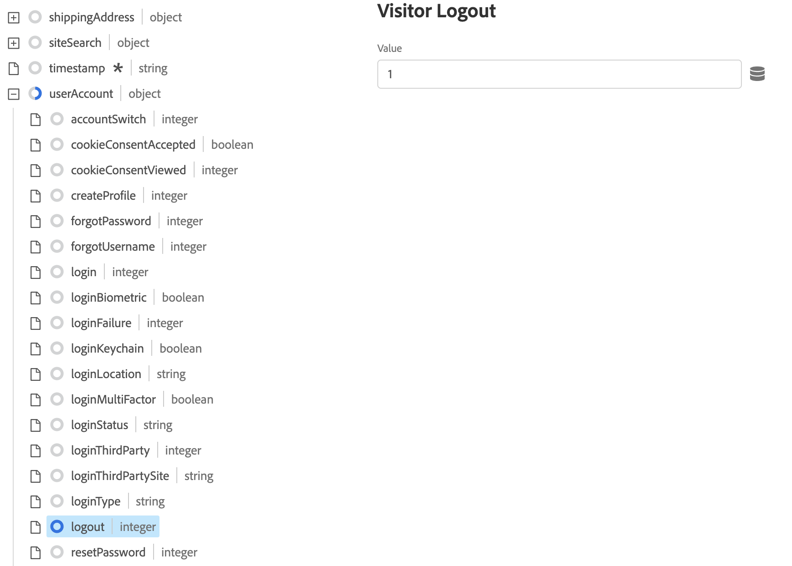

# Erfassen von Commerce-Daten mit Adobe Experience Platform Tags

Sie können zwar den Experience Platform-Connector zum Veröffentlichen und Abonnieren von Storefront-Ereignissen verwenden, einige Händler verwenden jedoch möglicherweise bereits eine Datenerfassungslösung, z. B. die [Adobe Experience Platform-Tags](https://experienceleague.adobe.com/docs/platform-learn/data-collection/tags/create-a-property.html). Für diese Händler bietet Adobe Commerce eine Veröffentlichungsoption nur im Experience Platform-Connector, der das Adobe Commerce Event SDK verwendet.


_Experience Platform Connector-Datenfluss mit Tags_

In diesem Thema erfahren Sie, wie Sie die vom Experience Platform-Connector bereitgestellten Storefront-Ereigniswerte der bereits verwendeten Adobe Experience Platform-Tags-Lösung zuordnen.

## Erfassen von Ereignisdaten aus Adobe Commerce

So erfassen Sie Commerce-Ereignisdaten:

- Installieren Sie die [Adobe Commerce Events SDK](https://github.com/adobe/commerce-events/tree/main/packages/commerce-events-sdk). Informationen zu PHP-Storefronts finden Sie im Abschnitt [install](install.md) Thema. PWA Studio-Storefronts: [PWA Studio-Handbuch](https://developer.adobe.com/commerce/pwa-studio/integrations/adobe-commerce/aep/).

  >[!NOTE]
  >
  > Do **not** [konfigurieren](connect-data.md) die Organisations-ID und die Datastream-ID.

## Zuordnen von Commerce-Storefront-Daten zu Adobe Experience Platform

Um Commerce-Storefront-Daten Adobe Experience Platform zuzuordnen, konfigurieren und installieren Sie Folgendes innerhalb von Adobe Experience Platform-Tags:

1. [Einrichten einer Tag-Eigenschaft](https://experienceleague.adobe.com/docs/platform-learn/implement-in-websites/configure-tags/create-a-property.html) in der Adobe Experience Platform-Datenerfassung.

1. under **Authoring** auswählen **Erweiterungen** und installieren und konfigurieren Sie die folgenden Erweiterungen:

   - [Adobe Client-Datenschicht](https://experienceleague.adobe.com/docs/experience-platform/tags/extensions/adobe/client-data-layer/overview.html)

   - [Adobe Experience Platform Web SDK](https://experienceleague.adobe.com/docs/experience-platform/edge/fundamentals/installing-the-sdk.html)

1. [Veröffentlichungs-Tag](https://experienceleague.adobe.com/docs/experience-platform/tags/publish/overview.html) in Ihre Entwicklungsumgebung.

1. Befolgen Sie die **Ereigniszuordnung** Gehen Sie wie folgt vor, um Datenelemente und Regeln für bestimmte Ereignisse zu konfigurieren.

### Ereigniszuordnung

Da sich die Datenerfassung mit Tags von der Verwendung des Adobe Commerce Event SDK unterscheidet, müssen die in beiden Frameworks verwendeten äquivalenten Begriffe verstanden werden.

| Adobe Experience Platform-Tags-Begriff | Adobe Commerce Event SDK - Begriff |
|---|---|
| _Datenelemente_ | context |
| _Regeln_ | event |
|  | _Regelbedingungen_ - Ereignis-Listener (aus ACDL)<br><br>_Regelaktionen_ - Ereignishandler (an Adobe Experience Platform senden) |

Wenn Sie die Datenelemente und Regeln in Adobe Experience Platform-Tags mit Adobe Commerce-spezifischen Ereignisdaten aktualisieren, werden Sie einige gängige Schritte ausführen.

Fügen wir beispielsweise die Adobe Commerce hinzu `signOut` -Ereignis auf Adobe Experience Platform-Tags. In den unten beschriebenen Schritten wird beschrieben, wie Sie - mit Ausnahme der festgelegten Werte - [Datenelemente](https://experienceleague.adobe.com/docs/experience-platform/collection/e2e.html#data-element) und [Regeln](https://experienceleague.adobe.com/docs/experience-platform/collection/e2e.html#create-a-rule), die für alle Adobe Commerce-Ereignisse gelten, die Sie zu Tags hinzufügen.

1. Erstellen Sie ein Datenelement:

   
   _Neues Datenelement erstellen_

1. Satz **Name** nach `sign out`.

1. Satz **Erweiterung** nach `Adobe Experience Platform Web SDK`.

1. Satz **Datenelementtyp** nach `XDM object`.

1. Wählen Sie die **Sandbox** und **Schema** , die Sie aktualisieren möchten.

1. under **userAccount** > **Abmelden**, legen Sie die **value** in **Besucher-Abmeldung** nach `1`.

   
   _Abmeldewert aktualisieren_

1. Auswählen **Speichern**.

1. Erstellen einer Regel:

   
   _Neue Regel erstellen_

1. Auswählen **Hinzufügen** under **EREIGNISSE**.

1. Satz **Erweiterung** nach `Adobe Client Data Layer`.

1. Satz **Ereignistyp** nach `Data Pushed`.

1. Auswählen **Bestimmtes Ereignis** und legen Sie die **Ereignis/Schlüssel zur Registrierung** nach `sign-out`.

1. Auswählen **Änderungen beibehalten** , um die neue Regel zu speichern.

1. Hinzufügen einer Aktion.

1. Satz **Erweiterung** nach `Adobe Experience Platform Web SDK`.

1. Satz **Aktionstyp** nach `Send Event`.

1. Satz **Instanz** nach `Alloy`.

1. Satz **Typ** nach `userAccount.logout`.

1. Satz **XDM-Daten** nach `%sign out%`.

1. Klicks **Speichern**.

   Sie haben ein Datenelement in Ihrem Schema für die `signOut` -Ereignis aus Adobe Commerce. Außerdem haben Sie eine Regel mit einer bestimmten Aktion erstellt, die auftreten sollte, wenn dieses Ereignis aus der Adobe Commerce-Storefront ausgelöst wird.

Wiederholen Sie die oben genannten Schritte in den Tags für jedes der unten beschriebenen Adobe Commerce-Ereignisse.

## Verfügbare Ereignisse

Ordnen Sie für jedes der folgenden Ereignisse die Adobe Commerce-Ereignisse Ihrem XDM zu, indem Sie die oben genannten Schritte ausführen.

- [`signOut`](#signout)
- [`signIn`](#signin)
- [`createAccount`](#createaccount)
- [`editAccount`](#editaccount)
- [`pageView`](#pageview)
- [&quot;productView&quot;](#productview)
- [`searchRequestSent`](#searchrequestsent)
- [`searchResponseReceived`](#searchresponsereceived)
- [`addToCart`](#addtocart)
- [`openCart`](#opencart)
- [`viewCart`](#viewcart)
- [`removeFromCart`](#removefromcart)
- [`initiativeCheckout`](#initiatecheckout)
- [`placeOrder`](#placeorder)

### signOut

Wird ausgelöst, wenn ein Käufer versucht, sich abzumelden.

#### Datenelemente

Erstellen Sie das folgende Datenelement:

1. Abmelden:

   - **Name**: `Sign out`
   - **Erweiterung**: `Adobe Experience Platform Web SDK`
   - **Datenelementtyp**: `XDM object`
   - **Feldergruppe**: `userAccount` > `logout`
   - **Besucher-Abmeldung**: **Wert** = `1`

#### Regeln 

- **Name**: `Sign out`
- **Erweiterung**: `Adobe Client Data Layer`
- **Ereignistyp**: `Data Pushed`
- **Bestimmtes Ereignis**: `sign-out`

##### Aktionen

- **Erweiterung**: `Adobe Experience Platform Web SDK`
- **Aktionstyp**: `Send event`
- **Typ**: `userAccount.logout`
- **XDM-Daten**: `%sign-out%`

### signIn

Wird ausgelöst, wenn ein Käufer versucht, sich anzumelden.

#### Datenelemente

Erstellen Sie die folgenden Datenelemente:

1. Konto-E-Mail:

   - **Name**: `account email`
   - **Erweiterung**: `Adobe Client Data Layer`
   - **Datenelementtyp**: `Data Layer Computed State`
   - **[Optional] path**: `accountContext.emailAddress`

1. Kontotyp:

   - **Name**: `account type`
   - **Erweiterung**: `Adobe Client Data Layer`
   - **Datenelementtyp**: `Data Layer Computed State`
   - **[Optional] path**: `accountContext.accountType`

1. Konto-ID:

   - **Name**: `account id`
   - **Erweiterung**: `Adobe Client Data Layer`
   - **Datenelementtyp**: `Data Layer Computed State`
   - **[Optional] path***: `accountContext.accountId`

1. Anmelden:

   - **Name**: `sign in`
   - **Erweiterung**: `Adobe Experience Platform Web SDK`
   - **Datenelementtyp**: `XDM object`
   - **Feldergruppe**: `person` > `accountID`
   - **Konto-ID**: **Wert** = `%account id%`
   - **Feldergruppe**: `person` > `accountType`
   - **Kontotyp**: **Wert** = `%account type%`
   - **Feldergruppe**: `person` > `personalEmailID`
   - **Persönliche Email-Adresse**: **Wert** = `%account email%`
   - **Feldergruppe**: `personalEmail` > `address`
   - **Adresse**: **Wert** = `%account email%`
   - **Feldergruppe**: `userAccount` > `login`
   - **Besucheranmeldung**: **Wert** = `1`

#### Regeln 

- **Name**: `sign in`
- **Erweiterung**: `Adobe Client Data Layer`
- **Ereignistyp**: `Data Pushed`
- **Bestimmtes Ereignis**: `sign-in`

##### Aktionen

- **Erweiterung**: `Adobe Experience Platform Web SDK`
- **Aktionstyp**: `Send event`
- **Typ**: `userAccount.login`
- **XDM-Daten**: `%sign in%`

### createAccount

Wird ausgelöst, wenn ein Käufer versucht, ein Konto zu erstellen.

#### Datenelemente

Erstellen Sie die folgenden Datenelemente:

1. Konto-E-Mail:

   - **Name**: `account email`
   - **Erweiterung**: `Adobe Client Data Layer`
   - **Datenelementtyp**: `Data Layer Computed State`
   - **[Optional] path**: `accountContext.emailAddress`

1. Kontotyp:

   - **Name**: `account type`
   - **Erweiterung**: `Adobe Client Data Layer`
   - **Datenelementtyp**: `Data Layer Computed State`
   - **[Optional] path**: `accountContext.accountType`

1. Konto-ID:

   - **Name**: `account id`
   - **Erweiterung**: `Adobe Client Data Layer`
   - **Datenelementtyp**: `Data Layer Computed State`
   - **[Optional] path**: `accountContext.accountId`

1. Konto erstellen:

   - **Name**: `Create account`
   - **Erweiterung**: `Adobe Experience Platform Web SDK`
   - **Datenelementtyp**: `XDM object`
   - **Feldergruppe**: `person` > `accountID`
   - **Konto-ID**: **Wert** = `%account id%`
   - **Feldergruppe**: `person` > `accountType`
   - **Kontotyp**: **Wert** = `%account type%`
   - **Feldergruppe**: `person` > `personalEmailID`
   - **Persönliche Email-Adresse**: **Wert** = `%account email%`
   - **Feldergruppe**: `personalEmail` > `address`
   - **Adresse**: **Wert** = `%account email%`
   - **Feldergruppe**: `userAccount` > `createProfile`
   - **Kontoprofil erstellen**: **Wert** = `1`

#### Regeln 

- **Name**: `Create account`
- **Erweiterung**: `Adobe Client Data Layer`
- **Ereignistyp**: `Data Pushed`
- **Bestimmtes Ereignis**: `create-account`

##### Aktionen

- **Erweiterung**: `Adobe Experience Platform Web SDK`
- **Aktionstyp**: `Send event`
- **Typ**: `userAccount.createProfile`
- **XDM-Daten**: `%create account%`

### editAccount

Wird ausgelöst, wenn ein Käufer versucht, ein Konto zu bearbeiten.

#### Datenelemente

Erstellen Sie die folgenden Datenelemente:

1. Konto-E-Mail:

   - **Name**: `account email`
   - **Erweiterung**: `Adobe Client Data Layer`
   - **Datenelementtyp**: `Data Layer Computed State`
   - **[Optional] path**: `accountContext.emailAddress`

1. Kontotyp:

   - **Name**: `account type`
   - **Erweiterung**: `Adobe Client Data Layer`
   - **Datenelementtyp**: `Data Layer Computed State`
   - **[Optional] path**: `accountContext.accountType`

1. Konto-ID:

   - **Name**: `account id`
   - **Erweiterung**: `Adobe Client Data Layer`
   - **Datenelementtyp**: `Data Layer Computed State`
   - **[Optional] path**: `accountContext.accountId`

1. Konto bearbeiten:

   - **Name**: `Edit account`
   - **Erweiterung**: `Adobe Experience Platform Web SDK`
   - **Datenelementtyp**: `XDM object`
   - **Feldergruppe**: `person` > `accountID`
   - **Konto-ID**: **Wert** = `%account id%`
   - **Feldergruppe**: `person` > `accountType`
   - **Kontotyp**: **Wert** = `%account type%`
   - **Feldergruppe**: `person` > `personalEmailID`
   - **Persönliche Email-Adresse**: **Wert** = `%account email%`
   - **Feldergruppe**: `personalEmail` > `address`
   - **Adresse**: **Wert** = `%account email%`
   - **Feldergruppe**: `userAccount` > `updateProfile`
   - **Kontoprofil erstellen**: **Wert** = `1`

#### Regeln

- **Name**: `Edit account`
- **Erweiterung**: `Adobe Client Data Layer`
- **Ereignistyp**: `Data Pushed`
- **Bestimmtes Ereignis**: `edit-account`

##### Aktionen

- **Erweiterung**: `Adobe Experience Platform Web SDK`
- **Aktionstyp**: `Send event`
- **Typ**: `userAccount.updateProfile`
- **XDM-Daten**: `%edit account%`

### pageView

Wird ausgelöst, wenn eine Seite geladen wird.

#### Datenelemente

Erstellen Sie die folgenden Datenelemente:

1. Seitenname:

   - **Name**: `page name`
   - **Erweiterung**: `Adobe Client Data Layer`
   - **Datenelementtyp**: `Data Layer Computed State`
   - **[Optional] path**: `pageContext.pageName`

#### Regeln 

- **Name**: `page view`
- **Erweiterung**: `Adobe Client Data Layer`
- **Ereignistyp**: `Data Pushed`
- **Bestimmtes Ereignis**: `page-view`

##### Aktionen

- **Erweiterung**: `Adobe Experience Platform Web SDK`
- **Aktionstyp**: `Send event`
- **Typ**: `web.webPageDetails.pageViews`
- **XDM-Daten**: `%page view%`

### productView

Wird ausgelöst, wenn eine Produktseite geladen wird.

#### Datenelemente

Erstellen Sie die folgenden Datenelemente:

1. Produktname:

   - **Name**: `product name`
   - **Erweiterung**: `Adobe Client Data Layer`
   - **Datenelementtyp**: `Data Layer Computed State`
   - **[Optional] path**: `productContext.name`

1. Produkt-SKU:

   - **Name**: `product sku`
   - **Erweiterung**: `Adobe Client Data Layer`
   - **Datenelementtyp**: `Data Layer Computed State`
   - **[Optional] path**: `productContext.sku`

1. Produktbild-URL:

   - **Name**: `product image`
   - **Erweiterung**: `Adobe Client Data Layer`
   - **Datenelementtyp**: `Data Layer Computed State`
   - **[Optional] path**: `productContext.mainImageUrl`

1. Produktwährung:

   - **Name**: `product currency`
   - **Erweiterung**: `Adobe Client Data Layer`
   - **Datenelementtyp**: `Data Layer Computed State`
   - **[Optional] path**: `productContext.pricing.currencyCode`

1. Währungscode:

   - **Name**: `currency code`
   - **Erweiterung**: `Core`
   - **Datenelementtyp**: `Custom Code`
   - **Editor öffnen**:

   ```bash
   return _satellite.getVar('product currency') || _satellite.getVar('storefront').storeViewCurrencyCode
   ```

1. Sonderpreis:

   - **Name**: `special price`
   - **Erweiterung**: `Adobe Client Data Layer`
   - **Datenelementtyp**: `Data Layer Computed State`
   - **[Optional] path**: `productContext.pricing.specialPrice`

1. Regelpreis:

   - **Name**: `regular price`
   - **Erweiterung**: `Adobe Client Data Layer`
   - **Datenelementtyp**: `Data Layer Computed State`
   - **[Optional] path**: `productContext.pricing.regularPrice`

1. Produktpreis:

   - **Name**: `product price`
   - **Erweiterung**: `Core`
   - **Datenelementtyp**: `Custom Code`
   - **Editor öffnen**:

   ```bash
   return _satellite.getVar('product regular price') || _satellite.getVar('product special price')
   ```

1. Produktansicht:

   - **Name**: `product view`
   - **Erweiterung**: `Adobe Experience Platform Web SDK`
   - **Datenelementtyp**: `XDM object`
   - **Feldergruppe**: `productListItems`. Auswählen **Bereitstellen einzelner Elemente** und klicken Sie auf **Element hinzufügen** Schaltfläche. Da diese Ansicht für eine Produktdetailseiten gilt, können Sie mit einem einzelnen Element füllen.
   - **Feldergruppe**: `productListItems` > `name`
   - **Name**: **Wert** = `%product name%`
   - **Feldergruppe**: `productListItems` > `SKU`
   - **SKU**: **Wert** = `%product sku%`
   - **Feldergruppe**: `productListItems` > `priceTotal`
   - **Preissumme**: **Wert** = `%product price%`
   - **Feldergruppe**: `productListItems` > `currencyCode`
   - **Währungscode**: **Wert** = `%currency code%`
   - **Feldergruppe**: `productListItems` > `ProductImageUrl`
   - **ProductImageUrl**: **Wert** = `%product image%`
   - **Feldergruppe**: `commerce` > `productViews` > `value`
   - **value**: **Wert** = `1`

#### Regeln 

- **Name**: `product view`
- **Erweiterung**: `Adobe Client Data Layer`
- **Ereignistyp**: `Data Pushed`
- **Bestimmtes Ereignis**: `product-page-view`

##### Aktionen

- **Erweiterung**: `Adobe Experience Platform Web SDK`
- **Aktionstyp**: `Send event`
- **Typ**: `commerce.productViews`
- **XDM-Daten**: `%product view%`

### searchRequestSent

Wird durch Ereignisse im Popup &quot;Suche beim Eingeben&quot;und durch Ereignisse auf den Suchergebnisseiten ausgelöst.

#### Datenelemente

Erstellen Sie die folgenden Datenelemente:

1. Sucheingabe

   - **Name**: `search input`
   - **Erweiterung**: `Adobe Client Data Layer`
   - **Datenelementtyp**: `Data Layer Computed State`
   - **[Optional] path**: `searchInputContext.units[0]`

1. Sucheingabesatz

   - **Name**: `search input phrase`
   - **Erweiterung**: `Core`
   - **Datenelementtyp**: `Custom Code`
   - **Editor öffnen**:

   ```bash
   return _satellite.getVar('search input').phrase;
   ```

1. Suche nach Eingabe

   - **Name**: `search input sort`
   - **Erweiterung**: `Core`
   - **Datenelementtyp**: `Custom Code`
   - **Editor öffnen**:

   ```bash
   const searchInput = _satellite.getVar('search input');
   const sortFromInput = searchInput ? searchInput.sort : [];
   const sort = sortFromInput.map((searchSort) => {
       return {
           attribute: searchSort.attribute,
           order: searchSort.direction,
       };
   });
   return sort;
   ```

1. Sucheingabefelder

   - **Name**: `search input filters`
   - **Erweiterung**: `Core`
   - **Datenelementtyp**: `Custom Code`
   - **Editor öffnen**:

   ```bash
   const searchInput = _satellite.getVar('search input');
   const filtersFromInput = searchInput ? searchInput.filter : [];
   const filters = filtersFromInput.map(
       (searchFilter) => {
           let value = [];
           let isRange = false;
           if (searchFilter.eq) {
               value.push(searchFilter.eq);
           } else if (searchFilter.in) {
               value = searchFilter.in;
           } else if (searchFilter.range) {
               isRange = true;
               value.push(String(searchFilter.range.from));
               value.push(String(searchFilter.range.to));
           }
           return {
               attribute: searchFilter.attribute,
               value,
               isRange,
           };
       }
   );
   
   return filters;
   ```

1. Suchanfrage:

   - **Name**: `search request`
   - **Erweiterung**: `Adobe Experience Platform Web SDK`
   - **Datenelementtyp**: `XDM object`
   - **Feldergruppe**: `siteSearch` > `phrase`
   - **value**: Noch nicht verfügbar
   - **Feldergruppe**: `siteSearch` > `sort`. Auswählen **Gesamtes Objekt bereitstellen**.
   - **Feldergruppe**: `siteSearch` > `filter`. Auswählen **Gesamtes Objekt bereitstellen**.
   - **Feldergruppe**: `searchRequest` > `id`
   - **Eindeutige Kennung**: **Wert** = `%search request ID%`
   - **Feldergruppe**: `searchRequest` > `value`
   - **value**: **Wert** = `1`

#### Regeln 

- **Name**: `search request sent`
- **Erweiterung**: `Adobe Client Data Layer`
- **Ereignistyp**: `Data Pushed`
- **Bestimmtes Ereignis**: `search-request-sent`

##### Aktionen

- **Erweiterung**: `Adobe Experience Platform Web SDK`
- **Aktionstyp**: `Send event`
- **Typ**: `searchRequest`
- **XDM-Daten**: `%search request%`

### searchResponseReceived

Wird ausgelöst, wenn die Live-Suche Ergebnisse für die Popup- oder Suchergebnisseite &quot;Suche beim Eingeben&quot;zurückgibt.

#### Datenelemente

Erstellen Sie die folgenden Datenelemente:

1. Suchergebnisse:

   - **Name**: `search results`
   - **Erweiterung**: `Adobe Client Data Layer`
   - **Datenelementtyp**: `Data Layer Computed State`
   - **[Optional] path**: `searchResultsContext.units[0]`

1. Suchergebnisnummer der Produkte:

   - **Name**: `search result number of products`
   - **Erweiterung**: `Core`
   - **Datenelementtyp**: `Custom Code`
   - **Editor öffnen**:

   ```bash
   return _satellite.getVar('search result').products.length;
   ```

1. Suchergebnisprodukte:

   - **Name**: `search result products`
   - **Erweiterung**: `Core`
   - **Datenelementtyp**: `Custom Code`
   - **Editor öffnen**:

   ```bash
   const searchResult = _satellite.getVar('search result');
   const productsFromResult = searchResult.products ? searchResult.products : [];
   const products = productsFromResult.map(
       (product) => {
           return { SKU: product.sku, name: product.name };
       }
   );
   return products;
   ```

1. Suchergebnisvorschläge:

   - **Name**: `search result products`
   - **Erweiterung**: `Core`
   - **Datenelementtyp**: `Custom Code`
   - **Editor öffnen**:

   ```bash
   const searchResult = _satellite.getVar('search result');
   const suggestionsFromResult = searchResult.suggestions ? searchResult.suggestions : [];
   const suggestions = suggestionsFromResult.map((suggestion) => suggestion.suggestion);
   return suggestions;
   ```

1. Produktbild-URL:

   - **Name**: `product image`
   - **Erweiterung**: `Adobe Client Data Layer`
   - **Datenelementtyp**: `Data Layer Computed State`
   - **[Optional] path**: `productContext.mainImageUrl`

1. Suchantwort:

   - **Name**: `search response`
   - **Erweiterung**: `Adobe Experience Platform Web SDK`
   - **Datenelementtyp**: `XDM object`
   - **Feldergruppe**: `siteSearch` > `suggestions`. Auswählen **Gesamtes Objekt bereitstellen**.
   - **Datenelement**: `%search result suggestions%`
   - **Feldergruppe**: `siteSearch` > `numberOfResults`
   - **value**: `%search result number of products%`
   - **Feldergruppe**: `productListItems`. Auswählen **Gesamtes Objekt bereitstellen**.
   - **Feldergruppe**: `productListItems` > `ProductImageUrl`
   - **ProductImageUrl**: **Wert** = `%product image%`
   - **Datenelement**: `%search result products%`
   - **Feldergruppe**: `searchResponse` > `id`
   - **Eindeutige Kennung**: **Wert** = `%search response ID%`
   - **Feldergruppe**: `searchResponse` > `value`
   - **value**: **Wert** = `1`

#### Regeln 

- **Name**: `search response received`
- **Erweiterung**: `Adobe Client Data Layer`
- **Ereignistyp**: `Data Pushed`
- **Bestimmtes Ereignis**: `search-response-received`

##### Aktionen

- **Erweiterung**: `Adobe Experience Platform Web SDK`
- **Aktionstyp**: `Send event`
- **Typ**: `searchResponse`
- **XDM-Daten**: `%search response%`

### addToCart

Wird ausgelöst, wenn ein Produkt einem Warenkorb hinzugefügt oder die Menge eines Produkts im Warenkorb erhöht wird.

#### Datenelemente

Erstellen Sie die folgenden Datenelemente:

1. Produktname:

   - **Name**: `product name`
   - **Erweiterung**: `Adobe Client Data Layer`
   - **Datenelementtyp**: `Data Layer Computed State`
   - **[Optional] path**: `productContext.name`

1. Produkt-SKU:

   - **Name**: `product sku`
   - **Erweiterung**: `Adobe Client Data Layer`
   - **Datenelementtyp**: `Data Layer Computed State`
   - **[Optional] path**: `productContext.sku`

1. Währungscode:

   - **Name**: `currency code`
   - **Erweiterung**: `Adobe Client Data Layer`
   - **Datenelementtyp**: `Data Layer Computed State`
   - **[Optional] path**: `productContext.pricing.currencyCode`

1. Sonderpreis für das Produkt:

   - **Name**: `product special price`
   - **Erweiterung**: `Adobe Client Data Layer`
   - **Datenelementtyp**: `Data Layer Computed State`
   - **[Optional] path**: `productContext.pricing.specialPrice`

1. Produktbild-URL:

   - **Name**: `product image`
   - **Erweiterung**: `Adobe Client Data Layer`
   - **Datenelementtyp**: `Data Layer Computed State`
   - **[Optional] path**: `productContext.mainImageUrl`

1. Produktregulärer Preis:

   - **Name**: `product regular price`
   - **Erweiterung**: `Adobe Client Data Layer`
   - **Datenelementtyp**: `Data Layer Computed State`
   - **[Optional] path**: `productContext.pricing.regularPrice`

1. Produktpreis:

   - **Name**: `product price`
   - **Erweiterung**: `Core`
   - **Datenelementtyp**: `Custom Code`
   - **Editor öffnen**:

   ```bash
   return _satellite.getVar('product regular price') || _satellite.getVar('product special price') 
   ```

1. Warenkorb:

   - **Name**: `cart`
   - **Erweiterung**: `Adobe Client Data Layer`
   - **Datenelementtyp**: `Data Layer Computed State`
   - **[Optional] path**: `shoppingCartContext`

1. Warenkorb-ID:

   - **Name**: `cart id`
   - **Erweiterung**: `Core`
   - **Datenelementtyp**: `Custom Code`
   - **Editor öffnen**:

   ```bash
   return _satellite.getVar('cart').id
   ```

1. Zum Warenkorb hinzufügen:

   - **Name**: `add to cart`
   - **Erweiterung**: `Adobe Experience Platform Web SDK`
   - **Datenelementtyp**: `XDM object`
   - **Feldergruppe**: `productListItems`. Auswählen **Bereitstellen einzelner Elemente** und klicken Sie auf **Element hinzufügen** Schaltfläche. Da diese Ansicht für eine Produktdetailseiten gilt, können Sie mit einem einzelnen Element füllen.
   - **Feldergruppe**: `productListItems` > `name`
   - **Name**: **Wert** = `%product name%`
   - **Feldergruppe**: `productListItems` > `SKU`
   - **SKU**: **Wert** = `%product sku%`
   - **Feldergruppe**: `productListItems` > `priceTotal`
   - **Preissumme**: **Wert** = `%product price%`
   - **Feldergruppe**: `productListItems` > `currencyCode`
   - **Feldergruppe**: `productListItems` > `ProductImageUrl`
   - **ProductImageUrl**: **Wert** = `%product image%`
   - **Währungscode**: **Wert** = `%currency code%`
   - **Feldergruppe**: `commerce` > `cart` > `cartID`
   - **Warenkorb-ID**: **Wert** = `%cart id%`
   - **Feldergruppe**: `commerce` > `productListAdds` > `value`
   - **value**: **Wert** = `1`

#### Regeln 

- **Name**: `add to cart`
- **Erweiterung**: `Adobe Client Data Layer`
- **Ereignistyp**: `Data Pushed`
- **Bestimmtes Ereignis**: `add-to-cart`

##### Aktionen

- **Erweiterung**: `Adobe Experience Platform Web SDK`
- **Aktionstyp**: `Send event`
- **Typ**: `commerce.productListAdds`
- **XDM-Daten**: `%add to cart%`

### openCart

Wird ausgelöst, wenn ein neuer Warenkorb erstellt wird, was passiert, wenn ein Produkt einem leeren Warenkorb hinzugefügt wird.

#### Datenelemente

Erstellen Sie das folgende Datenelement:

1. Öffnen Sie den Warenkorb:

   - **Name**: `open cart`
   - **Erweiterung**: `Adobe Experience Platform Web SDK`
   - **Datenelementtyp**: `XDM object`
   - **Feldergruppe**: `commerce` > `productListOpens` > `value`
   - **value**: **Wert** = `1`
   - **Feldergruppe**: `commerce` > `cart` > `cartID`
   - **Warenkorb-ID**: **Wert** = `%cart id%`
   - **Feldergruppe**: `productListItems`. Für `productListItems`, können mehrere Elemente vorberechnet werden. Auswählen **productListItems** > **Gesamtes Array bereitstellen**.

#### Regeln 

- **Name**: `open cart`
- **Erweiterung**: `Adobe Client Data Layer`
- **Ereignistyp**: `Data Pushed`
- **Bestimmtes Ereignis**: `open-cart`

##### Aktionen

- **Erweiterung**: `Adobe Experience Platform Web SDK`
- **Aktionstyp**: `Send event`
- **Typ**: `commerce.productListOpens`
- **XDM-Daten**: `%open cart%`

### viewCart

Wird ausgelöst, wenn eine beliebige Warenkorbseite geladen wird.

#### Datenelemente

Erstellen Sie die folgenden Datenelemente:

1. Storefront:

   - **Name**: `storefront`
   - **Erweiterung**: `Adobe Client Data Layer`
   - **Datenelementtyp**: `Data Layer Computed State`
   - **[Optional] path**: `storefrontInstanceContext`

1. Produktbild-URL:

   - **Name**: `product image`
   - **Erweiterung**: `Adobe Client Data Layer`
   - **Datenelementtyp**: `Data Layer Computed State`
   - **[Optional] path**: `productContext.mainImageUrl`

   1. Warenkorb:

   - **Name**: `cart`
   - **Erweiterung**: `Adobe Client Data Layer`
   - **Datenelementtyp**: `Data Layer Computed State`
   - **[Optional] path**: `shoppingCartContext`

1. Warenkorb-ID:

   - **Name**: `cart id`
   - **Erweiterung**: `Core`
   - **Datenelementtyp**: `Custom Code`
   - **Editor öffnen**:

   ```bash
   return _satellite.getVar('cart').id
   ```

1. Produktlistenelemente:

   - **Name**: `product list items:`
   - **Erweiterung**: `Core`
   - **Datenelementtyp**: `Custom Code`
   - **Editor öffnen**:

   ```bash
   const storefrontContext = _satellite.getVar('storefront');
   const cart = _satellite.getVar('cart');
   
   const returnList = [];
   cart.items.forEach(item => {
       const selectedOptions = [];
       item.configurableOptions?.forEach(option => {
           selectedOptions.push({
               attribute: option.optionLabel,
               value: option.valueLabel,
           });
       });
   
       const productListItem = {
           SKU: item.product.sku,
           name: item.product.name,
           quantity: item.quantity,
           priceTotal: item.prices.price.value * item.quantity,
           currencyCode: item.prices.price.currency ? item.prices.price.currency : storefrontContext.storeViewCurrencyCode,
           selectedOptions: selectedOptions,
       };
   
       returnList.push(productListItem);
   });
   return returnList;
   ```

1. Warenkorb anzeigen:

   - **Name**: `view cart`
   - **Erweiterung**: `Adobe Experience Platform Web SDK`
   - **Datenelementtyp**: `XDM object`
   - **Feldergruppe**: `productListItems`. Für `productListItems`kann es mehrere vorberechnete Elemente geben. Auswählen **productListItems** > **Gesamtes Array ausfüllen**.
   - **Datenelement**: `%product list items%`
   - **Feldergruppe**: `productListItems` > `ProductImageUrl`
   - **ProductImageUrl**: **Wert** = `%product image%`
   - **Feldergruppe**: `commerce` > `cart` > `cartID`
   - **Warenkorb-ID**: **Wert** = `%cart id%`
   - **Feldergruppe**: `commerce` > `productListViews` > `value`
   - **value**: **Wert** = `1`

#### Regeln

- **Name**: `view cart`
- **Erweiterung**: `Adobe Client Data Layer`
- **Ereignistyp**: `Data Pushed`
- **Bestimmtes Ereignis**: `shopping-cart-view`

##### Aktionen

- **Erweiterung**: `Adobe Experience Platform Web SDK`
- **Aktionstyp**: `Send event`
- **Typ**: `commerce.productListViews`
- **XDM-Daten**: `%view cart%`

### removeFromCart

Wird ausgelöst, wenn ein Produkt aus dem Warenkorb entfernt wird oder wenn die Menge eines Produkts im Warenkorb verringert wird.

#### Datenelemente

Erstellen Sie die folgenden Datenelemente:

1. Produktname:

   - **Name**: `product name`
   - **Erweiterung**: `Adobe Client Data Layer`
   - **Datenelementtyp**: `Data Layer Computed State`
   - **[Optional] path**: `productContext.name`

1. Produkt-SKU:

   - **Name**: `product sku`
   - **Erweiterung**: `Adobe Client Data Layer`
   - **Datenelementtyp**: `Data Layer Computed State`
   - **[Optional] path**: `productContext.sku`

1. Währungscode:

   - **Name**: `currency code`
   - **Erweiterung**: `Adobe Client Data Layer`
   - **Datenelementtyp**: `Data Layer Computed State`
   - **[Optional] path**: `productContext.pricing.currencyCode`

1. Sonderpreis für das Produkt:

   - **Name**: `product special price`
   - **Erweiterung**: `Adobe Client Data Layer`
   - **Datenelementtyp**: `Data Layer Computed State`
   - **[Optional] path**: `productContext.pricing.specialPrice`

1. Produktregulärer Preis:

   - **Name**: `product regular price`
   - **Erweiterung**: `Adobe Client Data Layer`
   - **Datenelementtyp**: `Data Layer Computed State`
   - **[Optional] path**: `productContext.pricing.regularPrice`

1. Produktpreis:

   - **Name**: `product price`
   - **Erweiterung**: `Core`
   - **Datenelementtyp**: `Custom Code`
   - **Editor öffnen**:

   ```bash
   return _satellite.getVar('product regular price') || _satellite.getVar('product special price') 
   ```

1. Warenkorb:

   - **Name**: `cart`
   - **Erweiterung**: `Adobe Client Data Layer`
   - **Datenelementtyp**: `Data Layer Computed State`
   - **[Optional] path**: `shoppingCartContext`

1. Warenkorb-ID:

   - **Name**: `cart id`
   - **Erweiterung**: `Core`
   - **Datenelementtyp**: `Custom Code`
   - **Editor öffnen**:

   ```bash
   return _satellite.getVar('cart').id
   ```

1. Aus Warenkorb entfernen:

   - **Name**: `remove from cart`
   - **Erweiterung**: `Adobe Experience Platform Web SDK`
   - **Datenelementtyp**: `XDM object`
   - **Feldergruppe**: `productListItems`. Auswählen **Bereitstellen einzelner Elemente** und klicken Sie auf **Element hinzufügen** Schaltfläche. Da diese Ansicht für eine Produktdetailseiten gilt, können Sie mit einem einzelnen Element füllen.
   - **Feldergruppe**: `productListItems` > `name`
   - **Name**: **Wert** = `%product name%`
   - **Feldergruppe**: `productListItems` > `SKU`
   - **SKU**: **Wert** = `%product sku%`
   - **Feldergruppe**: `productListItems` > `priceTotal`
   - **Preissumme**: **Wert** = `%product price%`
   - **Feldergruppe**: `productListItems` > `currencyCode`
   - **Währungscode**: **Wert** = `%currency code%`
   - **Feldergruppe**: `commerce` > `cart` > `cartID`
   - **Warenkorb-ID**: **Wert** = `%cart id%`
   - **Feldergruppe**: `commerce` > `productListRemovals` > `value`
   - **value**: **Wert** = `1`

#### Regeln 

- **Name**: `remove from cart`
- **Erweiterung**: `Adobe Client Data Layer`
- **Ereignistyp**: `Data Pushed`
- **Bestimmtes Ereignis**: `remove-from-cart`

##### Aktionen

- **Erweiterung**: `Adobe Experience Platform Web SDK`
- **Aktionstyp**: `Send event`
- **Typ**: `commerce.productListRemovals`
- **XDM-Daten**: `%remove from cart%`

### initiativeCheckout

Wird ausgelöst, wenn der Käufer auf eine Schaltfläche zum Auschecken klickt.

#### Datenelemente

Erstellen Sie die folgenden Datenelemente:

1. Storefront:

   - **Name**: `storefront`
   - **Erweiterung**: `Adobe Client Data Layer`
   - **Datenelementtyp**: `Data Layer Computed State`
   - **[Optional] path**: `storefrontInstanceContext`

1. Produktbild-URL:

   - **Name**: `product image`
   - **Erweiterung**: `Adobe Client Data Layer`
   - **Datenelementtyp**: `Data Layer Computed State`
   - **[Optional] path**: `productContext.mainImageUrl`

1. Warenkorb:

   - **Name**: `cart`
   - **Erweiterung**: `Adobe Client Data Layer`
   - **Datenelementtyp**: `Data Layer Computed State`
   - **[Optional] path**: `shoppingCartContext`

1. Warenkorb-ID:

   - **Name**: `cart id`
   - **Erweiterung**: `Core`
   - **Datenelementtyp**: `Custom Code`
   - **Editor öffnen**:

   ```bash
   return _satellite.getVar('cart').id
   ```

1. Produktlistenelemente:

   - **Name**: `product list items`
   - **Erweiterung**: `Core`
   - **Datenelementtyp**: `Custom Code`
   - **Editor öffnen**:

   ```bash
   const storefrontContext = _satellite.getVar('storefront');
   const cart = _satellite.getVar('cart');
   
   const returnList = [];
   cart.items.forEach(item => {
       const selectedOptions = [];
       item.configurableOptions?.forEach(option => {
           selectedOptions.push({
               attribute: option.optionLabel,
               value: option.valueLabel,
           });
       });
   
       const productListItem = {
           SKU: item.product.sku,
           name: item.product.name,
           quantity: item.quantity,
           priceTotal: item.prices.price.value * item.quantity,
           currencyCode: item.prices.price.currency ? item.prices.price.currency : storefrontContext.storeViewCurrencyCode,
           selectedOptions: selectedOptions,
       };
   
       returnList.push(productListItem);
   });
   return returnList;
   ```

1. Checkout starten:

   - **Name**: `initiate checkout`
   - **Erweiterung**: `Adobe Experience Platform Web SDK`
   - **Datenelementtyp**: `XDM object`
   - **Feldergruppe**: `productListItems`. Für `productListItems`kann es mehrere vorberechnete Elemente geben. Auswählen **productListItems** > **Gesamtes Array ausfüllen**.
   - **Datenelement**: `%product list items%`
   - **Feldergruppe**: `productListItems` > `ProductImageUrl`
   - **ProductImageUrl**: **Wert** = `%product image%`
   - **Feldergruppe**: `commerce` > `cart` > `cartID`
   - **Warenkorb-ID**: **Wert** = `%cart id%`
   - **Feldergruppe**: `commerce` > `checkouts` > `value`
   - **value**: **Wert** = `1`

#### Regeln 

- **Name**: `initiate checkout`
- **Erweiterung**: `Adobe Client Data Layer`
- **Ereignistyp**: `Data Pushed`
- **Bestimmtes Ereignis**: `initiate-checkout`

##### Aktionen

- **Erweiterung**: `Adobe Experience Platform Web SDK`
- **Aktionstyp**: `Send event`
- **Typ**: `commerce.checkouts`
- **XDM-Daten**: `%initiate checkout%`

### placeOrder

Wird ausgelöst, wenn der Käufer eine Bestellung aufgibt.

#### Datenelemente

Erstellen Sie die folgenden Datenelemente:

1. Konto-E-Mail:

   - **Name**: `account email`
   - **Erweiterung**: `Adobe Client Data Layer`
   - **Datenelementtyp**: `Data Layer Computed State`
   - **[Optional] path**: `accountContext.emailAddress`

1. Storefront:

   - **Name**: `storefront`
   - **Erweiterung**: `Adobe Client Data Layer`
   - **Datenelementtyp**: `Data Layer Computed State`
   - **[Optional] path**: `storefrontInstanceContext`

1. Produktbild-URL:

   - **Name**: `product image`
   - **Erweiterung**: `Adobe Client Data Layer`
   - **Datenelementtyp**: `Data Layer Computed State`
   - **[Optional] path**: `productContext.mainImageUrl`

1. Warenkorb:

   - **Name**: `cart`
   - **Erweiterung**: `Adobe Client Data Layer`
   - **Datenelementtyp**: `Data Layer Computed State`
   - **[Optional] path**: `shoppingCartContext`

1. Warenkorb-ID:

   - **Name**: `cart id`
   - **Erweiterung**: `Core`
   - **Datenelementtyp**: `Custom Code`
   - **Editor öffnen**:

   ```bash
   return _satellite.getVar('cart').id
   ```

1. Reihenfolge:

   - **Name**: `order`
   - **Erweiterung**: `Adobe Client Data Layer`
   - **Datenelementtyp**: `Data Layer Computed State`
   - **[Optional] path**: `orderContext`

1. Commerce-Bestellung:

   - **Name**: `commerce order`
   - **Erweiterung**: `Core`
   - **Datenelementtyp**: `Custom Code`
   - **Editor öffnen**:

   ```bash
   const order = _satellite.getVar('order');
   const storefront = _satellite.getVar('storefront');
   
   if (order.payments && order.payments.length) {
       payments = order.payments.map(payment => {
           return {
               paymentAmount: payment.total,
               paymentType: payment.paymentMethodCode,
               transactionID: order.orderId.toString(),
           };
       });
   } else {
       payments = [
           {
               paymentAmount: order.grandTotal,
               paymentType: order.paymentMethodCode,
               transactionID: order.orderId.toString(),
           },
       ];
   }
   
   return {
       purchaseID: order.orderId.toString(),
       currencyCode: storefront.storeViewCurrencyCode,
       payments,
   };
   ```

1. Bestellversand:

   - **Name**: `order shipping`
   - **Erweiterung**: `Core`
   - **Datenelementtyp**: `Custom Code`
   - **Editor öffnen**:

   ```bash
   const order = _satellite.getVar('order');
   return {
       shippingMethod: order.shipping.shippingMethod,
       shippingAmount: order.shipping.shippingAmount || 0,
   }
   ```

1. Promotion-ID:

   - **Name**: `promotion id`
   - **Erweiterung**: `Core`
   - **Datenelementtyp**: `Custom Code`
   - **Editor öffnen**:

   ```bash
   return _satellite.getVar('order').appliedCouponCode
   ```

1. Produktlistenelemente:

   - **Name**: `product list items`
   - **Erweiterung**: `Core`
   - **Datenelementtyp**: `Custom Code`
   - **Editor öffnen**:

   ```bash
   const storefrontContext = _satellite.getVar('storefront');
   const cart = _satellite.getVar('cart');
   
   const returnList = [];
   cart.items.forEach(item => {
       const selectedOptions = [];
       item.configurableOptions?.forEach(option => {
           selectedOptions.push({
               attribute: option.optionLabel,
               value: option.valueLabel,
           });
       });
   
       const productListItem = {
           SKU: item.product.sku,
           name: item.product.name,
           quantity: item.quantity,
           priceTotal: item.prices.price.value * item.quantity,
           currencyCode: item.prices.price.currency ? item.prices.price.currency : storefrontContext.storeViewCurrencyCode,
           selectedOptions: selectedOptions,
       };
   
       returnList.push(productListItem);
   });
   return returnList;
   ```

1. Platzierung:

   - **Name**: `place order`
   - **Erweiterung**: `Adobe Experience Platform Web SDK`
   - **Datenelementtyp**: `XDM object`
   - **Feldergruppe**: `productListItems`. Für `productListItems`kann es mehrere vorberechnete Elemente geben. Auswählen **productListItems** > **Gesamtes Array ausfüllen**.
   - **Datenelement**: `%product list items%`
   - **Feldergruppe**: `productListItems` > `ProductImageUrl`
   - **ProductImageUrl**: **Wert** = `%product image%`
   - **Feldergruppe**: `commerce` > `order`
   - **Eindeutige Kennung**: **Wert** = `%commerce order%`
   - **Feldergruppe**: `commerce` > `shipping`
   - **Eindeutige Kennung**: **Wert** = `%order shipping%`
   - **Feldergruppe**: `commerce` > `promotionID`
   - **Promotion-ID**: **Wert** = `%promotion id%`
   - **Feldergruppe**: `commerce` > `purchases` > `value`
   - **value**: **Wert** = `1`
   - **Persönliche Email-Adresse**: **Wert** = `%account email%`
   - **Feldergruppe**: `personalEmail` > `address`
   - **Adresse**: **Wert** = `%account email%`

#### Regeln 

- **Name**: `place order`
- **Erweiterung**: `Adobe Client Data Layer`
- **Ereignistyp**: `Data Pushed`
- **Bestimmtes Ereignis**: `place-order`

##### Aktionen

- **Erweiterung**: `Adobe Experience Platform Web SDK`
- **Aktionstyp**: `Send event`
- **Typ**: `commerce.order`
- **XDM-Daten**: `%place order%`

## Festlegen der Identität in Storefront-Ereignissen

Storefront-Ereignisse enthalten Profilinformationen, die auf dem `personalEmail` (für Kontoereignisse) und `identityMap` (für alle anderen Storefront-Ereignisse). Der Experience Platform-Connector fügt sich ein und erzeugt Profile, die auf diesen beiden Feldern basieren. Für jedes Feld sind jedoch unterschiedliche Schritte zum Erstellen von Profilen erforderlich:

>[!NOTE]
>
>Wenn Sie bereits über ein Setup verfügen, das auf verschiedenen Feldern basiert, können Sie diese weiterhin verwenden.

- `personalEmail` - Gilt nur für Kontoereignisse. Befolgen Sie die beschriebenen Schritte, Regeln und Aktionen. [above](#createaccount)
- `identityMap` - Gilt für alle anderen Storefront-Ereignisse. Siehe folgendes Beispiel.

### Beispiel

Die folgenden Schritte zeigen, wie Sie eine `pageView` -Ereignis mit `identityMap` im Experience Platform-Connector:

1. Konfigurieren Sie das Datenelement mit benutzerdefiniertem Code für ECID:

   
   _Datenelement mit benutzerdefiniertem Code konfigurieren_

1. Auswählen [!UICONTROL Open Editor] und fügen Sie den folgenden benutzerdefinierten Code hinzu:

   ```javascript
   return alloy("getIdentity").then((result) => {
       var identityMap = {
           ECID: [
           {
               id: ecid,
               primary: true
           }
           ],
           email: [
           {
               id: email,
               primary: false
           }
           ]
       };
     _satelite.setVar("identityMap", identityMap);
   });
   ```

1. Aktualisieren des XDM-Schemas mit `identityMap` als ECID festgelegt:

   
   _Festlegen von identityMap als ECID_

1. Definieren Sie Regelaktionen, die ECID abrufen:

   
   _ECID abrufen_

## Festlegen der Identität in Backoffice-Ereignissen

Im Gegensatz zu Storefront-Ereignissen, die ECID zur Identifizierung und Verknüpfung von Profilinformationen verwenden, sind Back-Office-Ereignisdaten SaaS-basiert und daher keine ECID verfügbar. Für Backoffice-Ereignisse müssen Sie E-Mails verwenden, um Käufer eindeutig zu identifizieren. In diesem Abschnitt erfahren Sie, wie Sie Back-Office-Ereignisdaten per E-Mail mit einer ECID verknüpfen.

1. Erstellen Sie ein Identitätszuordnungselement.

   
   _Identitätskarte für Back Office erstellen_

1. Auswählen [!UICONTROL Open Editor] und fügen Sie den folgenden benutzerdefinierten Code hinzu:

```javascript
const IdentityMap = {
  "ECID": [
    {
      id:  _satellite.getVar('ECID'),
      primary: true,
    },
  ],
};
 
if (_satellite.getVar('account email')) {
    IdentityMap.email = [
        {
            id: _satellite.getVar('account email'),
            primary: false,
        },
    ];
}
return IdentityMap;
```

1. Fügen Sie jedem Element dieses neue Element hinzu `identityMap` -Feld.

   
   _Jede identityMap aktualisieren_

## Einverständniserklärung

Die Datenerfassungszustimmung für Adobe Commerce- und Experience Platform-Connector ist standardmäßig aktiviert. Die Opt-out-Funktion wird über das [`mg_dnt` Cookie](https://experienceleague.adobe.com/docs/commerce-admin/start/compliance/privacy/compliance-cookie-law.html). Sie können die hier beschriebenen Schritte ausführen, wenn Sie `mg_dnt` um das Einverständnis zu verwalten. Die [Dokumentation zum Adobe Experience Platform Web SDK](https://experienceleague.adobe.com/docs/experience-platform/edge/consent/supporting-consent.html) verfügt über mehrere zusätzliche Optionen zur Verwaltung der Zustimmung.

1. Erstellen Sie eine **Benutzerdefinierter Core-Code** Datenelement (`%do not track cookie%`) für die `mg_dnt` Cookie:

   
   _Datenelement erstellen: Datenelement nicht verfolgen_

1. Erstellen Sie eine **Benutzerdefinierter Core-Code** Datenelement (`%consent%`), die `out` wenn Cookie gesetzt ist und `in` ansonsten:

   
   _Datenelement &quot;Einwilligung&quot;_

1. Konfigurieren der Adobe Experience Platform Web SDK-Erweiterung mit `%consent%` Datenelement:

   
   _SDK mit Zustimmung aktualisieren_

## Warnungen

- Wenn Sie die Schritte zum Deaktivieren der Experience Platform-Erfassung nicht ausführen, werden die Ereignisse doppelt gezählt
- Das nicht wie in diesem Thema beschriebene Einrichten von Zuordnungen/Ereignissen kann sich auf Adobe Analytics-Pinnwände auswirken
- Sie können Target nicht über den Experience Platform-Connector einrichten, wenn die Datenerfassung deaktiviert ist
