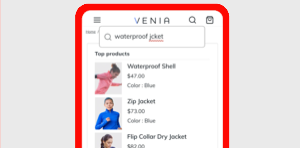

# Handbücher für Adobe Commerce-Dienste

Adobe bietet eine Sammlung von Commerce-, Integrations- und Datendiensten, die Händlern helfen, wichtige Geschäftskomponenten zu unterstützen.

<table>
<tr>
  <td valign="top" width="200">
      </td>
   <td valign="top"><a href="https://experienceleague.adobe.com/docs/commerce-merchant-services/live-search/overview.html"><strong>[!DNL Live Search]</strong></a>  
    
Implementieren Sie dieses KI-gestützte Suchwerkzeug, das intelligentere, schnellere und relevante Ergebnisse für B2C-Käufer liefert.

  </td>
   </tr>
<tr>
   <td valign="top" width="200">
       </td>
   <td valign="top">
   <a href="https://experienceleague.adobe.com/docs/commerce-merchant-services/product-recommendations/overview.html"><strong>[!DNL Product Recommendations]</strong></a>
    
Fügen Sie KI-gestützte Empfehlungen hinzu, die auf dem Kundenverhalten, beliebten Trends, der Produktähnlichkeit und mehr basieren.

  </td>
   </tr>
<tr>
    <td valign="top" width="200px">
       </td>
   <td valign="top"><a href="https://experienceleague.adobe.com/docs/commerce-merchant-services/catalog-service/guide-overview.html"> <strong>Catalog Service</strong></a>  
    
Geben Sie Ihren Kunden ein optimiertes Produkterlebnis, während Sie gleichzeitig die Leistung steigern, die Skalierbarkeit verbessern und Konversionen steigern.

  </td>
   </tr>
<tr>
  <td valign="top" width="200px">
    </td>
   <td valign="top"><a href="https://experienceleague.adobe.com/docs/commerce-merchant-services/payment-services/guide-overview.html"><strong>Zahlungsdienste</strong></a>   <em>(Für Magento Open Source verfügbar)</em>
    
Steigern Sie die Kundenzufriedenheit, indem Sie einfach verschiedene Zahlungsmethoden anbieten, darunter auch zinsfreie Zahlungseinsätze und einen einheitlichen Einblick in die Zahlungsverarbeitung, Bestellungen und Rechnungen.

  </td>
    </tr>
<tr>
  <td valign="top" width="200px">
    </td>
   <td valign="top"><a href="https://experienceleague.adobe.com/docs/commerce-merchant-services/quick-checkout/overview.html"><strong>Quick Checkout</strong></a>   <em>(Für Magento Open Source verfügbar)</em>
    
Durch schnelle und intuitive Einkaufserfahrung können Sie einmalige Kunden in treue Kontoinhaber umwandeln.

  </td>
    </tr>
<tr>
    <td valign="top">
       </td>
   <td valign="top"><a href="https://experienceleague.adobe.com/docs/commerce-merchant-services/store-fulfillment/guide-overview.html"> <strong>Store Fulfillment</strong></a>  <em>(Für Magento Open Source verfügbar)</em>
    
Überlegene Online-Käufe, die Wiederaufnahme des Kundenerlebnisses im Geschäft (BOPIS) und die Maximierung der Mitarbeiterproduktivität durch die Bereitstellung eines umfassenden Workflows, der über ein mobiles Gerät aktiviert wird.

  </td>
   </tr>
<tr>
    <td valign="top" width="200px">
       </td>
   <td valign="top"><a href="https://experienceleague.adobe.com/docs/commerce-channels/amazon/guide-overview.html"> <strong>Amazon-Vertriebskanal</strong></a>  <em>(Für Magento Open Source verfügbar)</em>
    
Integrieren Sie mit dem weltgrößten globalen Online-Shopping-Ziel, um Amazon-Verkäufe zu ermöglichen, Datenautomatisierung und -Synchronisation bereitzustellen, Amazon-Listen zu verwalten und vieles mehr über ein Dashboard.

  </td>
   </tr>
<tr>
    <td valign="top">
       </td>
   <td valign="top"><a href="https://experienceleague.adobe.com/docs/commerce-channels/channel-manager/guide-overview.html"> <strong>Kanalmanager</strong></a>  <em>(Für Magento Open Source verfügbar)</em>
    
Steigern Sie den Umsatz, erreichen Sie neue Kunden, optimieren Sie den Betrieb und sparen Sie Zeit durch die Integration in den Walmart Marketplace. Ermöglichen Sie es Mitarbeitern, die Verkäufe, Inventare und Preise von Walmart Marketplace nahtlos zu verwalten - alles in Commerce.

  </td>
   </tr>
</table>

## Verbindung zu Diensten

Die [Commerce Services Connector](saas.md) stellt die Integration für Ihre Adobe Commerce- oder Magento Open Source-Instanz mithilfe eines API-Schlüssels und eines privaten Schlüssels bereit. Bei Datendiensten (nur Adobe Commerce) können Sie auch den Datenraum in der Konfiguration angeben.
