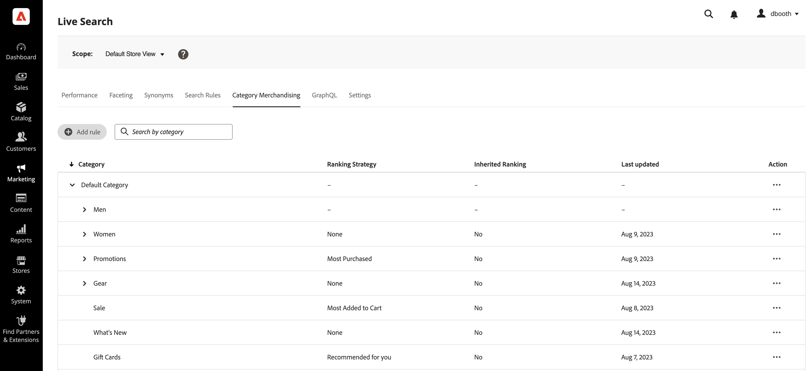

# Kategorie-Merchandising

KategorieMerchandising ermöglicht es den Eigentümern von Geschäften, [!DNL Live Search] Intelligente Rangfolge [Regeln](rules.md) auf Produktkategorien und Unterkategorien.

Auf die Funktion kann in Admin unter **Marketing** > SEO &amp; Suche > **[!DNL Live Search]** > **Kategorie-Merchandising**.

>[!NOTE]
>
>Kategorie-Merchandising ist verfügbar mit [!DNL Live Search] [3.0.0 oder höher](release-notes.md). Wenn die Registerkarte &quot;KategorieMerchandising&quot;angezeigt wird, aber keine Daten enthält, aktualisieren Sie die [!DNL Live Search] -Modul.

Die Ansicht &quot;Category Merchandising&quot;zeigt definierte Kategorieregeln mit Spalten für:

* Kategorie
* Ranking Strategy
* Vererbte Rangfolge
* Zuletzt aktualisiert
* Aktion

Sie können nach einer Kategorie oder Unterkategorie im Feld &quot;Suche nach Kategorie&quot;suchen.

## Rangstrategien

Kategorie-Merchandising verwendet dieselben Ranking-Typen wie bei [Einzelprodukte](rules-workspace.md).
Es gibt zwei Arten von Ranking: Intelligent und Manual.

**Intelligente Rangfolge** nutzt die Verhaltensdatenanalyse der Storefront durch [Adobe Sensei](https://www.adobe.com/sensei.html) um alle Produkte innerhalb ausgewählter Kategorien nach einem bestimmten Algorithmus zu sortieren. Sobald ein intelligentes Ranking ausgewählt wurde, wird erwartet, dass sich die spezifische Reihenfolge der Produkte im Laufe der Zeit ändert, da die zugrunde liegenden Daten von Adobe Sensei fortlaufend neu analysiert werden. So ändern sich zum Beispiel die beliebtesten Produkte im Laufe der Zeit automatisch, wenn sich die Voreinstellungen der Kunden ändern.
Intelligente Rangmethoden sind:

* Am häufigsten gekauft: Sortiert Produkte nach der Häufigkeit, mit der sie von Käufern in den letzten sieben Tagen gekauft wurden.
* Am häufigsten zum Warenkorb hinzugefügt: Sortiert Produkte nach der Häufigkeit, mit der sie von Käufern in den letzten sieben Tagen zum Warenkorb hinzugefügt wurden.
* Am häufigsten angezeigt: Sortiert Produkte nach der Häufigkeit, mit der sie von Käufern in den letzten sieben Tagen angesehen wurden.
* Empfohlen für Sie: Basierend auf dem bisherigen und aktuellen Verhalten jedes Käufers vor Ort sortiert Produkte nach der Wahrscheinlichkeit, dass der Käufer mit jedem Kontakt interagiert.
* Trends: Sortiert Produkte nach den jüngsten Popularitätssteigerungen basierend auf Ansichten.
* Keine: Sortiert Produkte in ihrer Standardreihenfolge.

**Manuelles Ranking** ermöglicht es Benutzern, die automatische Sortierungsreihenfolge des Produkts zu überschreiben, indem sie Regeln für manuelles Pin, Verstärken, Begraben und Ausblenden definieren.

## Übernommenes Ranking

Als Merchandiser möchten Sie vielleicht alle Damenbekleidungskategorien nach &quot;Trends&quot;sortieren können. Dazu gehören die Unterkategorien &quot;Damenhose&quot;, &quot;Damenhemden&quot; und &quot;Damenzubehör&quot;. Männer sollten nicht betroffen sein. Sie können vererbte Rankings verwenden, um dies zu erreichen.

Bei der Auswahl einer intelligenten Rangmethode für eine Kategorie oder Unterkategorie mit Unterkategorien können Sie die **Anwenden intelligenter Rankings auf Unterkategorien** -Option. Dadurch wird die Ranking-Methode auf alle Unterkategorien angewendet.

Diese Unterkategorien übernehmen diese Regel nun von der übergeordneten Kategorie (&quot;Ja&quot;in der Spalte &quot;Vererbte Rangfolge&quot;). In der Spalte Aktion sind nur folgende Optionen verfügbar: **Regel bearbeiten**, und **Details anzeigen**. Die **Löschen** für geerbte Regeln für Unterkategorien deaktiviert ist. Das Löschen der Vererbung von Unterkategorien erfordert das Rückgängigmachen der Vererbung von der übergeordneten Kategorie.

Für jede Kategorie oder Unterkategorie kann jeweils nur eine intelligente Rangfolge angewendet werden. Möglicherweise werden auch zusätzliche manuelle Ranglisten angewendet.

Wenn Sie einen Intelligent-Rang auf eine Kategorie anwenden und die **Intelligente Rangfolge auf Unterkategorien anwenden** -Option, werden alle intelligenten Rangfolgen überschrieben, die bereits auf die Unterkategorien angewendet wurden.

{width="700"}

Wenn Sie auf **Alle anzeigen**, wird ein Dialogfeld mit Details zu den vorgeschlagenen Änderungen geöffnet.

Wenn Sie eine intelligente Rangfolge direkt zu einer Kategorie hinzufügen, die über ein geerbtes intelligentes Ranking verfügt, wird die Vererbung durch das neue Intelligent-Ranking überschrieben.

Beim Löschen des Rangs Intelligent aus der Kategorie wird die Vererbung wieder hergestellt.
In beiden Szenarien werden alle manuellen Rankings beibehalten.

Wenn Sie einen Intelligent -Rang aus einer Kategorie entfernen und die Unterkategorie &quot;Vererbung&quot;ausgewählt ist, werden nur die geerbten Intelligent Rankings aus den Unterkategorien entfernt. Manuelle Rankings unterliegen nicht der Vererbung und bleiben bestehen.

Es wird ein Dialogfeld angezeigt, in dem erklärt wird, welche geerbten Unterkategorien von allen Änderungen betroffen sind, die Sie an einer übergeordneten Kategorie vornehmen.

{width="1200"}

## Erstellen einer Kategorieregel

So erstellen Sie eine Kategorieregel:

1. Klicken Sie auf **Regel hinzufügen** Schaltfläche.
1. Im _Kategorie auswählen_ Ansicht klicken Sie durch die Kategorien und Unterkategorien.
1. Aktivieren Sie das Kontrollkästchen, um die Kategorie auszuwählen, die Sie bewerten möchten.
1. Klicks **Anwenden**.

   

1. Im _Kategorieregel hinzufügen_ -Ansicht die intelligente Ranking-Methode auswählen, die Sie auf die Kategorie anwenden möchten.
Auf der Seite &quot;Kategorievorschau&quot;werden die tatsächlichen Ergebnisse des ausgewählten Ranges unter Verwendung Ihrer Live-Suchdaten angezeigt.
1. Klicks **Speichern und veröffentlichen** , um die Regel zu speichern.

Die [!DNL Live Search] -Dienst verarbeitet die Regel und aktiviert sie im Store, wenn sie fertig ist.

## Kategorieregel ändern

So ändern Sie eine vorhandene Regel:

1. Klicken Sie auf **...** in der Spalte Aktion und wählen Sie **Bearbeiten**.
1. Nehmen Sie in der Regelansicht &quot;Kategorie bearbeiten&quot;die erforderlichen Änderungen vor und klicken Sie auf **Speichern und veröffentlichen**.

Die Änderungen werden im Speicher angezeigt, wenn [!DNL Live Search] hat die Änderung verarbeitet.

## Kategorieregel löschen

So löschen Sie eine Kategorieregel:

1. Klicken Sie auf **...** in der Spalte Aktion und wählen Sie **Löschen**.
1. Im _Regel löschen_ modal, wählen Sie **Löschen** , um die Regel zu entfernen oder **Abbrechen** , um die Aktion abzubrechen.

## Manuelles Ranking

Mit der manuellen Rangordnung können Sie die durch intelligente Ranking-Regeln bestimmte Produktreihenfolge überschreiben (sofern vorhanden) und manuell steuern, wo Produkte in den Ergebnissen angezeigt werden.

Ereignisse sind Aktionen, die die Suchergebnisse ändern, wenn definierte Bedingungen erfüllt sind. Ein manuelles Ranking kann bis zu 25 Ereignisse aufweisen.

* Verstärken: Verschiebt ein Produkt in den Suchergebnissen höher.
* Bury: Verschiebt ein Produkt in den Suchergebnissen nach unten.
* Produkt veröffentlichen: Verschiebt ein Produkt an eine bestimmte Position in den Ergebnissen.
* Produkt ausblenden: Schließt ein Produkt aus den Suchergebnissen aus.

Erstellen Sie ein manuelles Ranking:

1. Richten Sie wie oben beschrieben eine intelligente Rangregel für eine Kategorie ein. Die Ergebnisse der Abfrage werden in der Ansicht &quot;Vorschau der Kategorieseite&quot;angezeigt. Hierbei werden Ihre tatsächlichen Live-Suchdaten verwendet, um eine Vorschau der Ergebnisse anzuzeigen.

1. Klicken Sie auf ein Produkt und ziehen Sie es in die Ansicht &quot;Vorschau der Kategorieseite&quot;. Ziehen Sie es an die gewünschte Position. Die Felder Produkt und Position werden automatisch im Bereich Ereignisse ausgefüllt.

Sie können auch auf das Pin-Symbol klicken, um ein Produkt an seiner aktuellen Position zu veröffentlichen. Verwenden Sie das Kontextmenü mit den Auslassungspunkten, um &quot;Nach oben pin&quot;oder &quot;Nach unten pinnen&quot;zu verwenden.

So fügen Sie ein Ereignis manuell hinzu:

1. Klicken Sie unter &quot;Manuelles Ranking&quot;auf die **Ereignis auswählen** und wählen Sie ein Ereignis aus, das ausgeführt werden soll, wenn die zugehörigen Bedingungen erfüllt sind.
1. Geben Sie den Namen des Produkts ein, das Sie beeinflussen möchten. Bei der Eingabe werden Produkte vorgeschlagen.
1. Wählen Sie für mehrere Ereignisse alle anderen Ereignisse aus, die bei Erfüllung von Bedingungen Trigger werden sollen.
