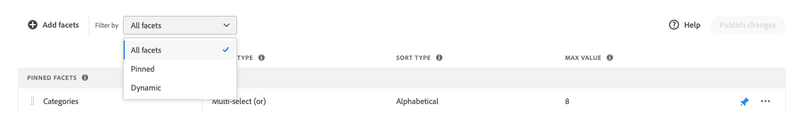

# Facets verwalten

Befolgen Sie diese Anweisungen, um die Eigenschaften vorhandener Facetten zu aktualisieren oder ihre Darstellung im Storefront zu ändern.

## Preisfacettengruppierungen konfigurieren

Siehe [Einstellungen](settings.md) um Preisfacettenintervalle und -gruppierungen zu konfigurieren.

## Facette bearbeiten

1. Suchen Sie die Facette, die Sie bearbeiten möchten.
1. Wenn die Liste viele Facetten enthält, legen Sie *Filtern nach* auf einen der folgenden Werte:

   * Angeheftet
   * Dynamik

   Weitere Informationen finden Sie unter [Facettentypen](facets-type.md).

   

1. Um die Facetteneigenschaften zu bearbeiten, klicken Sie auf **Mehr** (...) Optionen.
1. Klicken **Bearbeiten**

   

1. Führen Sie einen der folgenden Schritte aus, um die Facettenbeschriftung zu bearbeiten:

   * Für [!DNL Commerce] storefront, bearbeiten Sie die [Attributbezeichnung](https://experienceleague.adobe.com/docs/commerce-admin/catalog/product-attributes/product-attributes.html).
   * Klicken Sie bei einer Headless-Implementierung auf den Wert in der ersten Spalte und bearbeiten Sie den Text nach Bedarf.

   

1. (Nur Headless) Um die Methode zu ändern, die zum Sortieren von Facettenwerten verwendet wird, klicken Sie auf den Wert im *Sortiertyp* und wählen Sie eine der folgenden Optionen:

   * Alphabetisch
   * Count

   

1. Im **Max. Wert** festlegen, legen Sie die maximale Anzahl (von 0 bis 10) der Facettenfilterwerte fest, die im Storefront angezeigt werden sollen.
1. Wenn Sie fertig sind, klicken Sie auf **Speichern**.
Ihre Änderungen werden erst dann in der Storefront angezeigt, nachdem sie veröffentlicht wurden.

## Facette des Pins/Entpin

Der Pin ändert die Farbe, wenn darauf geklickt wird, und wird verwendet, um die Facette in die *Angeheftete Facetten* oder *Dynamische Facetten* Abschnitt.

1. So veröffentlichen Sie eine Facette am oberen Rand des *Filter* Liste, suchen Sie die Facette im *Dynamische Facetten* und klicken Sie auf die graue Nadel ().
Der Stift wird blau und die Facette wechselt zur *Angeheftete Facetten* Abschnitt.
1. Um eine Facette zu entschlüsseln, suchen Sie die Facette im *Angeheftete Facetten* und klicken Sie auf den blauen Stift ().
Die Nadel wird grau und die Facette wechselt zur *Dynamische Facetten* Abschnitt.

   

## Fixierte Facette verschieben

>[!NOTE]
>
>Die Reihenfolge von fixierten Facetten wird nur in Headless-Implementierungen unterstützt. Wenn geordnete Facetten benötigt werden, verwenden Sie die [!DNL Live Search] PLP-Widget.

Die Reihenfolge der fixierten Facetten kann geändert werden, indem die Zeile an eine andere Position verschoben wird. Verfestigte Facetten haben eine *Verschieben* Symbol () am Anfang der Zeile. Im Gegensatz zu fixierten Facetten können dynamische Facetten nicht verschoben werden.

1. Suchen Sie die Facette im *Angeheftete Facetten* der Liste.
1. Verwenden Sie die **Verschieben** (), um die Zeile an eine neue Position im *Angeheftete Facetten* Abschnitt.
Nach der Veröffentlichung der Änderungen werden die neu sortierten Facetten in der Storefront angezeigt *Filter* Liste.

## Facette löschen

1. Suchen Sie die Facette in der Liste und klicken Sie auf **Mehr** (...) Optionen.
1. Klicken **Löschen**.
1. Wenn Sie zur Bestätigung aufgefordert werden, klicken Sie auf **Facette löschen**.
Die Facette wird aus der Storefront entfernt, nachdem die Änderungen veröffentlicht wurden.

## Veröffentlichungsänderungen

1. Um die Storefront mit Ihren Änderungen zu aktualisieren, klicken Sie auf **Veröffentlichungsänderungen**.
1. Warten Sie etwa 15 Minuten, bis die Aktualisierungen in Ihrem Store angezeigt werden.
