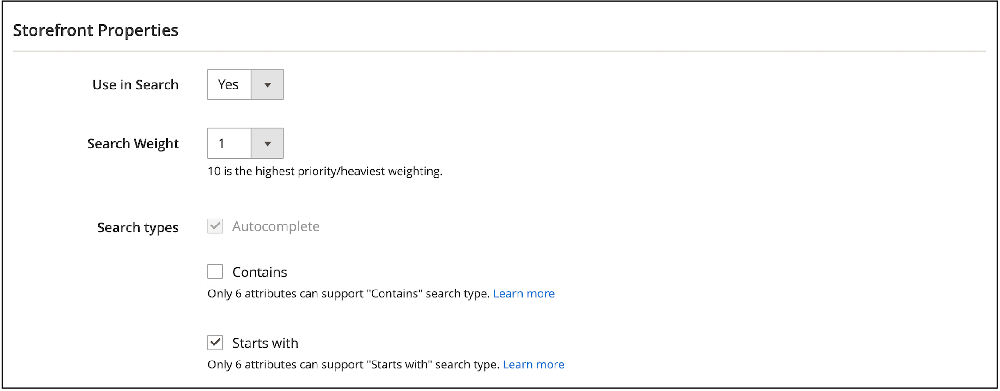

# Für Erfolg mit [!DNL Live Search] einrichten

Adobe Commerce [!DNL Live Search] und [[!DNL Catalog Service]](../catalog-service/guide-overview.md) arbeiten zusammen, um eine leistungsfähige, relevante und intuitive Suchlösung bereitzustellen, mit der Ihre Kunden schnell genau das finden können, was sie benötigen. Genauer gesagt überdeckt [!DNL Catalog Service] Ihre Katalogdaten für SaaS-Dienste, z. B. [!DNL Live Search].

Dieser Artikel enthält schrittweise Anweisungen zur Implementierung von [!DNL Live Search] mit [!DNL Catalog Service].

>[!IMPORTANT]
>
>Wenn es um die Site-Suche geht, bietet Ihnen Adobe Commerce Optionen. Lesen Sie vor der Implementierung unbedingt [Grenzen und Beschränkungen](boundaries-limits.md) , um sicherzustellen, dass [!DNL Live Search] Ihren Geschäftsanforderungen entspricht.

## Zielgruppe

Dieser Artikel richtet sich an Entwickler oder Systemintegratoren in Ihrem Team, die für die Installation und Konfiguration Ihrer Adobe Commerce-Instanz zuständig sind.

## Voraussetzungen

- [Adobe Commerce](https://business.adobe.com/products/magento/magento-commerce.html) 2.4.4+
- PHP-Version 8.1, 8.2 oder 8.3
- [!DNL Composer]

## Unterstützte Plattformen

- Adobe Commerce on Cloud (ECE) : 2.4.4+
- Adobe Commerce On-Premise (EE) : 2.4.4+

## Workflow-Übersicht

Auf hoher Ebene erfordert das Onboarding von [!DNL Live Search], dass Sie:

1. [Installieren](#1-install-the-live-search-extension) der [!DNL Live Search]-Erweiterung
1. [Konfigurieren](#2-configure-api-keys) der API-Schlüssel
1. [Synchronisieren](#3-sync-your-catalog-data) Ihrer Katalogdaten
1. [Überprüfen](#4-verify-that-the-data-was-exported) , ob die Katalogdaten exportiert wurden
1. [Konfigurieren](#5-configure-the-data) der Daten
1. [Testen](#6-test-the-connection) der Verbindung
1. [Überprüfen](#7-validate-events-are-capturing-data), ob Ereignisse Daten erfassen
1. [Anpassen](#8-customize-for-your-storefront) der Storefront

## 1. Installieren Sie die [!DNL Live Search] -Erweiterung

[!DNL Live Search] wird als Erweiterung von [Adobe Marketplace](https://commercemarketplace.adobe.com/magento-live-search.html) bis [Composer](https://getcomposer.org/) installiert. Nach der Installation und Konfiguration von [!DNL Live Search] beginnt Adobe [!DNL Commerce] mit der Freigabe von Such- und Katalogdaten für SaaS-Dienste. An dieser Stelle können Benutzer von *Admin* Suchfacetten, Synonyme und Merchandising-Regeln einrichten, anpassen und verwalten.

>[!NOTE]
>
>Ab [!DNL Live Search] 3.0.2 ist die [!DNL Catalog Service] -Erweiterung im Paket mit der [!DNL Live Search] -Installation enthalten.

1. Vergewissern Sie sich, dass [cron-Aufträge](https://experienceleague.adobe.com/en/docs/commerce-operations/configuration-guide/cli/configure-cron-jobs) und [Indexer](https://experienceleague.adobe.com/en/docs/commerce-admin/systems/tools/index-management) ausgeführt werden.

   >[!IMPORTANT]
   >
   >Aufgrund der Ankündigung zum Ende der Unterstützung für Elasticsearch 7 vom August 2023 wird empfohlen, dass alle Adobe Commerce-Kunden zur OpenSearch 2.x-Suchmaschine migrieren. Weitere Informationen zur Migration Ihrer Suchmaschine während eines Produkt-Upgrades finden Sie unter [Migration zu OpenSearch](https://experienceleague.adobe.com/en/docs/commerce-operations/upgrade-guide/prepare/opensearch-migration) im _Upgrade-Handbuch_.

1. Laden Sie das Paket `live-search` vom [Adobe Marketplace](https://commercemarketplace.adobe.com/magento-live-search.html) herunter.

1. Führen Sie Folgendes über die Befehlszeile aus:

   ```bash
   composer require magento/live-search
   ```

   Wenn Sie die Erweiterung [!DNL Live Search] zu einer Adobe Commerce-Installation vom Typ **new** hinzufügen, führen Sie den folgenden Befehl aus, um [!DNL OpenSearch] und die zugehörigen Module vorübergehend zu deaktivieren, und installieren Sie [!DNL Live Search]. Fahren Sie dann mit Schritt 4 fort.

   ```bash
      bin/magento module:disable Magento_Elasticsearch Magento_Elasticsearch7 Magento_OpenSearch Magento_ElasticsearchCatalogPermissions Magento_InventoryElasticsearch Magento_ElasticsearchCatalogPermissionsGraphQl
   ```

   Wenn Sie die Erweiterung [!DNL Live Search] zu einer vorhandenen Adobe Commerce-Installation von **2} hinzufügen, führen Sie Folgendes aus, um die [!DNL Live Search] -Module zu deaktivieren, die Storefront-Suchergebnisse bereitstellen.** Fahren Sie dann mit Schritt 4 fort:

   ```bash
      bin/magento module:disable Magento_LiveSearchAdapter Magento_LiveSearchStorefrontPopover Magento_LiveSearchProductListing 
   ```

   [!DNL Elasticsearch] verwaltet weiterhin Suchanforderungen aus dem Store, während der [!DNL Live Search]-Dienst Katalogdaten synchronisiert und Produkte im Hintergrund indiziert.

1. Führen Sie Folgendes aus:

   ```bash
   bin/magento setup:upgrade
   ```

1. Stellen Sie sicher, dass die folgenden [Indexer](https://experienceleague.adobe.com/en/docs/commerce-admin/systems/tools/index-management) auf &quot;Nach Zeitplan aktualisieren&quot;eingestellt sind:

   - Produkt-Feed
   - Produktvarianten-Feed
   - Katalogattribut-Feed
   - Produktpreis-Feed
   - Umfang des Website-Daten-Feeds
   - Umfang des Daten-Feeds für Kundengruppen
   - Kategorien-Feed
   - Kategorieberechtigungs-Feed

1. Wenn Sie [!DNL Live Search] auf einer neuen Commerce-Instanz installieren, sind Sie fertig und können zu [2 überspringen. Konfigurieren Sie den Abschnitt &quot;API-Schlüssel](#2-configure-api-keys)&quot;. Wenn Sie die Live-Suche in einer vorhandenen Commerce-Instanz installieren, fahren Sie mit dem nächsten Schritt fort.

1. Führen Sie die folgenden Befehle aus, um die Erweiterung [!DNL Live Search] zu aktivieren, [!DNL OpenSearch] zu deaktivieren und `setup` auszuführen.

   ```bash
   bin/magento module:enable Magento_LiveSearchAdapter Magento_LiveSearchStorefrontPopover  Magento_LiveSearchProductListing 
   ```

   ```bash
   bin/magento module:disable Magento_Elasticsearch Magento_Elasticsearch6 Magento_Elasticsearch7 Magento_ElasticsearchCatalogPermissions Magento_InventoryElasticsearch 
   Magento_ElasticsearchCatalogPermissionsGraphQl
   ```

   ```bash
   bin/magento setup:upgrade
   ```

### Installieren der [!DNL Live Search] Beta-Version

>[!IMPORTANT]
>
>Die folgende Funktion befindet sich in der Beta-Phase. Um an der Beta-Version teilzunehmen, senden Sie eine E-Mail-Anfrage an [commerce-store-front-services](mailto:commerce-storefront-services@adobe.com).

Diese Beta-Version unterstützt drei neue Funktionen in der [`productSearch`-Abfrage](https://developer.adobe.com/commerce/services/graphql/live-search/product-search/):

- **Ebenensuche** - Suche in einem anderen Suchkontext - Mit dieser Funktion können Sie bis zu zwei Ebenen der Suche für Ihre Suchabfragen durchführen. Beispiel:

   - **Suche auf Ebene 1** - Suchen Sie nach &quot;motor&quot;auf &quot;product_attribute_1&quot;.
   - **Suche auf Ebene 2** - Suchen Sie nach &quot;Teilenummer 123&quot;auf &quot;product_attribute_2&quot;. In diesem Beispiel wird in den Ergebnissen nach &quot;motor&quot;nach &quot;part number 123&quot;gesucht.

  Die Ebenensuche ist für die Suchindexierung `startsWith` und die Suchindexierung `contains` wie unten beschrieben verfügbar:

- **startsWith search indexation** - Suche mithilfe der `startsWith` -Indexierung. Diese neue Funktion ermöglicht Folgendes:

   - Suchen nach Produkten, bei denen der Attributwert mit einer bestimmten Zeichenfolge beginnt.
   - Konfiguration einer Suche &quot;endet mit&quot;, damit Käufer nach Produkten suchen können, bei denen der Attributwert mit einer bestimmten Zeichenfolge endet. Um die Suche &quot;endet mit&quot;zu aktivieren, muss das Produktattribut umgekehrt aufgenommen werden und der API-Aufruf sollte auch eine umgekehrte Zeichenfolge sein.

- **enthält Suchindexierung** - Suchen Sie nach einem Attribut, das die Indexierung enthält. Diese neue Funktion ermöglicht Folgendes:

   - Suchen nach einer Abfrage in einer größeren Zeichenfolge. Beispiel: Ein Käufer sucht in der Zeichenfolge &quot;HAPE-123&quot;nach der Produktnummer &quot;PE-123&quot;.

      - Hinweis: Dieser Suchtyp unterscheidet sich von der vorhandenen [Phrasensuche](https://developer.adobe.com/commerce/services/graphql/live-search/product-search/#phrase), die eine automatische Suche durchführt. Wenn Ihr Produktattributwert beispielsweise &quot;Hosen im Freien&quot;lautet, gibt die Wortgruppensuche eine Antwort für &quot;out pan&quot;zurück, gibt jedoch keine Antwort für &quot;oor ants&quot;zurück. Eine enthält Suche gibt jedoch eine Antwort für &quot;oor ants&quot;zurück.

Diese neuen Bedingungen verbessern den Filtermechanismus für Suchabfragen, um die Suchergebnisse zu verfeinern. Diese neuen Bedingungen wirken sich nicht auf die Hauptsuchabfrage aus.

Sie können diese neuen Bedingungen auf Ihrer Suchergebnisseite implementieren. Sie können beispielsweise einen neuen Abschnitt auf der Seite hinzufügen, in dem der Käufer seine Suchergebnisse weiter verfeinern kann. Sie können es Kunden ermöglichen, bestimmte Produktattribute auszuwählen, z. B. &quot;Hersteller&quot;, &quot;Artikelnummer&quot;und &quot;Beschreibung&quot;. Von dort aus suchen sie in diesen Attributen mit den Bedingungen `contains` oder `startsWith`. Eine Liste der durchsuchbaren [Attribute](https://experienceleague.adobe.com/en/docs/commerce-admin/catalog/product-attributes/attributes-input-types) finden Sie im Administratorhandbuch.

1. Um die Beta-Version zu installieren, fügen Sie Ihrem Projekt die folgende Abhängigkeit hinzu:

   ```bash
   composer require magento/module-live-search-search-types:"^1.0.0-beta1"
   ```

1. Übertragen Sie die Änderungen und übertragen Sie sie in Ihre `composer.json` - und `composer.lock` -Dateien in Ihr Cloud-Projekt. [Weitere Infos](https://experienceleague.adobe.com/en/docs/commerce-cloud-service/user-guide/configure-store/extensions#upgrade-an-extension).

   Diese Beta-Version fügt **[!UICONTROL Search types]** Checkboxes für **[!UICONTROL Autocomplete]**, **[!UICONTROL Contains]** und **[!UICONTROL Starts with]** im Admin hinzu. Außerdem wird die GraphQL-API [`productSearch`](https://developer.adobe.com/commerce/services/graphql/live-search/product-search/#filtering-using-search-capability) aktualisiert, um diese neuen Suchfunktionen aufzunehmen.

1. Legen Sie in Admin [ ein Produktattribut](https://experienceleague.adobe.com/en/docs/commerce-admin/catalog/product-attributes/product-attributes-add#step-5-describe-the-storefront-properties) fest, das durchsuchbar ist, und geben Sie die Suchfunktion für dieses Attribut an, z. B. **Enthält** (Standard) oder **Beginnt mit**. Sie können maximal sechs Attribute festlegen, die für **Enthält** aktiviert werden sollen, sowie sechs Attribute, die für **Beginnt mit** aktiviert werden sollen. Beachten Sie bei der Beta-Version, dass der Administrator diese Einschränkung nicht durchsetzt, sie jedoch bei API-Suchen erzwungen wird.

   

1. In der [Entwicklerdokumentation](https://developer.adobe.com/commerce/services/graphql/live-search/product-search/#filtering-using-search-capability) erfahren Sie, wie Sie Ihre [!DNL Live Search] -API-Aufrufe mit den neuen Suchfunktionen `contains` und `startsWith` aktualisieren.

### Feldbeschreibungen

| Feld | Beschreibung |
|--- |--- |
| `Autocomplete` | Standardmäßig aktiviert und kann nicht geändert werden. Mit `Autocomplete` können Sie `contains` im [Suchfilter](https://developer.adobe.com/commerce/services/graphql/live-search/product-search/#filtering) verwenden. Hier gibt die Suchabfrage in `contains` eine Suchanfrage vom Typ autocomplete zurück. Adobe empfiehlt die Verwendung dieser Art der Suche nach Beschreibungsfeldern, die in der Regel mehr als 50 Zeichen enthalten. |
| `Contains` | Aktiviert die Suche &quot;Text, der in einer Zeichenfolge enthalten ist&quot;anstelle einer automatischen Suche. Verwenden Sie `contains` im [Suchfilter](https://developer.adobe.com/commerce/services/graphql/live-search/product-search/#filtering-using-search-capability). Weitere Informationen finden Sie unter [Einschränkungen](https://developer.adobe.com/commerce/services/graphql/live-search/product-search/#limitations) . |
| `Starts with` | Ermöglicht Ihnen die Abfrage von Zeichenfolgen, die mit einem bestimmten Wert beginnen. Verwenden Sie `startsWith` im [Suchfilter](https://developer.adobe.com/commerce/services/graphql/live-search/product-search/#filtering-using-search-capability). |

## 2. API-Schlüssel konfigurieren

Der Adobe Commerce-API-Schlüssel und der zugehörige private Schlüssel sind erforderlich, um [!DNL Live Search] mit einer Installation von Adobe Commerce zu verbinden. Der API-Schlüssel wird im Konto des [!DNL Commerce] -Lizenzinhabers generiert und verwaltet, der ihn für den Entwickler oder den Systemintegrator freigeben kann. Der Entwickler kann dann die SaaS-Datenräume im Auftrag des Lizenzinhabers erstellen und verwalten. Wenn Sie bereits über eine Reihe von API-Schlüsseln verfügen, müssen Sie diese nicht neu generieren.

Erfahren Sie, wie Sie Ihre API-Schlüssel im Artikel [Commerce Services Connector](../landing/saas.md) konfigurieren.

## 3. Ihre Katalogdaten synchronisieren {#synchronize-catalog-data}

[!DNL Live Search] verschiebt Katalogdaten in die Adobe SaaS-Infrastruktur. Die Daten werden indiziert und die Suchergebnisse werden von diesem Index direkt an die Storefront übermittelt. Je nach Größe und Komplexität kann die Indizierung zwischen 30 Minuten und einigen Stunden dauern.

Um die erste Synchronisierung Ihrer Katalogdaten mit SaaS-Diensten zu starten, führen Sie die folgenden Befehle in dieser Reihenfolge aus:

```bash
bin/magento saas:resync --feed productattributes
bin/magento saas:resync --feed products
bin/magento saas:resync --feed scopesCustomerGroup
bin/magento saas:resync --feed scopesWebsite
bin/magento saas:resync --feed prices
bin/magento saas:resync --feed productoverrides
bin/magento saas:resync --feed variants
bin/magento saas:resync --feed categories
bin/magento saas:resync --feed categoryPermissions
```

Wenn Sie diese Befehle ausführen, beginnt die erste Synchronisierung Ihrer Katalogdaten mit SaaS-Diensten.

>[!WARNING]
>
> Während die Daten indiziert und synchronisiert sind, sind die Such- und Kategoriedurchsuchvorgänge nicht in der Storefront verfügbar. Je nach Größe Ihres Katalogs kann es mindestens eine Stunde dauern, bis `cron` ausgeführt wird, bis der Prozess Ihre Daten mit den SaaS-Diensten synchronisiert.

### Fortschritt der Synchronisierung überwachen

Sie können die synchronisierten und freigegebenen Daten über das [Data Management Dashboard](https://experienceleague.adobe.com/en/docs/commerce-admin/systems/data-transfer/data-dashboard) anzeigen. Dieses Dashboard bietet wertvolle Einblicke in die Verfügbarkeit von Produktdaten für Ihre Storefront, sodass sie Ihren Käufern umgehend angezeigt werden können.


Sie können auch Synchronisierungsbefehle ausführen und Fehler im Synchronisierungsprozess mithilfe der Protokolle [Commerce CLI](../data-export/data-export-cli-commands.md#troubleshooting) und der Datenexport-Erweiterung beheben.

#### Zukünftige Produktaktualisierungen

Nach der ersten Synchronisierung kann es bis zu 15 Minuten dauern, bis inkrementelle Produktaktualisierungen für die Storefront-Suche verfügbar sind. Weitere Informationen finden Sie unter [Streaming von Produktaktualisierungen](indexing.md) in der Indizierungsdokumentation.

## 4. Überprüfen, ob die Daten exportiert wurden {#verify-export}

Um zu überprüfen, ob Ihre Katalogdaten aus Adobe Commerce exportiert und mit [!DNL Live Search] synchronisiert wurden, haben Sie einige Optionen:

- Suchen Sie in den folgenden Tabellen nach Einträgen:

   - `cde_products_feed`
   - `cde_product_attributes_feed`

  >[!NOTE]
  >
  >Wenn der Fehler `table does not exist` auftritt, suchen Sie nach Einträgen in den Tabellen `catalog_data_exporter_products` und `catalog_data_exporter_product_attributes`. Diese Tabellennamen werden in [!DNL Live Search] -Versionen vor 4.2.1 verwendet.

- Verwenden Sie den [GraphQL-Playground](https://developer.adobe.com/commerce/services/graphql/live-search/) mit der Standardabfrage, um Folgendes zu überprüfen:

   - Die zurückgegebene Produktanzahl entspricht in etwa dem, was Sie für die Store-Ansicht erwarten.
   - Facets werden zurückgegeben.

Weitere Hilfe finden Sie unter [[!DNL Live Search] Nicht synchronisierter Katalog](https://experienceleague.adobe.com/en/docs/commerce-knowledge-base/kb/troubleshooting/miscellaneous/live-search-catalog-data-sync) in der Support-Wissensdatenbank.

## 5. Konfigurieren der Daten

Durch die korrekte Konfiguration Ihrer Produktdaten werden gute Suchergebnisse für Ihre Kunden sichergestellt. In diesem Abschnitt aktivieren Sie die Widgets zur Produktliste und weisen Kategorien zu.

### Widgets zur Produktliste aktivieren

Wenn Sie [!DNL Live Search] 4.0.0+ installieren, sind die Widgets für die Produktliste standardmäßig aktiviert. Wenn Widgets aktiviert sind, wird eine andere UI-Komponente für die Suchergebnisseite und die Produktlistenseite zum Durchsuchen von Kategorien verwendet. Diese UI-Komponente führt direkte Aufrufe an die [Catalog Service-API](https://developer.adobe.com/commerce/services/graphql/live-search/product-search/) durch, was zu schnelleren Antwortzeiten führt.

Wenn Sie eine [!DNL Live Search] -Version vor 4.0.0+ haben, müssen Sie das Widget &quot;Produktliste&quot;manuell aktivieren.

1. Navigieren Sie vom *Admin* zu **[!UICONTROL Stores]** > _[!UICONTROL Settings]_>**[!UICONTROL Configuration]**.
1. Wählen Sie unter &quot;**[!UICONTROL Live Search]**&quot;die Option &quot;**[!UICONTROL Storefront Features]**&quot;.
1. Setzen Sie **[!UICONTROL Enable Product Listing Widgets]** auf `Yes`.

   

Wenn Sie diese Konfiguration ändern, wird die Meldung `Page cache is invalidated` angezeigt. Sie müssen den Magento-Cache leeren, um Ihre Änderung zu speichern.

1. Greifen Sie auf die Seite [Cache-Verwaltung](https://experienceleague.adobe.com/en/docs/commerce-admin/systems/tools/cache-management) zu, indem Sie einen der folgenden Schritte ausführen:

   - Klicken Sie auf den Link **[!UICONTROL Cache Management]** in der Meldung über dem Arbeitsbereich.
   - Wechseln Sie in der Seitenleiste _Admin_ zu **[!UICONTROL System]** > _[!UICONTROL Tools]_>**[!UICONTROL Cache Management]**.

1. Wählen Sie die **Konfiguration** [!UICONTROL Cache Type] aus und klicken Sie auf **[!UICONTROL Flush Magento Cache]**.

   Änderungen an der Storefront werden unmittelbar nach dem Leeren des Caches vorgenommen.

### Zuweisen von Kategorien

Produkte, die in [!DNL Live Search] zurückgegeben werden, müssen einer [Kategorie](https://experienceleague.adobe.com/en/docs/commerce-admin/catalog/categories/categories) zugewiesen werden. In Luma beispielsweise werden Produkte in Kategorien wie &quot;Männer&quot;, &quot;Frauen&quot;und &quot;Zahnrad&quot;unterteilt. Unterkategorien sind auch &quot;Tops&quot;, &quot;Bottom&quot; und &quot;Watches&quot;. Diese Kategoriezuweisungen verbessern die Granularität beim Filtern.

## 6. Verbindung testen {#test-connection}

Testen Sie mit Ihren Katalogdaten jetzt in SaaS, um sicherzustellen, dass in den folgenden Szenarien Produktdaten zurückgegeben werden:

- Das Feld [!UICONTROL Search] gibt die Ergebnisse korrekt zurück
- Kategoriesuche gibt Ergebnisse korrekt zurück
- Facets sind als Filter auf Suchergebnisseiten verfügbar

Wenn alles ordnungsgemäß funktioniert, ist [!DNL Live Search] installiert, verbunden und einsatzbereit.

Wenn Sie im Storefront auf Probleme stoßen, überprüfen Sie die Datei &quot;`var/log/system.log`&quot;auf API-Kommunikationsfehler oder -fehler auf der Dienstseite.

Um [!DNL Live Search] über eine Firewall zuzulassen, fügen Sie `commerce.adobe.io` zur Zulassungsliste hinzu.

## 7. Stellen Sie sicher, dass Ereignisse Daten erfassen.

Stellen Sie sicher, dass die auf Ihrer Site bereitgestellten Storefront-Ereignisse funktionieren. Dies ist besonders für Headless-Implementierungen wichtig.

- Überprüfen Sie die für [!DNL Live Search] erforderlichen [Ereignisse](events.md).
- Stellen Sie sicher, dass das Dashboard [Live-Suche](performance.md) Daten aus Ihrer/Ihren Nicht-Produktionsumgebung(en) anzeigt.
- [Ereignisabruf überprüfen](../product-recommendations/verify.md). Während sich diese Seite im [!DNL Product Recommendations] -Handbuch befindet, gelten auch die Überprüfungsschritte für [!DNL Live Search].

## 8. Benutzerspezifisch für Ihre Storefront

Sie haben Ihre Daten installiert, synchronisiert, validiert und konfiguriert. [!DNL Live Search] Der nächste Schritt besteht darin sicherzustellen, dass die [!DNL Live Search] -Widgets dem Aussehen und dem Erscheinungsbild Ihres Stores entsprechen.

Sie können die Popover- und PLP-Widgets gestalten, indem Sie nach Bedarf benutzerdefinierte CSS-Regeln definieren. Siehe [Formatieren von Popover-Elementen ](storefront-popover.md#styling-popover-example) und [Produktanlistungs-Seiten-Widget](plp-styling.md#styling-example).

Wenn Sie die Funktionalität der Widgets erweitern möchten, ist der Quellcode für jedes in einem öffentlichen Repository verfügbar.
In diesem Szenario können Sie die JavaScript an Ihre eigenen Anforderungen anpassen und dann Ihren benutzerdefinierten Code auf Ihrem CDN hosten. Dieses benutzerdefinierte Skript kommuniziert mit dem [!DNL Live Search] -Dienst und gibt die Ergebnisse wie normal zurück, sodass Sie die Funktionalität des Widgets steuern können.

- [PLP widget repo](https://github.com/adobe/storefront-product-listing-page)
- [Suchleiste repo](https://github.com/adobe/storefront-search-as-you-type)

## Aktualisieren von [!DNL Live Search] {#update}

Führen Sie vor der Aktualisierung der Live Search-Suche Folgendes über die Befehlszeile aus, um die installierte Live Search-Version zu überprüfen:

```bash
composer show magento/module-live-search | grep version
```

Um [!DNL Live Search] zu aktualisieren, führen Sie Folgendes über die Befehlszeile aus:

```bash
composer update magento/live-search --with-dependencies
```

Um auf eine Hauptversion wie 3.1.1 auf 4.0.0 zu aktualisieren, bearbeiten Sie die Stammdatei des Projekts [!DNL Composer] `.json` wie folgt:

1. Wenn Ihre derzeit installierte `magento/live-search` -Version `3.1.1` oder niedriger ist und Sie auf Version `4.0.0` oder höher aktualisieren, führen Sie vor dem Upgrade den folgenden Befehl aus:

   ```bash
   bin/magento module:enable Magento_AdvancedSearch
   ```

   Führen Sie den folgenden Befehl aus, um Informationen zur derzeit installierten Version von `magento/live-search` zu erhalten:

   ```bash
   composer show magento/live-search
   ```

1. Öffnen Sie die Stammdatei `composer.json` und suchen Sie nach `magento/live-search`.

1. Aktualisieren Sie im Abschnitt `require` die Versionsnummer wie folgt:

   ```json
   "require": {
      ...
      "magento/live-search": "^4.0",
      ...
    }
   ```

1. Speichern Sie `composer.json`. Führen Sie dann Folgendes über die Befehlszeile aus:

   ```bash
   composer update magento/live-search --with-dependencies
   ```

## Deinstallieren von [!DNL Live Search] {#uninstall}

Informationen zum Deinstallieren von [!DNL Live Search] finden Sie unter [Module deinstallieren](https://experienceleague.adobe.com/en/docs/commerce-operations/installation-guide/tutorials/uninstall-modules).

## [!DNL Live Search] Pakete {#packages}

Die Erweiterung [!DNL Live Search] besteht aus den folgenden Paketen:

| Paket | Beschreibung |
|--- |--- |
| `module-live-search` | Ermöglicht Händlern, ihre Sucheinstellungen für Facetten, Synonyme, Abfrageregeln usw. zu konfigurieren und bietet Zugriff auf einen schreibgeschützten GraphQL-Player, auf dem Abfragen vom *Admin* getestet werden können. |
| `module-live-search-adapter` | Sendet Suchanfragen von der Storefront an den Dienst [!DNL Live Search] und rendert die Ergebnisse in der Storefront. <br /> - Kategoriedurchsuchen - Routen von Anforderungen aus der Storefront [oberste Navigation](https://experienceleague.adobe.com/en/docs/commerce-admin/catalog/catalog/navigation/navigation-top) zum Suchdienst.<br /> - Globale Suche - Routet Anfragen aus dem Feld [Schnellsuche](https://experienceleague.adobe.com/en/docs/commerce-admin/catalog/catalog/search/search) oben rechts im Storefront zum Dienst [!DNL Live Search]. |
| `module-live-search-storefront-popover` | Ein Popup &quot;Suche beim Eingeben&quot;ersetzt die standardmäßige Schnellsuche und gibt Daten und Miniaturansichten der Top-Suchergebnisse zurück. |

## [!DNL Live Search] dependencies {#dependencies}

Das [!DNL Composer] -Metapaket zur Installation der [!DNL Live Search] -Erweiterung umfasst die folgenden Modulabhängigkeiten.

- `magento/module-saas-catalog`
- `magento/module-saas-category`
- `magento/module-saas-category-permissions`
- `magento/module-saas-product-override`
- `magento/module-saas-product-variant`
- `magento/module-saas-price`
- `magento/module-saas-scopes`
- `magento/module-bundle-product-data-exporter`
- `magento/module-catalog-inventory-data-exporter`
- `magento/module-catalog-url-rewrite-data-exporter`
- `magento/module-configurable-product-data-exporter`
- `magento/module-parent-product-data-exporter`
- `magento/module-gift-card-product-data-exporter`
- `magento/module-bundle-product-override-data-exporter`
- `data-services`
- `services-id`

## Erweiterte Konzepte

Die folgenden Abschnitte enthalten erweiterte Themen bei Verwendung von [!DNL Live Search] und [!DNL Catalog Service].

### Endpunkt

[!DNL Live Search] kommuniziert über den Endpunkt bei `https://catalog-service.adobe.io/graphql`.

Da [!DNL Live Search] keinen Zugriff auf die gesamte Produktdatenbank hat, weisen die zentralen GraphQL-APIs für [!DNL Live Search] GraphQL und Commerce keine vollständige Parität auf.

Adobe empfiehlt, die SaaS-APIs direkt aufzurufen - insbesondere den Catalog Service-Endpunkt.

- Steigern Sie die Leistung und reduzieren Sie die Prozessorlast durch Umgehen der Commerce-Datenbank/des Graphql-Prozesses.
- Nutzen Sie die [!DNL Catalog Service] -Föderation, um [!DNL Live Search], [!DNL Catalog Service] und [!DNL Product Recommendations] von einem einzelnen Endpunkt aus aufzurufen.

Für einige Anwendungsfälle ist es möglicherweise besser, [!DNL Catalog Service] für Produktdetails und ähnliche Fälle aufzurufen. Weitere Informationen finden Sie unter [refineProduct](https://developer.adobe.com/commerce/services/graphql/catalog-service/refine-product/) .

Wenn Sie über eine benutzerdefinierte Headless-Implementierung verfügen, sehen Sie sich die [!DNL Live Search]-Referenzimplementierungen an:

- [PLP-Widget](https://github.com/adobe/storefront-product-listing-page)
- [Live-Suchfeld](https://github.com/adobe/storefront-search-as-you-type)

Die automatische Erfassung von Benutzerinteraktionsdaten funktioniert nicht standardmäßig, wenn Sie nicht die Standardkomponenten wie den Suchadapter, Luma-Widgets oder AEM CIF Widgets verwenden. Adobe Sensei verwendet diese erfassten Daten für intelligentes Merchandising und Performance-Tracking. Um dieses Problem zu beheben, müssen Sie eine benutzerdefinierte Lösung entwickeln, um diese Datenerfassung Headless zu implementieren.

Die neueste Version von [!DNL Live Search] verwendet bereits [!DNL Catalog Service].

### Sprachunterstützung

[!DNL Live Search] -Widgets unterstützen die folgenden Sprachen:

|  |  |  |  |
|--- |--- |--- |--- |
| Sprache | Region | Sprachcode | Magento Locale |
| bulgarisch | Bulgarien | bg_BG | bg_BG |
| Katalan | Spanien | ca_ES | ca_ES |
| tschechisch | Tschechische Republik | cs_CZ | cs_CZ |
| dänisch | Dänemark | da_DK | da_DK |
| deutsch | Deutschland | de_DE | de_DE |
| griechisch | Griechenland | el_GR | el_GR |
| englisch | Vereinigtes | en_GB | en_GB |
| englisch | Vereinigte Staaten | en_US | en_US |
| spanisch | Spanien | es_ES | es_ES |
| estnisch | Estland | et_EE | et_EE |
| Baskisch | Spanien | eu_ES | eu_ES |
| Persisch | Iran | fa_IR | fa_IR |
| finnisch | Finnland | fi_FI | fi_FI |
| französisch | Frankreich | fr_FR | fr_FR |
| Galizisch | Spanien | gl_ES | gl_ES |
| Hindi | Indien | hi_IN | hi_IN |
| ungarisch | Ungarn | hu_HU | hu_HU |
| Indonesisch | Indonesien | id_ID | id_ID |
| italienisch | Italien | it_IT | it_IT |
| Koreanisch | Südkorea | ko_KR | ko_KR |
| litauisch | Litauen | lt_LT | lt_LT |
| lettisch | Lettland | lv_LV | lv_LV |
| norwegisch | Norwegen Bokmal | nb_NO | nb_NO |
| holländisch | Niederlande | nl_NL | nl_NL |
| polnisch | Polen | pl_PL | pl_PL |
| portugiesisch | Brasilien | pt_BR | pt_BR |
| portugiesisch | Portugal | pt_PT | pt_PT |
| rumänisch | Rumänien | ro_RO | ro_RO |
| Russisch | Russland | ru_RU | ru_RU |
| schwedisch | Schweden | sv_SE | sv_SE |
| Thailändisch | Thailand | th_TH | th_TH |
| türkisch | Türkei | tr_TR | tr_TR |
| Chinesisch | China | zh_CN | zh_Hans_CN |
| Chinesisch | Taiwan | zh_TW | zh_Hant_TW |

Wenn das Widget erkennt, dass die Commerce Admin-Spracheinstellung mit einer unterstützten Sprache übereinstimmt, wird standardmäßig diese Sprache verwendet. Andernfalls wird für das Widget standardmäßig &quot;Englisch&quot;verwendet. Im Admin wird die Spracheinstellung konfiguriert, indem Sie zu _[!UICONTROL Stores]_> [!UICONTROL Settings] >_[!UICONTROL Configuration]_ > _[!UICONTROL General]_> [!UICONTROL Country Options] navigieren.

Administratoren können auch die Sprache des [Suchindex](settings.md#language) festlegen, um bessere Suchergebnisse sicherzustellen.

### Widget-Code-Repository

Der Code für das Widget zur Produktlistenseite und das Widget zum Live-Suchfeld können von GitHub heruntergeladen werden.

Entwickler, die Zugriff auf den Code haben, können seine Funktionsweise und Darstellung vollständig anpassen. Sie hosten den Code auf ihren eigenen Servern, verwenden jedoch weiterhin den [!DNL Live Search]-Dienst.

- [PLP-Widget](https://github.com/adobe/storefront-product-listing-page)
- [Suchleiste](https://github.com/adobe/storefront-search-as-you-type)

### Datenexport-Erweiterung

Nachdem die Live Search-Funktion aktiviert wurde, synchronisiert die Datenexport-Erweiterung Commerce-Daten zwischen der Commerce-Anwendung und der Live Search. Dadurch wird sichergestellt, dass die aktuellsten Commerce-Daten auf der Storefront verfügbar sind. Im Admin können Sie den Synchronisierungsstatus über das Data Management-Dashboard überprüfen. Sie können den Datenexportprozess mithilfe der Commerce-CLI und -Protokolle verwalten und beheben. Weitere Informationen finden Sie im [Datenexport-Handbuch](../data-export/overview.md).

### Inventory management

[!DNL Live Search] unterstützt die Funktionen von [Inventory management](https://experienceleague.adobe.com/en/docs/commerce-admin/inventory/introduction) in Commerce (ehemals &quot;Multi-Source-Inventar&quot;oder &quot;MSI&quot;). Um die vollständige Unterstützung zu aktivieren, müssen Sie [das Abhängigkeitsmodul `commerce-data-export` auf Version 102.2.0+ aktualisieren.](install.md#update)

[!DNL Live Search] gibt einen booleschen Hinweis zurück, ob ein Produkt in Inventory management verfügbar ist, enthält jedoch keine Informationen darüber, welche Quelle den Bestand hat.

### Preisindex

Live Search-Kunden können den [SaaS-Preisindex](../price-index/price-indexing.md) verwenden, der schnellere Preisänderungen und Synchronisierungszeiten ermöglicht.

### Preisstützung

Live Search-Widgets unterstützen die meisten, aber nicht alle von Adobe Commerce unterstützten Preistypen.

Derzeit werden Basispreise unterstützt. Folgende erweiterte Preise werden nicht unterstützt:

- Kosten
- Mindestpreis für Werbung

Komplexere Preisberechnungen finden Sie unter [API-Mesh](../catalog-service/mesh.md) .

Das Preisformat unterstützt die Gebietsschema-Konfigurationseinstellung in der Commerce-Instanz: *Stores* > Einstellungen > *Konfiguration* > Allgemein > *Allgemein* > Lokale Optionen > Gebietsschema.

### Headless-Storefront-Unterstützung

Optional müssen Sie möglicherweise das `module-data-services-graphql` -Modul installieren, das die bestehende GraphQL-Abdeckung der Anwendung erweitert und Felder enthält, die für die Erfassung von verhaltensbezogenen Storefront-Daten erforderlich sind.

```bash
composer require magento/module-data-services-graphql
```

Dieses Modul fügt GraphQL-Abfragen zusätzliche Kontexte hinzu:

- `dataServicesStorefrontInstanceContext`
- `dataServicesMagentoExtensionContext`
- `dataServicesStoreConfigurationContext`

### B2B-Unterstützung

[!DNL Live Search] unterstützt [B2B-Funktionalität](https://experienceleague.adobe.com/en/docs/commerce-admin/b2b/guide-overview) mit zusätzlichen [Einschränkungen](boundaries-limits.md#b2b-and-category-permissions).

### PWA-Unterstützung

[!DNL Live Search] funktioniert mit PWA Studio, aber die Benutzer sehen möglicherweise geringfügige Unterschiede im Vergleich zu anderen Commerce-Implementierungen. Grundlegende Funktionen wie Such- und Produktlistenseite funktionieren in Venia, aber einige Permutationen von Graphql funktionieren möglicherweise nicht ordnungsgemäß. Es kann auch Leistungsunterschiede geben.

- Die aktuelle PWA-Implementierung von [!DNL Live Search] erfordert mehr Verarbeitungszeit, um Suchergebnisse zurückzugeben als [!DNL Live Search] mit der nativen Commerce-Storefront.
- [!DNL Live Search] in PWA unterstützt nicht die [Ereignisverarbeitung](https://developer.adobe.com/commerce/services/shared-services/storefront-events/sdk/). Daher funktionieren Suchberichte und intelligente Merchandising nicht auf PWA-Storefronts.
- Bei Verwendung von [PWA Studio](https://developer.adobe.com/commerce/pwa-studio/) unterstützt GraphQL das direkte Filtern nach `description`, `name` und `short_description` nicht. Diese Felder können jedoch mit einem allgemeineren Filter zurückgegeben werden.

Um [!DNL Live Search] mit PWA Studio zu verwenden, müssen Integratoren auch:

1. Installieren Sie [livesearch-storefront-utils](https://www.npmjs.com/package/@magento/ds-livesearch-storefront-utils).
1. Legen Sie die `environmentId` im Objekt `storeDetails` fest.

   ```javascript
   const storeDetails: StoreDetailsProps = {
       environmentId: <Storefront_ID>,
       websiteCode: "base",
       storeCode: "main_website_store",
       storeViewCode: "default",
       searchUnitId: searchUnitId,
       config: {
           minQueryLength: 5,
           pageSize: 8,
           currencySymbol: "$",
           },
       };
   ```

### Cookies

[!DNL Live Search] erfasst Benutzerinteraktionsdaten im Rahmen seiner grundlegenden Funktionalität und Cookies werden zum Speichern dieser Daten verwendet. Beim Erfassen von Benutzerinformationen muss der Benutzer dem Speichern von Cookies zustimmen. [!DNL Live Search] und [!DNL Product Recommendations] teilen den Datenstrom und daher denselben Cookie-Mechanismus. Weitere Informationen dazu finden Sie unter [Umgang mit Cookie-Einschränkungen](https://experienceleague.adobe.com/en/docs/commerce-merchant-services/product-recommendations/developer/setting-cookie).
