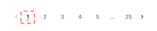
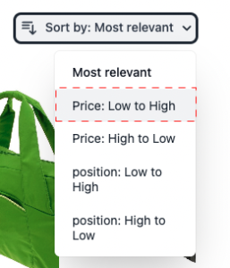
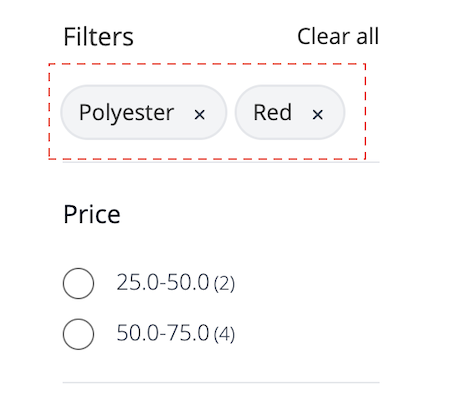
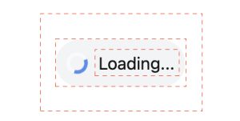

# Seiten-Widget &quot;Produktliste&quot;

Die [!DNL Live Search Product Listing Page Widget] (PLP) verwendet die Commerce Services-Plattform, um eine leistungsfähige, durchsuchbare und facettenfähige Produktanlistungsseite bereitzustellen. Hier wird beschrieben, wie Sie das PLP-Widget aktivieren und gestalten.

## Aktivieren des PLP-Widgets

Wenn die [!DNL Live Search] -Dienst installiert ist, wird die Standardsuchfunktion in [!DNL Live Search] automatisch.
Das PLP-Widget muss in der Admin-Konsole aktiviert sein.

1. Navigieren Sie zu **Stores** > Einstellungen > **Konfiguration** > **[!DNL Live Search]** > **Storefront-Funktionen** und **Enable Product Listing Widgets** auf &quot;Ja&quot;.
1. Auswählen **Konfiguration speichern** , um die Einstellung zu speichern.

## Stilbeispiel

Sie können das Erscheinungsbild des PLP-Widgets so anpassen, dass es zu Ihrer Site passt, indem Sie [CSS](https://developer.adobe.com/commerce/frontend-core/guide/css/).

>[!NOTE]
>
>Elemente mit benutzerdefinierten Klassen innerhalb eines Adobe Commerce-Designs werden nicht vererbt. Diese Elemente müssen durch ihre spezifische Klasse als Ziel ausgewählt werden, um die benutzerdefinierten Klassen abzugleichen. Primäre Aktionsklassen funktionieren nicht auf einer Widget-Schaltfläche.
>Generische Targeting-Elemente innerhalb des CSS werden vererbt. `button` wird auf Widget-Schaltflächen angewendet.

Die hervorgehobenen Divs enthalten die Zielklasse `ds-sdk-product-item__product-name`.


Passen Sie den Produktnamen an, indem Sie eine Regel hinzufügen, um sie in Großbuchstaben zu versetzen.

```css
.ds-sdk-product-item__product-name {
 text-transform: uppercase;
}
```


## CSS-Klassen

### Produktliste

* `.ds-sdk-product-list`: Außenbereich
* `.ds-sdk-product-list__grid`: Inner div


#### Paginierung von Produktlisten

* `.ds-plp-pagination`


* `.ds-plp-pagination_item`


* `.ds-plp-pagination_item--current`



### Widgets

* `.ds-widgets`: Außenbereich
* `.ds-widgets__actions`: Linkes seitliches inneres Div
* `.ds-widgets__results`: Rechtes inneres Div


### Sortieren-Dropdown

* `.ds-sdk-sort-dropdown`


* `.ds-sdk-sort-dropdown__button`


* `.ds-sdk-sort-dropdown__items`


* `.ds-sdk-sort-dropdown__items--item`


* `.ds-sdk-sort-dropdown__items--item-selected`


* `.ds-sdk-sort-dropdown__items--item-active`



### Facets

* `.ds-plp-facets`
* `.ds-plp-facets__header`
* `.ds-plp-facets__header_title`
* `.ds-plp-facets__header__clear-all`

{width="350"}

* `.ds-plp-facets__pills`
* `.ds-sdk-pill`

{width="350"}

* `.ds-sdk-pill__label`
* `.ds-sdk-pill__cta`

{width="350"}

* `.ds-plp-facets__list`

{width="350"}

* `.ds-sdk-input`
* `.ds-sdk-input__label`
* `.ds-sdk-input__options`
* `.ds-sdk-input_fieldset_show-more`


* `.ds-sdk-labelled-input`


* `.ds-sdk-labelled-input__input`
* `.ds-sdk-labelled-input__label`


### Produktelement

* `.ds-sdk-product-item`
* `.ds-sdk-product-item__image`
* `.ds-sdk-product-item__product-name`
* `.ds-sdk-product-item__product-options`
* `.ds-sdk-product-price`
   * `.ds-sdk-product-price--no-discount`
   * `.ds-sdk-product-price--grouped`
   * `.ds-sdk-product-price--bundle`
   * `.ds-sdk-product-price--discount`


### Laden

* `.ds-sdk-loading`
* `.ds-sdk-loading__spinner`
* `.ds-sdk-loading__spinner-label`


