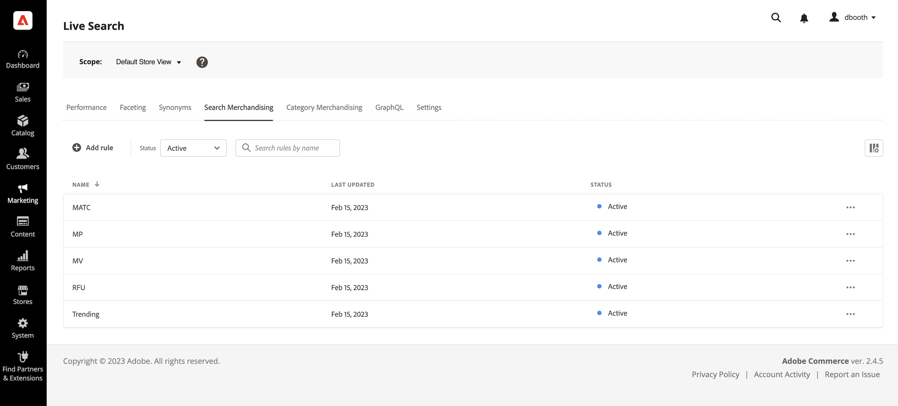

# Suchen von Merchandising Workspace

Der Arbeitsbereich *Merchandising durchsuchen* listet die aktuelle Auswahl der Regeln und deren Status auf und bietet Zugriff auf Tools, die Sie zum Erstellen und Verwalten von Regeln benötigen. Im Arbeitsbereich haben Sie folgende Möglichkeiten:

* Nach Regeln suchen
* Anzeigen von Regeldetails
* Aktivieren/Deaktivieren von Regeln
* Regeln löschen
* Zugriff auf den Regeleditor

## Festlegen des Umfangs

Wenn Ihre Adobe Commerce-Installation mehrere Store-Ansichten enthält, setzen Sie **Umfang** auf die [Store-Ansicht](https://experienceleague.adobe.com/docs/commerce-admin/start/setup/websites-stores-views.html#scope-settings), für die Ihre Regeln gelten.

## Spalten ein-/ausblenden

1. Klicken Sie oben rechts auf die Spalten **Anzeigen/Ausblenden**  .
Die sichtbaren Spalten haben ein blaues Häkchen im Menü &quot;Optionen&quot;. Der Regelname ist die einzige Spalte, die nicht ausgeblendet werden kann.

1. Führen Sie im Menü einen der folgenden Schritte aus:

   * Um eine ausgeblendete Spalte anzuzeigen, klicken Sie auf einen beliebigen Spaltennamen ohne Häkchen.
   * Um eine sichtbare Spalte auszublenden, klicken Sie auf einen beliebigen Spaltennamen mit einem Häkchen.

## Regeln nach Status filtern

1. Wenn Ihr Store viele Regeln enthält, können Sie die Regeln nach Status filtern, um die Liste zu verkürzen. Standardmäßig werden in der Liste Regeln alle Regeln angezeigt.

1. Um nur Regeln mit einer bestimmten Statuseinstellung aufzulisten, setzen Sie **Status** auf einen der folgenden Werte:

   * Alle
   * Aktiv
   * Inaaktiv
   * Geplant

## Suchen nach Suchregeln nach Namen

Beginnen Sie mit der Eingabe des Regelnamens oder eines beliebigen Wortes im Regelnamen.
Die Suche findet die entsprechenden Regeln während der Eingabe. Die Zeichenfolge der übereinstimmenden Zeichen wird im Namen jeder gefundenen Regel hervorgehoben.

## Details anzeigen

Im Detailbereich werden der Regelname, der Status, die Bedingungen und Ereignisse, das Start- und Enddatum, die Beschreibung und das Datum der letzten Bearbeitung angezeigt. Regeln können im Detailbereich aktiviert, bearbeitet und gelöscht werden.

1. Suchen Sie im Arbeitsbereich *Merchandising durchsuchen* die Regel im Raster, das Sie anzeigen möchten, und klicken Sie auf **Mehr** (...).
1. Klicken Sie auf **Details anzeigen**.
Im Bereich Details anzeigen können Sie Folgendes tun:

   * Regel bearbeiten
   * Regel löschen
   * Regel aktivieren/deaktivieren

1. Um das Bedienfeld *Details anzeigen* zu schließen, klicken Sie oben rechts auf **Schließen** (X).

   

## Spaltenbeschreibungen

| Spalte | Beschreibung |
|--- |--- |
| Name | Der Name der Regel. |
| Zuletzt aktualisiert | Das Datum der letzten Aktualisierung der Regel. |
| Startdatum | Das Startdatum einer geplanten Regel. |
| Enddatum | Das Enddatum einer geplanten Regel. |
| Status | Der farbkodierte Status gibt den aktuellen Status der Regel an. Verwenden Sie das Steuerelement Status oberhalb des Rasters, um Regeln nach Status zu filtern. Werte: Alle Status - Zeigt alle Regeln unabhängig vom Status an. Aktiv (blau) - Zeigt nur aktive Regeln an. Geplant (orange) - zeigt nur geplante Regeln an. Inaktiv (grau) - zeigt nur inaktive Regeln an. |

## Steuerelemente

| Kontrolle | Beschreibung |
|--- |--- |
| Regel hinzufügen | Öffnet den Regeleditor [.](rules-add.md) |
| Status | Filtert die Liste der Regeln nach Status. Optionen: Alle, aktiv, inaktiv, Geplant |
|  | Gibt die im Raster sichtbaren Spalten an. Optionen: Zuletzt aktualisiert, Startdatum, Enddatum, Status |
| Suche | Sucht nach einer Regel mit vollständigem Namen oder teilweiser Übereinstimmung. |
|  | Zeigt ein Menü mit weiteren Aktionen an, die auf die ausgewählte Regel angewendet werden können. Optionen: Bearbeiten, Details anzeigen, Löschen |

## Regeldetails

| Feld | Beschreibung |
|--- |--- |
| Status | Der aktuelle Status der Regel. |
| Bedingungen | Die Suchabfrage, die die mit der Regel verknüpften Bedingungen beschreibt. |
| Startdatum | Das Datum, an dem die Regel in Kraft tritt, falls geplant. |
| Enddatum | Das Datum, an dem die Regel abläuft, falls geplant. |
| Beschreibung | Eine kurze Beschreibung der Regel. |
| Letzte Aktualisierung | Datum und Uhrzeit der letzten Aktualisierung der Regel. |
| Aktiviert | Ein Steuerelement, das den Status der Regel ändert. Optionen: aktiviert/deaktiviert |
