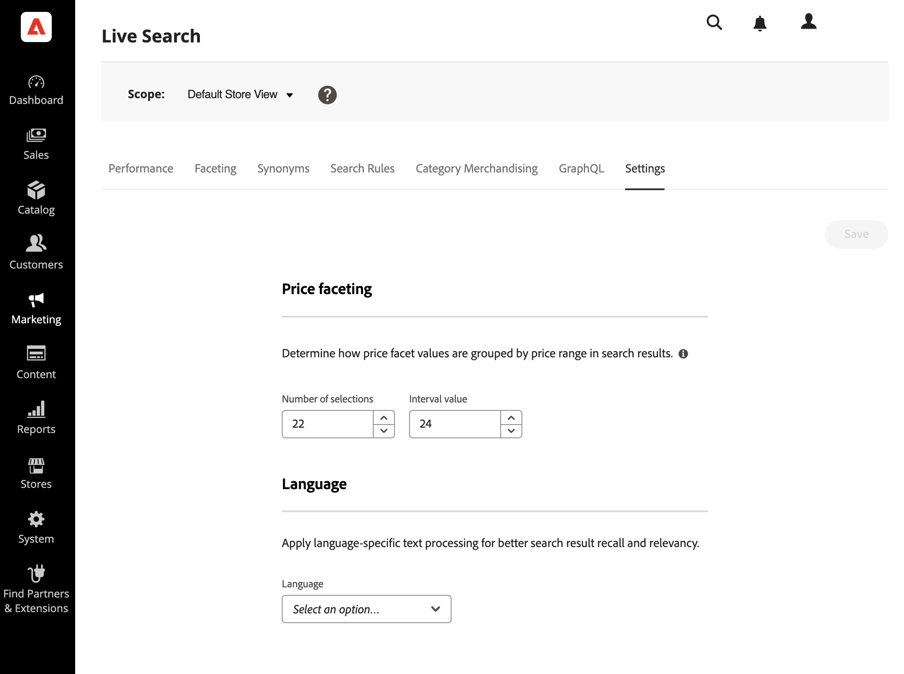

# Einstellungen

Verwenden Sie die *Einstellungen* um die Preisfacettenbereiche und -intervalle sowie die Standardsprache für den Index zu konfigurieren.

Preisfacetten geben die Anzahl der Preisbereichsgruppen und die Verteilung der Preiswerte auf sie an.

Die Spracheinstellungen bestimmen [!DNL Live Search] Dienst, der beim Schreiben des Index erwartet werden soll.

## Preisfacetten

Sie können die Anzahl der Preisbereichsgruppen und die Verteilung der Preiswerte auf diese Gruppen festlegen. Jeder Preisbereich überschneidet die vorherige Gruppe um eins. Beispielsweise werden für fünf Gruppen mit einem Intervall von 20 die folgenden Preisbereiche erstellt: 0-20, 20-40, 40-60, 60-80 und >80. Wenn nicht genügend Produkte im Katalog vorhanden sind, um alle definierten Bereiche auszufüllen, wird die Anzeige der verfügbaren Gruppen entsprechend angepasst. Beispiel: 0-20, 60-80, >80.

1. Navigieren Sie im Admin zu **Marketing** > *SEO und Suche* > **[!DNL Live Search]**.
1. Im **Einstellungen** Registerkarte unter *Preisfacetten* führen Sie folgende Schritte aus:
   * Geben Sie die **Anzahl der Auswahlen**, oder Preisgruppierungen, die verfügbar sein sollen. Es können bis zu 50 Preisgruppierungen definiert werden.
   * Geben Sie die **Intervallwert** oder Preisbereich für jede Gruppe. Der Höchstwert beträgt 10.000.
1. Klicks **Speichern**.

   Es dauert etwa 15 Minuten, bis die aktualisierten Einstellungen in der Storefront verfügbar sind.

### Feldbeschreibungen

| Feld | Beschreibung |
|--- |--- |
| Anzahl der Auswahlen | Gibt die Anzahl der Preisbereichsgruppen an, die als Suchfilter in der Storefront verwendet werden können. Standardwert: 8, Maximum value: 50 |
| Intervallwert | Gibt das Preisbereichsintervall für jede Gruppe an. Beispielsweise werden bei fünf Auswahlen mit einem Intervallwert von 20 fünf Gruppierungen von 0-20, 20-40, 40-60, 60-80 und >80 erstellt. Standardwert: 5, Maximum value: 10.000 |

<!-- ## Language

The Language setting tells [!DNL Live Search] which language to expect when reading the catalog and writing the index. 

Languages have different sets of rules for grammar: how words are separated, verb tenses and synonyms, for example.
The Language setting ensures that the correct set of rules are applied to the indexing mechanism.

The Language settings should be set to the primary language of the catalog. -->
