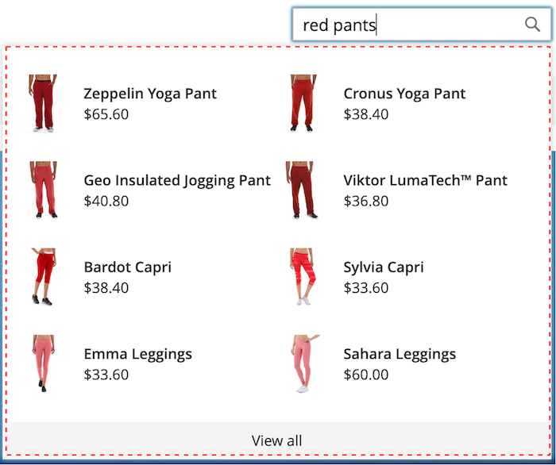
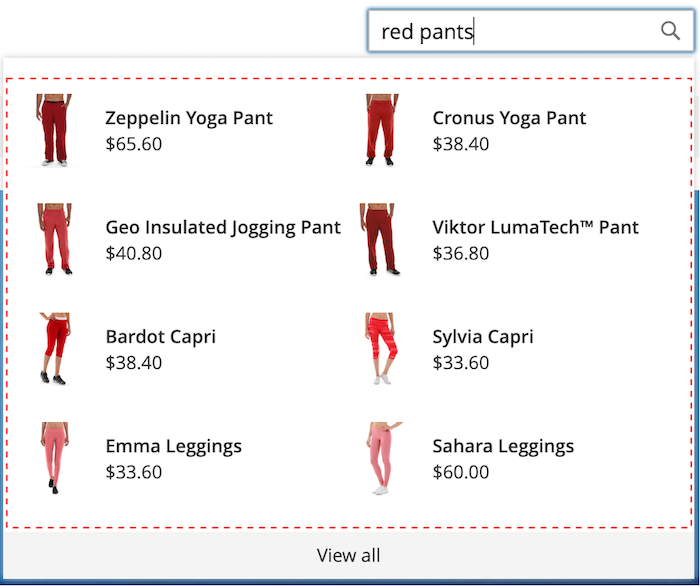

# Formatieren von Popover-Elementen

Die [storefront popover](storefront-popover.md) zeigt immer das Produkt an `name` und `price`und die Feldauswahl nicht konfigurierbar ist. Popover-Elemente können jedoch mit CSS-Klassen formatiert werden. Beispielsweise ändern die folgenden Deklarationen die Hintergrundfarbe des Popover-Containers und der Fußzeile.

```css
.livesearch.popover-container {
    background-color: lavender;
}

.livesearch.view-all-footer {
    background-color: magenta;
}
```

## Container-Sichtbarkeit

Die übergeordnete Komponente der `.livesearch.popover-container` is `.search-autocomplete`.  Die `.active` -Klasse gibt die Sichtbarkeit des Containers an. Die `.active` -Klasse wird bedingt hinzugefügt, wenn das Popover geöffnet ist.

```css
.search-autocomplete.active   /* visible */
.search-autocomplete          /* not visible */
```

Weitere Informationen zum Formatieren von Storefront-Elementen finden Sie unter [Kaskadierende Stylesheets (CSS)](https://devdocs.magento.com/guides/v2.4/frontend-dev-guide/css-topics/css-overview.html) im [Frontend-Entwicklerhandbuch](https://devdocs.magento.com/guides/v2.4/frontend-dev-guide/bk-frontend-dev-guide.html).

## Klassenselektoren

Die folgenden Klassenselektoren können verwendet werden, um den Container, die Empfehlung und die Produktelemente im Popover zu gestalten.

* `.livesearch.popover-container`
* `.livesearch.view-all-footer`
* `.livesearch.suggestions-container`
* `.livesearch.suggestions-header`
* `.livesearch.suggestion`
* `.livesearch.products-container`
* `.livesearch.product-result`
* `.livesearch.product-name`
* `.livesearch.product-price`

### Container-Klassenauswahl

`.livesearch.popover-container`



`.livesearch.view-all-footer`


### Empfehlungen-Klassenauswahl

`.livesearch.suggestions-container`


`.livesearch.suggestions-header`


`.livesearch.suggestion`


### Produktklassenauswahl

`.livesearch.products-container`


`.livesearch.product-result`


`.livesearch.product-name`


`.livesearch.product-price`


## Arbeiten mit einem geänderten Design {#working-with-modified-theme}

Das Storefront-Popover kann mit einer benutzerdefinierten [Design](https://devdocs.magento.com/guides/v2.3/frontend-dev-guide/themes/theme-overview.html) , der die erforderlichen Dateien von *Luma*. Die `top.search` im `header-wrapper` des `Magento_Search` darf nicht geändert werden.

```html
<referenceContainer name="header-wrapper">
   <block class="Magento\Framework\View\Element\Template" name="top.search" as="topSearch" template="Magento_Search::form.mini.phtml">
      <arguments>
         <argument name="configProvider" xsi:type="object">Magento\Search\ViewModel\ConfigProvider</argument>
      </arguments>
   </block>
</referenceContainer>
```

## Popover deaktivieren

So deaktivieren Sie das Popover und stellen den Standard wieder her [Schnellsuche](https://docs.magento.com/user-guide/catalog/search-quick.html) verwenden, geben Sie den folgenden Befehl ein:

```bash
bin/magento module:disable Magento_LiveSearchStorefrontPopover
```
