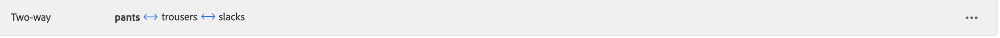

# Synonyme hinzufügen

Erhöhen Sie die Kundeninteraktion durch Hinzufügen Ihrer eigenen kuratierten Liste von [!DNL Live Search] Synonyme. [!DNL Live Search] kann bis zu 200 Synonyme pro `Data Space ID`.

![[!DNL Live Search] Synonyme](assets/synonym-workspace.png)

## Schritt 1: Synonym hinzufügen

1. Navigieren Sie im Admin zu **Marketing** > SEO &amp; Suche > **[!DNL Live Search]**.
1. Legen Sie für mehrere Stores **Anwendungsbereich** der [Store-Ansicht](https://experienceleague.adobe.com/docs/commerce-admin/start/setup/websites-stores-views.html#scope-settings) wobei die Synonym-Einstellungen gelten.
1. Klicken Sie auf **Synonyme** Registerkarte.
1. Klicken Sie auf **Synonyme hinzufügen** Schaltfläche.

## Schritt 2: Synonym nach Typ definieren

Befolgen Sie die Anweisungen für das [Typ des Synonyms](synonyms-type.md) die Sie erstellen möchten.

### Zweiwegsynonym

1. Standard akzeptieren **Zweiweg** -Option.

   

1. Geben Sie die **Schlüsselwort** Begriff oder Satz, der abgeglichen werden soll.
1. Geben Sie die **Erweiterung** Begriffe, die Sie als Synonyme für den Suchbegriff hinzufügen möchten. Trennen Sie mehrere Begriffe durch Kommas.
In diesem Beispiel lautet das passende Keyword &quot;Hosen&quot;und die Erweiterungsbegriffe lauten &quot;lange Hosen, Hosen, Slacks&quot;.

   

1. Wenn Sie fertig sind, klicken Sie auf **Speichern**.
Der Satz von Synonymen erscheint in der Liste mit einem Zwei-Wege-Pfeil zwischen den einzelnen Begriffen, was bedeutet, dass die Begriffe austauschbar sind.

   

### Einwegsynonym

1. Klicken Sie auf **Einweg** Synonym.

   

1. Geben Sie die **Schlüsselwort** und **Erweiterung** Begriffe. Trennen Sie mehrere Begriffe durch Kommas.

   

   In diesem Beispiel ist das Keyword &quot;Hosen&quot;und die Einweg-Erweiterungsbegriffe &quot;Capris, Hosen mit Kalbslänge, Pädagogiker&quot;sind jeweils eine Untergruppe von &quot;Hosen&quot;, jedoch mit einer bestimmten Bedeutung.

1. Wenn Sie fertig sind, klicken Sie auf **Speichern**.
Die Gruppe von Synonymen wird in der Liste mit einem einseitigen Pfeil angezeigt, der von den Erweiterungsbegriffen zum Keyword zeigt, um anzugeben, dass es sich bei den Begriffen um Untergruppen des Keywords handelt. Ein Pluszeichen trennt jeden Erweiterungsbegriff.

   

## Schritt 3: Veröffentlichungsänderungen

1. Wenn Ihre Synonyme abgeschlossen sind, klicken Sie auf **Veröffentlichungsänderungen**.
1. Warten Sie bis zu zwei Stunden, bis Ihre Updates in der Storefront verfügbar sind.

## Feldbeschreibungen

| Feld | Beschreibung |
|--- |--- |
| [Typ](synonyms.md) | Bestimmt, ob die Synonyme dieselbe Bedeutung wie das Keyword haben oder eine Untergruppe des Keywords sind. Optionen: Zweiweg (Standard) - Begriffe, die dieselbe Bedeutung wie der Suchbegriff haben und dieselben Suchergebnisse zurückgeben Einweg - Begriffe, die eine Teilmenge des Suchbegriffs darstellen. Einwegsynonyme geben eine engere Liste spezifischer Produkte zurück. |
| Schlüsselwort | Ein Wort, das häufig mit einer Auswahl von Produkten in Ihrem Katalog verknüpft ist. |
| Erweiterung | Zusätzliche Begriffe, die dieselbe oder eine ähnliche Bedeutung wie der Suchbegriff haben. |
