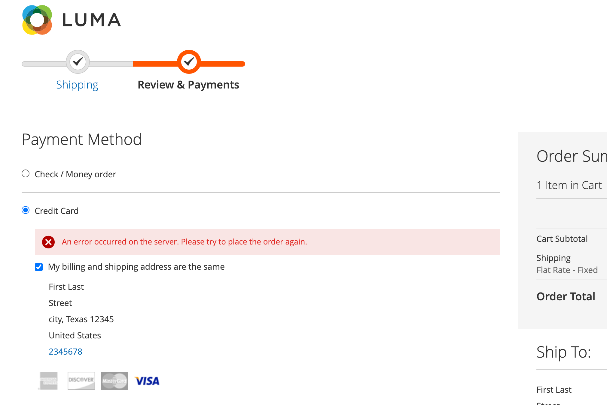

# Checkout

Sie können das Auschecken für Adobe Commerce konfigurieren [!DNL Payment Services] um Ihren Käufern am besten zu entsprechen. Funktionen wie [automatische Aufhebung der Bestellung](#order-auto-voided-if-error) und [Kreditkartenausfall](#credit-card-vaulting) Sicherstellen, dass Ihre Kunden ein reibungsloses Benutzererlebnis bieten.

## Reihenfolge bei Fehler automatisch aufgehoben

Wenn beim Auschecken ein Fehler auftritt, [!DNL Payment Services] löscht/bricht die Bestellung automatisch ab.

Auf der Checkout-Seite für den Käufer wird eine Fehlermeldung angezeigt. Die Nachricht kann variieren.

{width="600" zoomable="yes"}

Ein Kommentar zur stornierten Bestellung wird auch im Admin für eine bestimmte [bestellen](https://experienceleague.adobe.com/docs/commerce-admin/stores-sales/order-management/orders/orders.html?lang=en).

{width="600" zoomable="yes"}

Wenn ein Käufer die Autorisierung für eine Bestellung erhält, die Bestellung jedoch nicht erstellt und in eine `Capture`, wird die Reihenfolge automatisch aufgehoben. Auf diese Weise wird sichergestellt, dass keine Kreditkarte auf der Kreditkarte des Kunden reserviert wird und die Gebühr des Zahlungsdienstleisters vermieden wird, die eintritt, wenn die Genehmigung am Ende des standardmäßigen Zeitraums von 29 Tagen widerrufen wird.

>[!NOTE]
>
>Die automatische Aufhebung einer Bestellung tritt nur dann auf, wenn der Kunde eine Zahlungsmethode verwendet, die auf `Authorize` mode, not `Authorize and Capture` -Modus.

## Kasse von der Produktseite

Wenn ein Kunde direkt von der Produktseite aus mit PayPal auscheckt oder [!DNL Pay Later] -Schaltflächen, wird nur der Artikel gekauft, der auf der aktuellen Produktseite dargestellt wird. Artikel, die sich bereits im Warenkorb des Kunden befinden, werden nicht zum Kassengang hinzugefügt und werden nicht gekauft.

Mit dieser Funktion kann der Kunde den Artikel, den er gerade anzeigt, schnell kaufen und dabei Artikel beibehalten, die ihm zuvor in den Warenkorb gelegt wurden.
Wenn der Kunde die Bestellung storniert, wird der Artikel auf der aktuellen Produktseite zum Warenkorb des Kunden hinzugefügt.

Wenn ein Kunde von der Produktseite aus in den Checkout-Fluss wechselt, wird die Checkout-Seite vereinfacht. In der Ansicht werden nur die bestellbaren Daten und Optionen angezeigt.

## Kreditkartenausnahme

Käufer können ihre Kreditkarteninformationen für zukünftige Käufe auf der Website (alle Geschäfte innerhalb desselben Händlers-Kontos) verwerten oder &quot;speichern&quot;.

Siehe [Kreditkartenausnahme](vaulting.md) für weitere Informationen
