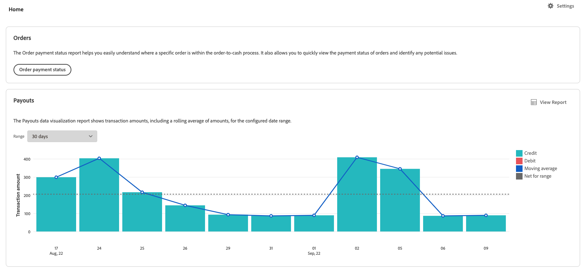

# Bestellstatusbericht

[!DNL Payment Services] für [!DNL Adobe Commerce] und [!DNL Magento Open Source] bietet Ihnen eine umfassende Berichterstellung, damit Sie einen klaren Überblick über die Bestellungen und Zahlungen Ihres Geschäfts erhalten.

Der Bericht über den Bestellstatus zeigt Ihnen, wo sich eine bestimmte Bestellung innerhalb des Bestellprozesses befindet. Dieser Bericht ermöglicht es Ihnen, schnell den Zahlungsstatus Ihrer Bestellungen anzuzeigen und potenzielle Probleme zu identifizieren.

Sie müssen nicht mehrere Ansichten öffnen, um Referenzaufträge und Zahlungen manuell zu vergleichen. [!DNL Payment Services] für [!DNL Adobe Commerce] und [!DNL Magento Open Source] bietet Ihnen die Möglichkeit, sich einen Überblick über Ihre Bestellungen und Zahlungen zu verschaffen - alles im Bestellstatusbericht.

Weitere Informationen finden Sie in diesem Bericht im Admin-Bereich unter Zahlungsstatus, Status der Fakturierung und des Versands, Status der Rückerstattung, Status von Streitigkeiten und mehr.

Sie können Bestellungsstatustransaktionen im .csv-Dateiformat herunterladen, um sie in bestehenden Buchhaltungs- oder Auftragsverwaltungssoftware zu verwenden.

>[!NOTE]
>
>Sie können keine Finanzberichte anzeigen, wenn Sie [integrierte und aktivierte Livemodus](production.md#enable-live-payments) für [!DNL Payment Services].

## Im Bericht verwendete Daten

Die [!DNL Payment Services] -Modul verwendet Bestelldaten und kombiniert sie mit aggregierten Zahlungsdaten aus anderen Quellen (einschließlich PayPal), um aussagekräftige und sehr nützliche Berichte bereitzustellen.

Die Bestelldaten werden exportiert und im Zahlungsdienst beibehalten. Wenn Sie [Bestellstatus ändern oder hinzufügen](https://docs.magento.com/user-guide/sales/order-status-custom.html){target=&quot;_blank&quot;} oder [Bearbeiten einer Store-Ansicht](https://docs.magento.com/user-guide/stores/stores-all-view-edit.html){target=&quot;_blank&quot;}, [store](https://docs.magento.com/user-guide/stores/store-information.html){target=&quot;_blank&quot;} oder Website-Namen verwenden, werden diese Daten mit Zahlungsdaten kombiniert und der Bericht Bestellzahlungsstatus wird mit den kombinierten Informationen ausgefüllt.

Dieser Prozess umfasst zwei Schritte:

1. Der Index wird entweder `ON SAVE` (jedes Mal, wenn Bestellinformationen oder Store-Informationen geändert werden) oder `BY SCHEDULE` (auf einen vorkonfigurierten Cron-Zeitplan), je nachdem, wie er in konfiguriert ist [Indexverwaltung](https://docs.magento.com/user-guide/system/index-management.html){target=&quot;_blank&quot;} im Admin.

   Standardmäßig erfolgt die Datenindizierung `ON SAVE`, was bedeutet, dass bei jeder Änderung der Reihenfolge, des Bestellstatus, der Store-Ansicht, des Stores oder der Website der Neudexationsprozess sofort stattfindet.

1. Die indexierten Daten werden an den Zahlungsdienst gesendet, der dann in den Bestellstatusbericht eingetragen wird.

Die einzigen Daten, die zu Berichtszwecken exportiert und erfasst werden, sind Daten, die vom Bestellstatusbericht verwendet werden.

>[!NOTE]
>
>Die in dieser Tabelle angezeigten Daten werden in absteigender Reihenfolge sortiert (`DESC`) standardmäßig mithilfe der `ORDER DATE`. Die `ORDER DATE` ist der Datum-Zeitstempel, an dem die Bestellung erstellt wurde.

### Datenexport konfigurieren

Auch wenn die Neuindizierung standardmäßig in `ON SAVE` -Modus wird empfohlen, die Indizierung in `BY SCHEDULE` -Modus. Die `BY SCHEDULE` Der Index wird auf einem Cron-Zeitplan von einer Minute ausgeführt und alle geänderten Daten werden innerhalb von zwei Minuten nach jeder Datenänderung im Bestellstatusbericht angezeigt. Diese geplante Neuindizierung hilft Ihnen, den Aufwand für Ihren Store zu reduzieren, insbesondere wenn Sie eine große Menge eingehender Bestellungen haben, da dies planmäßig erfolgt (nicht bei jeder Bestellung).

Sie können den Indexmodus ändern.`ON SAVE` oder `BY SCHEDULE`—[im Admin](https://docs.magento.com/user-guide/system/index-management.html#change-the-index-mode){target=&quot;_blank&quot;}.

Informationen zum Konfigurieren des Datenexports finden Sie unter [Befehlszeilenkonfiguration](configure-cli.md#configure-data-export).

## Verfügbarkeit

Im _Admin_ Seitenleiste, navigieren Sie zu **[!UICONTROL Sales]** > **[!UICONTROL Payment Services]** > **[!UICONTROL Order payment status]** um den Zahlungsstatus Ihrer Bestellungen anzuzeigen.

## Datenquelle auswählen

In der Berichtansicht Bestellzahlstatus können Sie die Datenquelle auswählen._[!UICONTROL Live]_oder_[!UICONTROL Sandbox]_- für die Sie Berichtsergebnisse anzeigen möchten.

Wenn _[!UICONTROL Live]_die ausgewählte Datenquelle ist, können Sie Berichtinformationen für Ihre Stores anzeigen, die [!DNL Payment Services] in_[!UICONTROL Live]_ -Modus. Wenn [!UICONTROL Sandbox]_ die ausgewählte Datenquelle ist, können Sie Berichtinformationen für Ihre Sandbox-Umgebung anzeigen.

Datenquellenauswahlen funktionieren wie folgt:

* Wenn Sie keine Stores haben, die [!DNL Payment Services] Im Livemodus wird bei der Auswahl der Datenquelle standardmäßig _[!UICONTROL Sandbox]_.
* Wenn Sie über Stores (einen oder mehrere) verfügen, die [!DNL Payment Services] Im Livemodus wird bei der Auswahl der Datenquelle standardmäßig _[!UICONTROL Live]_.
* Beim Exportieren von Berichten wird immer die Auswahl der Datenquelle berücksichtigt.

So wählen Sie die Datenquelle für Ihre [!UICONTROL Order Payment Status] Bericht:

1. Im _Admin_ Seitenleiste, navigieren Sie zu **[!UICONTROL Sales]** > **[!UICONTROL [!DNL Payment Services]]** > **[!UICONTROL Order payment status]**.
1. Klicken **[!UICONTROL Data source]** und wählen Sie _[!UICONTROL Live]_oder_[!UICONTROL Sandbox]_.

   Die Berichtsergebnisse werden basierend auf der ausgewählten Datenquelle neu generiert.

## Datum und Zeitrahmen anpassen

In der Berichtansicht Bestellzahlungsstatus können Sie den Zeitrahmen der Status, die Sie anzeigen möchten, anpassen, indem Sie bestimmte Daten auswählen. Standardmäßig werden 30 Tage Bestellzahlstatus im Raster angezeigt.

1. Im _Admin_ Seitenleiste, navigieren Sie zu **[!UICONTROL Sales]** > **[!UICONTROL [!DNL Payment Services]]** > **[!UICONTROL Order payment status]**.
1. Klicken Sie auf **[!UICONTROL Order dates]** Kalenderauswahl .
1. Wählen Sie den entsprechenden Datumsbereich aus.
1. Zeigen Sie die Bestellzahlstatus für Ihre angegebenen Daten im Raster an.

## Spalten ein- und ausblenden

Der Bericht Bestellzahlstatus zeigt standardmäßig alle verfügbaren Informationsspalten an. Sie können jedoch anpassen, welche Spalten in Ihrem Bericht angezeigt werden.

1. Im _Admin_ Seitenleiste, navigieren Sie zu **[!UICONTROL Sales]** > **[!UICONTROL [!DNL Payment Services]]** > **[!UICONTROL Order payment status]**.
1. Klicken Sie auf _Spalteneinstellungen_ Symbol ().
1. Um anzupassen, welche Spalten im Bericht angezeigt werden, aktivieren oder deaktivieren Sie die Spalten in der Liste.

   Im Bericht Bestellzahlstatus werden alle Änderungen angezeigt, die Sie im Menü Spalteneinstellungen vorgenommen haben. Die Spaltenvoreinstellungen werden gespeichert und bleiben in Kraft, wenn Sie von der Berichtsansicht weg navigieren.

## Status anzeigen

Die Ansicht des Bestellstatus-Berichts zeigt für jede Bestellung von Zahlungsdiensten umfassende Informationen zum Transaktionsstatus und Zahlstatus an.

### Transaktionsstatus

Standardmäßig werden 30 Tage Bestellzahlstatus im Raster angezeigt.

Scrollen Sie nach links und rechts, um [Bestellstatusangaben](#column-descriptions), einschließlich Bestelldatum, autorisiertes Datum, fakturiert, versandt, Zahlungsstatus und mehr.

Die Anzahl der Zeilen, die bei einer Suche zurückgegeben oder in den standardmäßigen 30 Tagen des Bestellzahlstatus angezeigt werden, wird über dem Raster der Statusanzeige für Bestellungen neben dem Auswahlfilter für Bestelldaten-Kalender angezeigt.

### Zahlungsstatus

In der Spalte Zahlungsstatus wird der aktuelle Status einer Zahlung angezeigt. A `Capture failed` Die Zahlung zeigt einen roten Warnstatus und eine `Voided` Die Zahlung zeigt einen grauen Warnstatus an.

### Erstattungsstatus

In der Spalte Rückerstattungsstatus wird der aktuelle Status einer Rückerstattung angezeigt. A `Capture failed` Die Zahlung zeigt einen roten Warnstatus und eine `Voided` Die Zahlung zeigt einen grauen Warnstatus an.

## Berichtdaten aktualisieren

Die Ansicht des Bestellstatus-Berichts zeigt eine _[!UICONTROL Last updated]_Zeitstempel, der das letzte Mal angibt, dass die Berichtinformationen aktualisiert wurden. Standardmäßig werden die Daten des Berichts zum Bestellstatus alle drei Stunden automatisch aktualisiert.

Sie können auch manuell eine Aktualisierung der Berichtdaten zum Bestellzahlungsstatus erzwingen, um die aktuellsten Berichtinformationen anzuzeigen.

1. Im _Admin_ Seitenleiste, navigieren Sie zu **[!UICONTROL Sales]** > **[!UICONTROL [!DNL Payment Services]]** > **[!UICONTROL Order payment status]**.
1. Klicken Sie auf _Aktualisieren_ Symbol ().

   Die Daten des Berichts zum Bestellstatus werden aktualisiert, und *[!UICONTROL Update complete]* -Bestätigung angezeigt und die neuesten Informationen im Raster vorhanden sind.

## Streitigkeiten anzeigen

Sie können alle Streitigkeiten bezüglich der Bestellungen Ihres Ladens einsehen und zum PayPal-Abwicklungszentrum navigieren, um über den Bestellstatusbericht darauf zu reagieren.

1. Im _Admin_ Seitenleiste, navigieren Sie zu **[!UICONTROL Sales]** > **[!UICONTROL [!DNL Payment Services]]** > **[!UICONTROL Order payment status]**.
1. Navigieren Sie zum **[!UICONTROL Disputes column]**.
1. Anzeigen von Streitigkeiten für eine bestimmte Bestellung, siehe [den Streitstatus](#order-payment-status-information).
1. Klicken Sie auf den Link zur Kennung des Streits (beginnend mit _PP-D-_), um zur [PayPal Resolution Center](https://www.paypal.com/us/smarthelp/article/what-is-the-resolution-center-faq3327).
1. Ergreifen Sie bei Bedarf geeignete Maßnahmen für den Streit.

   Klicken Sie auf die Spaltenüberschrift &quot;Streitigkeiten&quot;, um die Streitigkeiten nach Status zu sortieren.

## Zahlungsstatus der Bestellung herunterladen

Sie können eine CSV-Datei mit allen Status herunterladen, die im Raster der Bestellzahlungsansicht angezeigt werden, unabhängig davon, ob Sie den standardmäßigen Status von 30 Tagen oder einen benutzerdefinierten Zeitrahmen anzeigen.

1. Im _Admin_ Seitenleiste, navigieren Sie zu **[!UICONTROL Sales]** > **[!UICONTROL [!DNL Payment Services]]** > **[!UICONTROL Order payment status]**.
1. Wenn Sie Status für einen anderen Zeitraum als die letzten 30 Tage anzeigen möchten, [Datumsbereich-Zeitrahmen für Ihre Status anpassen](#customize-dates-timeframe).
1. Klicken Sie auf _Download_ ().

Ihr Bestellzahlstatus wird im .csv -Format heruntergeladen.

<!-- ## Default order payment status timeframes

These order payment status timeframes are currently available in [!DNL Payment Services].

| Report       | Description          |
| ------------ | -------------------- |
| Yesterday | Available from the Order payment status dates selector, this shows information for the prior date. |
| | Today | Available from the Order payment status dates selector, this shows information for the current day. |
| Last 7 days | Available from the Order payment status dates selector, this shows information for the last seven days. |
| Last 30 days | Available from the Order payment status dates selector and by default in the Order payment statuses view, this shows information for the last 30 days. |
| Last 90 days | Available from the Order payment status dates selector, this shows information for the last 90 days. |
| Year to date | Available from the Order payment status dates selector, this shows information for the the entire year to date. |
| Custom range | Available from the Order payment status dates selector, this can be filtered to show a custom date range. |
-->

## Statusinformationen zur Bestellzahlung

In der Statusansicht der Bestellzahlung werden für jeden Status, der im Raster angezeigt wird, umfangreiche Informationen angezeigt.

### Spaltenbeschreibungen

Berichte zum Bestellstatus enthalten die folgenden Informationen.

| Spalte | Beschreibung |
| ------------ | -------------------- |
| [!UICONTROL Order ID] | Commerce-Bestell-ID   So sehen Sie verwandte [Bestellinformationen](https://docs.magento.com/user-guide/sales/orders.html){target=&quot;_blank&quot;}, klicken Sie auf die ID. |
| [!UICONTROL Order Date] | Zeitstempel der Bestellung |
| [!UICONTROL Authorized Date] | Datum des Zeitstempels der Zahlungsgenehmigung |
| [!UICONTROL Order Status] | Aktueller Commerce [Bestellstatus](https://docs.magento.com/user-guide/sales/order-status.html){target=&quot;_blank&quot;} |
| [!UICONTROL Invoiced] | Rechnungsstatus —*[!UICONTROL No]*, *[!UICONTROL Partial]* oder *[!UICONTROL Yes]* |
| [!UICONTROL Shipped] | Versandstatus —*[!UICONTROL No]*, *[!UICONTROL Partial]* oder *[!UICONTROL Yes]* |
| [!UICONTROL Order Amt] | Gesamtbetrag der Bestellung |
| [!UICONTROL Cur] | Währungstyp der Bestellung |
| [!UICONTROL Pay Status] | Zahlungsstatus für eine bestimmte Bestellung |
| [!UICONTROL Paid Amt] | Auf Bestellung entrichteter Betrag |
| [!UICONTROL Cur] | Währungstyp des für eine Bestellung gezahlten Betrags |
| [!UICONTROL Refund Status] | Status einer Rückerstattung bei einer Bestellung (z. B. Informationen aus Rückgaben, RMAs und Kreditkarten)—   *[!UICONTROL Requires refund]*, *[!UICONTROL Refund requested]*, *[!UICONTROL Refunded]*, *[!UICONTROL Refund failed]* oder *[!UICONTROL Voided]* |
| [!UICONTROL Refund Amount] | Erstatteter Gesamtbetrag für eine Bestellung |
| [!UICONTROL Cur] | Währungstyp des für eine Bestellung rückerstatteten Betrags |
| [!UICONTROL Disputes] | Stand der Streitigkeiten über einen Beschluss (Informationen aus Streitigkeiten und Chargebacks)—*[!UICONTROL Open]*, *[!UICONTROL Waiting for buyer response]*, *[!UICONTROL Waiting for seller response]*, *[!UICONTROL Under review]*, *[!UICONTROL Resolved]* oder *[!UICONTROL Other]* |
| [!UICONTROL Payment Method] | Zahlungsmethode, die bei einer Bestellung im Commerce-Geschäft verwendet wird |
| [!UICONTROL Website] | Website, von der aus die Bestellung aufgegeben wurde |
| [!UICONTROL Store] | Store, aus dem die Bestellung aufgegeben wurde |
| [!UICONTROL Store View] | Store-Ansicht, aus der die Bestellung aufgegeben wurde |
