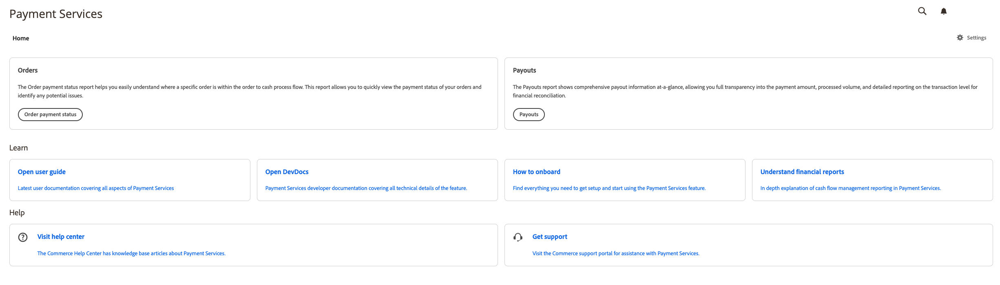

# Einführung in die [!DNL Payment Services] Startseite

[!DNL Payment Services] für [!DNL Adobe Commerce] und [!DNL Magento Open Source] bietet eine Startansicht mit allen erforderlichen Informationen, um mit der Einrichtung und Verwendung der Erweiterung zu beginnen.

1. Im _Admin_ Seitenleiste, navigieren Sie zu **[!UICONTROL Sales]** > **[!UICONTROL Payment Services]**:

   

1. In dieser Startansicht können Sie auf _Startseite_ Ansicht, _Lernen_ about [!DNL Payment Services], konfigurieren Sie die Erweiterung _Einstellungen_ oder erhalten _Hilfe_.

## Startseite

| Feld | Beschreibung |
|---|---|
| [!UICONTROL Orders] | Diese Berichte ermöglichen es Ihnen, den Zahlungsstatus Ihrer Bestellungen schnell anzuzeigen und potenzielle Probleme zu identifizieren. |
| [!UICONTROL Payouts] | Die Payouts-Berichte zeigen umfassende Auszahlungsinformationen auf einen Blick, sodass Sie vollständige Transparenz in Bezug auf den Zahlungsbetrag, das verarbeitete Volumen und detaillierte Berichte über die Transaktionsstufe zur finanziellen Abstimmung erhalten. |

## Lernen

| Feld | Beschreibung |
|---|---|
| [!UICONTROL Read documentation] | Die neuesten Benutzer- und Entwicklerdokumente finden Sie unter [!DNL Payment Services]. |
| [!UICONTROL How to onboard] | Suchen Sie alles, was Sie für die Einrichtung benötigen, und beginnen Sie mit der Verwendung der [!DNL Payment Services] Funktion. |
| [!UICONTROL Understand financial reports] | Ausführliche Erläuterung der Berichterstattung zum Cashflow-Management im [!DNL Payment Services]. |

## Hilfe

| Feld | Beschreibung |
|---|---|
| [!UICONTROL Visit help center] | Die [!DNL Adobe Commerce] Hilfe-Center enthält Artikel zur Wissensdatenbank [!DNL Payment Services]. |
| [!UICONTROL Get support] | Besuchen Sie die [!DNL Adobe Commerce] Support-Portal für Unterstützung mit [!DNL Payment Services.] |

## Einstellungen

Klicken Sie in der Startansicht auf **[!UICONTROL Settings]**. Siehe [Einstellungen](settings.md) für weitere Informationen.
