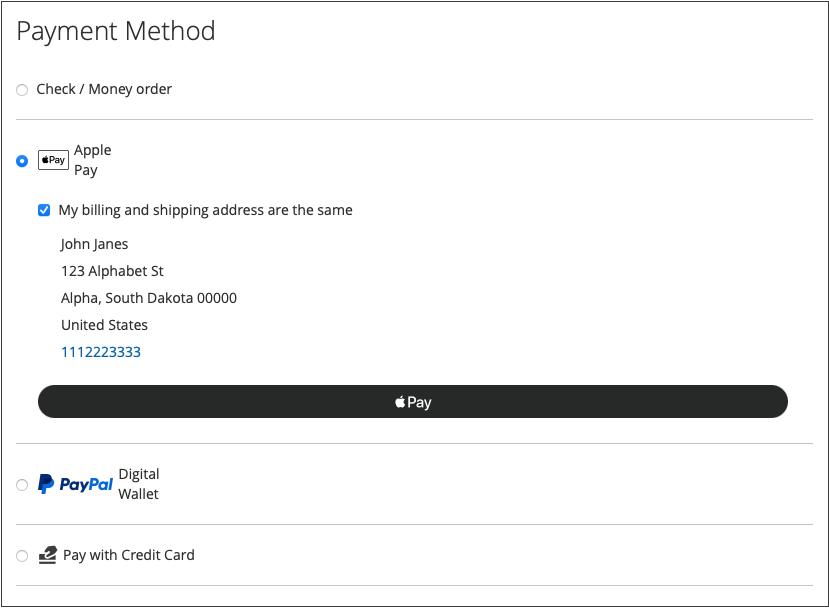

# Zahlungsoptionen

Mit [!DNL Adobe Commerce] und [!DNL Magento Open Source] [!DNL Payment Services], haben Sie mehrere Zahlungsoptionen für Sie.

Sie können diese Zahlungsoptionen in [Home settings](payments-home.md) oder [Store-Konfiguration](configure-admin.md) (empfohlen für ältere Zahlungsoptionen oder ein Multi-Store-Setup).

Je nachdem, wo Sie sich im Checkout-Prozess befinden, gibt es für jede Zahlungsmethode unterschiedliche Verhaltensweisen:

* Produktseite - Die Produktseite für ein Element
* Mini-Warenkorb: Verfügbar beim Klicken auf das Warenkorbsymbol, wenn ein Produkt zum Warenkorb hinzugefügt wurde
* Warenkorb - Verfügbar bei Klick auf _Warenkorb anzeigen und bearbeiten_ aus dem Mini-Warenkorb
* Checkout-Ansicht - bei Klick auf _Zur Kasse gehen_ aus dem Mini-Warenkorb oder Warenkorb

>[!IMPORTANT]
>
>[!DNL Payment Services] Das Onboarding muss vor der Bearbeitung der Zahlungen abgeschlossen sein.

## Erlebnis für Standardzahlungen im Vergleich zu erweiterten Zahlungen

[!DNL Payment Services] stellt **Erweitert** (vollständig unterstützt) und **Standard** (Express-Checkout) Zahlungsoptionen und Onboarding-Flüsse, je nach Land, in dem Sie tätig sind.

* **Erweitert** - Alle verfügbaren [Zahlungsoptionen](../payment-services/payments-options.md) sind verfügbar für aktuelle [vollständig unterstützte Länder](../payment-services/overview.md#availability). Wählen Sie beim Onboarding die Option Live-Zahlungen aus. [Erweiterte Onboarding-Option](../payment-services/production.md#advanced-onboarding).
* **Standard** - Eine Untergruppe von Zahlungsoptionen (Express-Checkout) - PayPal-Kredit- und Debitkarten - ist für andere verfügbare unterstützte Länder verfügbar. [Kreditkartenfelder](#credit-card-fields) und [Apple Pay](#apple-pay-button) für diese Onboarding-Option nicht verfügbar sind. Wählen Sie beim Onboarding die Option Live-Zahlungen aus. [Standardmäßige Onboarding-Option](../payment-services/production.md#standard-onboarding).

Siehe [Aktivieren [!DNL Payment Services] für die Produktion](../payment-services/production.md#complete-merchant-onboarding) für Informationen zum Abschluss des erweiterten und standardmäßigen Onboarding.

## [!UICONTROL Credit Card Fields]

[!UICONTROL Credit Card Fields] bieten einen einfachen und sicheren Checkout für Kreditkarten- oder Debitkartenzahlmethoden. Wenn ein Kunde mit Kreditkartenfeldern zur Kasse geht, gibt er seinen Namen, seine Rechnungsadresse sowie seine Kredit- oder Debitkarteninformationen ein, um seine Bestellung aufzugeben. Ihre Kundeninformationen werden während der Kaufsitzung sicher verwendet, um sie nahtlos durch den Checkout-Fluss zu führen.

{width="500" zoomable="yes"}

Aktivieren [Kreditkartenausfall](#vaulting) für Ihre Geschäfte, damit die Käufer ihre Kreditkarteninformationen für einen schnellen Checkout zu einem späteren Zeitpunkt überprüfen können.

Sie können [!UICONTROL Credit Card Fields] in der Store-Konfiguration oder der [!DNL Payment Services] Home. Siehe [Einstellungen](settings.md#credit-card-fields) für weitere Informationen.

Sie können auch das Layout, die Breite, die Höhe und den äußeren Stil der Kreditkartenfelder ändern. Siehe [PayPal-Dokumentation](https://developer.paypal.com/docs/checkout/advanced/customize/card-field-style/) für weitere Informationen.

## [!DNL Apple Pay] button

Kunden können [[!DNL Apple Pay]](https://www.apple.com/apple-pay/), das die auf einem iOS- oder macOS-Gerät gespeicherten Zahlungsberechtigungen für Kredit- und Debitkarten verwendet, um Einkäufe zu tätigen.

[!DNL Apple Pay] ist nur im Safari-Browser verfügbar. Händler können bis zu 99 Domänen pro Händlerkonto hinzufügen.

{width="500" zoomable="yes"}

Die [!DNL Apple Pay] -Schaltfläche ist von der Produktseite aus sichtbar, in der Mini-Warenkorb-, Warenkorb- und Checkout-Ansicht.

>[!NOTE]
>
> Verwendung [!DNL Apple Pay] für Ihre Filialen [Selbstregistrierung mit [!DNL Apple Pay]](https://developer.paypal.com/docs/checkout/apm/apple-pay/#register-your-live-domain) (_Live-Domäne registrieren_ nur -Abschnitt) und [Konfigurieren Sie es für Ihre Stores in [!DNL Payment Services]](settings.md#payment-buttons).

Sie können [!UICONTROL Apple Pay] in der Store-Konfiguration oder der Zahlungsdienst-Startseite. Siehe [Einstellungen](settings.md#apple-pay) für weitere Informationen.

## [!DNL Google Pay] button

Kunden können [[!DNL Google Pay]](https://pay.google.com/about/) indem Sie Zahlungsdetails zu ihrem Google-Konto hinzufügen, wo sie für ein nahtloses Checkout-Erlebnis sicher gespeichert sind.

[!DNL Google Pay] ist nur in bestimmten Ländern oder Regionen und auf bestimmten Geräten verfügbar. Siehe [[!DNL Google Pay] Dokumentation](https://developer.paypal.com/docs/checkout/apm/google-pay/#link-googlepayintegration) für weitere Informationen.

{width="500" zoomable="yes"}

Die [!DNL Google Pay] -Schaltfläche ist von der Produktseite aus sichtbar, in der Mini-Warenkorb-, Warenkorb- und Checkout-Ansicht.

Sie können [!UICONTROL Google Pay] in der Store-Konfiguration oder der Zahlungsdienst-Startseite. Siehe [Einstellungen](configure-admin.md) für weitere Informationen.

>[!NOTE]
>
> Die [!DNL Google Pay] Die API kann nur auf Websites in einem sicheren Kontext verwendet werden. Siehe [Fehlerbehebung](https://developers.google.com/pay/api/web/support/troubleshooting) Dokumentation finden Sie weitere Informationen.

## [!DNL PayPal Payment Buttons]

[!DNL PayPal payment buttons], die PayPal verwenden, um einen Kauf abzuschließen, speichert die Lieferadresse Ihres Käufers, die Rechnungsadresse und Zahlungsdetails zur späteren Verwendung. Käufer können jede Zahlungsmethode verwenden, die zuvor von PayPal gespeichert oder angeboten wurde.

{width="350" zoomable="yes"}

Sie können [!UICONTROL PayPal payment buttons] in der Store-Konfiguration oder der [!DNL Payment Services] Home. Siehe [Einstellungen](settings.md#payment-buttons) für weitere Informationen.

Erfahren Sie mehr über die Verfügbarkeit der Zahlungsmethoden nach Ländern in der [Dokumentation zu Zahlungsmethoden](https://developer.paypal.com/docs/checkout/payment-methods/).

### [!DNL PayPal] button

Kunden können mit der Schaltfläche PayPal problemlos und sicher auschecken.

Die [!DNL PayPal] -Schaltfläche ist von der Produktseite aus sichtbar, in der Mini-Warenkorb-, Warenkorb- und Checkout-Ansicht.

### [!DNL Venmo] button

Kunden können mit dem [Venmo](https://venmo.com/) Schaltfläche.

Die [!DNL Venmo] -Schaltfläche ist von der Produktseite aus sichtbar, in der Mini-Warenkorb-, Warenkorb- und Checkout-Ansicht.

### Schaltfläche &quot;PayPal Debit&quot;oder &quot;Kreditkarte&quot;

Kunden können mit der Schaltfläche PayPal Debit oder Kreditkarte auschecken.

Die Schaltfläche PayPal Debit oder Kreditkarte ist auf der Checkout-Seite sichtbar.

Diese Option kann verwendet werden, um Ihren Kunden eine Lastschrift oder Kreditkartenzahlungsoption mit einer PayPal-gehosteten Schaltfläche als Alternative zu einer Kreditkartenintegration vorzuzeigen.

### [!DNL Pay Later] button

Bieten Sie Ihren Kunden kurzfristige, zinsfreie Zahlungen und andere Finanzierungsoptionen an, damit sie jetzt kaufen und später mit dem [!DNL Pay Later] Schaltfläche.

Die [!DNL Pay Later] -Schaltfläche ist von der Produktseite aus sichtbar, in der Mini-Warenkorb-, Warenkorb- und Checkout-Ansicht.

Weitere Informationen zu den Pay-Later-Angeboten finden Sie unter [PayPal&#39;s Pay Later bietet Dokumentation](https://developer.paypal.com/docs/checkout/pay-later/us/). Verwenden Sie die **Land oder Region** Dropdown-Liste, um eine Zielregion auszuwählen.

Erfahren Sie, wie Sie die [!DNL Pay Later] Nachrichten durch Aktualisierung der [Einstellungen](settings.md#payment-buttons) Konfiguration.

## Verwenden Sie nur PayPal-Zahlungsschaltflächen

Um Ihren Store schnell in den Produktionsmodus zu bringen, können Sie Folgendes konfigurieren: _only_ PayPal-Zahlungsschaltflächen (Venmo, PayPal usw.)—anstatt auch die Zahlungsoption PayPal Kreditkarte zu verwenden.

Dies ermöglicht Ihnen Folgendes:

* Stellen Sie verschiedene Zahlungsoptionen für Ihre Kunden bereit, einschließlich der Zahlungsschaltflächen Venmo und PayPal, mit der Option, gehostete PayPal-Kartenfelder zu deaktivieren und einen vorhandenen Kreditkartenanbieter zu verwenden.
* Verwenden Sie Ihren bestehenden Kreditkartenanbieter für Kreditkartenzahlungen und gleichzeitig die anderen Zahlungsoptionen von PayPal.
* Verwenden Sie die Zahlungsschaltflächen von PayPal in Regionen, in denen PayPal keine Kreditkarten als Zahlungsoption unterstützt.

nach **Erfassen von Zahlungen mit _only_ PayPal-Zahlungsschaltflächen (_not_ die Zahlungsoption PayPal für Kreditkarten)**:

1. Stellen Sie sicher, dass Ihr Store [im Produktionsmodus](settings.md#enable-payment-services).
1. [Konfigurieren der gewünschten PayPal-Zahlungsschaltflächen](settings.md#payment-buttons) in den Einstellungen.
1. drehen _Aus_ die **[[!UICONTROL Show PayPal Credit and Debit card button]](settings.md#payment-buttons)** in der _[!UICONTROL Payment buttons]_Abschnitt.

nach **Zahlungen mit Ihrem bestehenden Kreditkartenanbieter erfassen _und_ PayPal-Zahlungsschaltflächen**:

1. Stellen Sie sicher, dass Ihr Store [im Produktionsmodus](settings.md#enable-payment-services).
1. [Konfigurieren der gewünschten PayPal-Zahlungsschaltflächen](settings.md#payment-buttons).
1. drehen _Aus_ die **[[!UICONTROL PayPal Show Credit and Debit card button]](settings.md#payment-buttons)** in der _[!UICONTROL Payment buttons]_Abschnitt.
1. drehen _Aus_ die **[[!UICONTROL Show on checkout page]](settings.md#credit-card-fields)** in der _[!UICONTROL Credit card fields]_und verwenden Sie Ihre [bestehendes Kreditkartenkonto](https://experienceleague.adobe.com/docs/commerce-admin/stores-sales/payments/payments.html#payments).

## Auftragsumberechnung

Wenn ein Kunde von der Mini-Warenkorb-, Warenkorb- oder Produktseite aus in den Kassengang wechselt, wird er auf eine Seite zur Überprüfung der Bestellung weitergeleitet, auf der er die ausgewählte Lieferadresse in einem PayPal-Popup-Fenster sehen kann. Nachdem der Kunde die Versandmethode ausgewählt hat, wird der Auftragsbetrag entsprechend neu berechnet und der Kunde kann Versandkosten und Steuern sehen.

Wenn ein Kunde von der Checkout-Seite aus in den Checkout-Fluss eintritt, ist dem System die Lieferadresse und der endgültige berechnete Betrag bereits bekannt und die Summen werden entsprechend dargestellt.

Steuerferien, Versandkosten und Umsatzsteuern können von Ort zu Ort sehr variieren. Nachher [!DNL Payment Services] die Lieferadresse und den Preis erhalten, berechnet sie schnell alle anwendbaren Kosten neu und zeigt sie in den letzten Phasen des Auscheckens entsprechend an.

## Kreditkartenausnahme

Käufer können ihre Kreditkarteninformationen für zukünftige Käufe auf der Website (alle Geschäfte innerhalb desselben Händlers-Kontos) verwerten oder &quot;speichern&quot;.

Siehe [Kreditkartenausnahme](vaulting.md) für weitere Informationen.

## Sicherheit

Siehe [PCI-Compliance](security.md#pci-compliance) für weitere Informationen.
