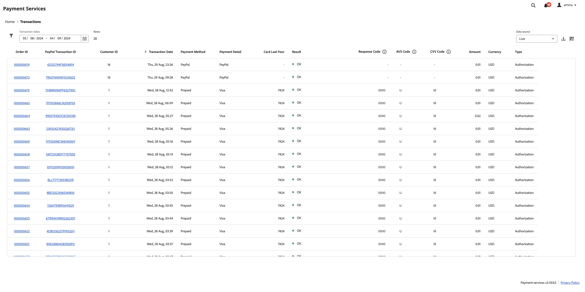

# Transaktionsbericht

[!DNL Payment Services] für [!DNL Adobe Commerce] und [!DNL Magento Open Source] bietet Ihnen umfassende Berichte, sodass Sie einen klaren Überblick über die Transaktionen, Bestellungen und Zahlungen Ihres Geschäfts erhalten.

{width="700" zoomable="yes"}

Der Transaktionsbericht bietet Einblicke in die Rate der Transaktionsautorisierungen und negative Transaktionstrends, sodass Sie den Zustand Ihres Geschäfts effektiv überwachen und alle Transaktionsprobleme vorbeugend identifizieren und beheben können.

Siehe Individuelle Transaktionen für Bestellungen, die in der Storefront platziert werden, ihre Zahlungsmethoden, Ergebnisse, Zahlungsantwort-Codes und mehr.

Die im Transaktionsbericht enthaltenen Informationen sind nur für den Händlereinsatz bestimmt. Teilen Sie diese Informationen nicht mit Kunden oder anderen potenziellen Betrügern. Transaktionsinformationen können verwendet werden, um Sicherheitsprüfungen zu umgehen oder Bestellungen zu platzieren, die zu Chargebacks führen.

Sie können den Transaktionsbericht im .csv-Dateiformat herunterladen, um ihn in bestehenden Buchhaltungs- oder Auftragsverwaltungssoftware verwenden zu können.

>[!NOTE]
>
>Finanzberichte können nicht angezeigt werden, wenn Sie nicht [den Live-Modus](production.md#enable-live-payments) für [!DNL Payment Services] integriert und aktiviert haben.

## Ansicht des Transaktionsberichts

Die Ansicht des Transaktionsberichts ist in der Ansicht &quot;Transaktionen&quot;von Zahlungsdiensten verfügbar. Sie enthält alle verfügbaren Informationen über Transaktionen für Ihre Geschäfte.

Wechseln Sie in der Seitenleiste _Admin_ zu **[!UICONTROL Sales]** > **[!UICONTROL Payment Services]** > _[!UICONTROL Transactions]_>**[!UICONTROL View Report]**, um die detaillierte Ansicht des Berichts &quot;Transaktionen&quot;in der Tabelle anzuzeigen.

{width="800" zoomable="yes"}

Sie können diese Ansicht entsprechend den Abschnitten in diesem Thema konfigurieren, um die gewünschten Daten am besten darzustellen.

Siehe verknüpfte Commerce-Bestell- und PayPal-Transaktions-IDs, Transaktionsbeträge, Zahlungsmethoden pro Transaktion und mehr, alles in diesem Bericht.

Nicht alle Zahlungsmethoden bieten die gleiche Granularität von Informationen. Kreditkartentransaktionen bieten beispielsweise Antwort-, AVS- und CCV-Codes sowie die letzten vier Ziffern der Karte im Transaktionsbericht; PayPal-Zahlungsschaltflächen nicht.

Sie können [Transaktionen herunterladen](#download-transactions) in einem CSV-Dateiformat, das in der bestehenden Buchhaltungs- oder Auftragsverwaltungssoftware verwendet werden kann.

>[!WARNING]
>
> Der Transaktionsbericht enthält keine außerhalb von [!DNL Payment Services] durchgeführten Aufnahmen.

### Datenquelle auswählen

In der Berichtsansicht &quot;Transaktionen&quot;können Sie die Datenquelle **[!UICONTROL Live]** oder **[!UICONTROL Sandbox]** auswählen, für die Sie Berichtsergebnisse anzeigen möchten.

{width="300" zoomable="yes"}

Wenn _[!UICONTROL Live]_die ausgewählte Datenquelle ist, können Sie Berichtinformationen für Ihre Stores anzeigen, die [!DNL Payment Services] im Produktionsmodus verwenden. Wenn_[!UICONTROL Sandbox]_ die ausgewählte Datenquelle ist, können Sie Berichtinformationen für Ihren Sandbox-Modus anzeigen.

Datenquellenauswahlen funktionieren wie folgt:

* Wenn keine Stores vorhanden sind, die im Produktionsmodus &quot;[!DNL Payment Services]&quot;verwenden, wird standardmäßig die Datenquelle &quot;_[!UICONTROL Sandbox]_&quot;ausgewählt.
* Wenn Sie Stores (einen oder mehrere) haben, die im Produktionsmodus [!DNL Payment Services] verwenden, wird standardmäßig _[!UICONTROL Live]_als Datenquelle ausgewählt.
* Beim Exportieren von Berichten wird immer die Auswahl der Datenquelle berücksichtigt.

So wählen Sie die Datenquelle für Ihren [!UICONTROL Transactions] -Bericht aus:

1. Wechseln Sie auf der Seitenleiste _Admin_ zu **[!UICONTROL Sales]** > **[!UICONTROL [!DNL Payment Services]]** > _[!UICONTROL Transactions]_>**[!UICONTROL View Report]**.
1. Klicken Sie auf **[!UICONTROL Data source]** und wählen Sie **[!UICONTROL Live]** oder **[!UICONTROL Sandbox]** aus.

   Die Berichtsergebnisse werden basierend auf der ausgewählten Datenquelle neu generiert.

### Datum und Zeitrahmen anpassen

In der Ansicht des Transaktionsberichts können Sie den Zeitrahmen der Transaktionen, die Sie anzeigen möchten, anpassen, indem Sie bestimmte Daten auswählen. Standardmäßig werden 30 Tage Transaktionen im Raster angezeigt.

1. Wechseln Sie auf der Seitenleiste _Admin_ zu **[!UICONTROL Sales]** > **[!UICONTROL [!DNL Payment Services]]** > _[!UICONTROL Transactions]_>**[!UICONTROL View Report]**.
1. Klicken Sie auf den Kalender-Auswahlfilter **[!UICONTROL Transaction dates]** .
1. Wählen Sie den entsprechenden Datumsbereich aus.
1. Zeigen Sie die Transaktionen für die angegebenen Daten im Raster an.

### Berichtinformationen filtern

In der Ansicht des Transaktionsberichts können Sie die anzuzeigenden Statusergebnisse filtern, indem Sie Filterkriterien auswählen.

1. Wechseln Sie auf der Seitenleiste _Admin_ zu **[!UICONTROL Sales]** > **[!UICONTROL [!DNL Payment Services]]** > _[!UICONTROL Transactions]_>**[!UICONTROL View Report]**.
1. Klicken Sie auf den Selektor **[!UICONTROL Filter]** .
1. Schalten Sie die _[!UICONTROL Transaction Result]_-Optionen um, um die Berichtsergebnisse nur für ausgewählte Bestellvorgänge anzuzeigen.
1. Schalten Sie die _[!UICONTROL Payment Method]_-Optionen um, um die Berichtsergebnisse für die Art der für die Transaktion verwendeten Zahlung anzuzeigen.
1. Schalten Sie die _[!UICONTROL Payment Detail]_-Optionen um, um zusätzliche Informationen für die verwendete Zahlungsart anzuzeigen, sofern verfügbar.
1. Geben Sie einen _Min. Bestellbetrag_ oder _Max. Bestellbetrag_ ein, um die Berichtsergebnisse innerhalb dieses Bestellwertbereichs anzuzeigen.
1. Geben Sie _[!UICONTROL Order ID]_ein, um nach einer bestimmten Transaktion zu suchen.
1. Stellen Sie die _[!UICONTROL Card Last Four]_ein, um nach einer bestimmten Kredit- oder Debitkarte zu suchen.
1. Geben Sie einen _[!UICONTROL Customer ID]_ein, um alle Transaktionen eines bestimmten Kunden anzuzeigen.
1. Geben Sie den Wert _[!UICONTROL Customer Email]_ein, um Transaktionen für diese E-Mail zu filtern.
1. Klicken Sie auf **[!UICONTROL Hide filters]** , um den Filter auszublenden.

### Spalten ein- und ausblenden

Der Transaktionsbericht zeigt standardmäßig alle verfügbaren Informationsspalten an. Sie können jedoch anpassen, welche Spalten in Ihrem Bericht angezeigt werden.

1. Wechseln Sie auf der Seitenleiste _Admin_ zu **[!UICONTROL Sales]** > **[!UICONTROL [!DNL Payment Services]]** > _[!UICONTROL Transactions]_>**[!UICONTROL View Report]**.
1. Klicken Sie auf das Symbol **[!UICONTROL Column settings]** {width="20" zoomable="yes"}.
1. Um anzupassen, welche Spalten im Bericht angezeigt werden, aktivieren oder deaktivieren Sie die Spalten in der Liste.

   Der Transaktionsbericht zeigt sofort alle Änderungen an, die Sie im Menü Spalteneinstellungen vorgenommen haben. Die Spaltenvoreinstellungen werden gespeichert und bleiben in Kraft, wenn Sie von der Berichtsansicht weg navigieren.

### Berichtdaten aktualisieren

Die Ansicht des Transaktionsberichts zeigt einen _[!UICONTROL Last updated]_-Zeitstempel an, der das letzte Mal anzeigt, dass die Berichtinformationen aktualisiert wurden. Standardmäßig werden die Daten des Transaktionsberichts alle drei Stunden automatisch aktualisiert.

Sie können auch manuell eine Aktualisierung der Berichtsdaten erzwingen, um die aktuellsten Berichtinformationen anzuzeigen.

1. Wechseln Sie auf der Seitenleiste _Admin_ zu **[!UICONTROL Sales]** > **[!UICONTROL [!DNL Payment Services]]** > _[!UICONTROL Transactions]_>**[!UICONTROL View Report]**.
1. Klicken Sie auf das Symbol _Aktualisieren_ ({width="20" zoomable="yes"}).

   Die Daten des Transaktionsberichts werden aktualisiert, eine *[!UICONTROL Update complete]* -Bestätigung wird angezeigt und die neuesten Informationen werden im Raster angezeigt.

### Herunterladen von Transaktionen

Sie können eine .csv -Datei mit allen Transaktionen herunterladen, die im Raster der Ansicht der Transaktionen sichtbar sind, unabhängig davon, ob Sie die standardmäßigen 30-Tage-Transaktionen oder einen benutzerdefinierten Zeitrahmen anzeigen.

1. Wechseln Sie in der Seitenleiste _Admin_ zu **[!UICONTROL Sales]** > **[!UICONTROL [!DNL Payment Services]]** > **[!UICONTROL Transactions]**.
1. Wenn Sie Transaktionen für einen anderen Zeitraum als die letzten 30 Tage anzeigen möchten, passen Sie [den Zeitrahmen für den Datumsbereich für Ihren Status an](#customize-dates-timeframe).
1. Klicken Sie auf das Symbol _Download_ {width="20" zoomable="yes"}.

Ihre Transaktionen werden im .csv-Format heruntergeladen.

### Spaltenbeschreibungen

Transaktionsberichte enthalten die folgenden Informationen.

| Spalte | Beschreibung |
| ------------ | -------------------- |
| [!UICONTROL Order ID] | Commerce-Bestell-ID (enthält nur Werte für erfolgreiche Transaktionen und ist bei abgelehnten Transaktionen leer)   Um verwandte [Bestellinformationen](https://experienceleague.adobe.com/en/docs/commerce-admin/stores-sales/order-management/orders/orders){target="_blank"} anzuzeigen, klicken Sie auf die ID. |
| [!UICONTROL PayPal Transaction ID] | Vom Zahlungsdienstleister bereitgestellte Transaktions-ID, die nur Werte für erfolgreiche Transaktionen enthält und einen Bindestrich für zurückgewiesene Transaktionen enthält. Sie können auf diese ID klicken, um auf die Detailseite der PayPal-Transaktion zuzugreifen. |
| [!UICONTROL Customer ID] | Commerce-Kunden-ID einer Bestellung  Weitere Informationen finden Sie unter Thema [Kundeninformationen](https://experienceleague.adobe.com/en/docs/commerce-admin/customers/customer-accounts/account-create){target="_blank"} .  |
| [!UICONTROL Transaction Date] | Transaktionsdatumszeitstempel |
| [!UICONTROL Payment Method] | Art der für die Transaktion verwendeten Zahlung mit Informationen über Marke und Kartentyp. Weitere Informationen finden Sie unter [Kartentypen](https://developer.paypal.com/docs/api/orders/v2/#definition-card_type) . Verfügbar für Zahlungsdienste-Versionen 1.6.0 und höher |
| [!UICONTROL Payment Detail] | Enthält zusätzliche Informationen zur Art der für die Transaktion verwendeten Zahlung, sofern verfügbar. |
| [!UICONTROL Card Last Four] | Letzte vier Stellen der Kredit- oder Debitkarten, die für die Transaktion verwendet werden |
| [!UICONTROL Result] | Das Ergebnis der Transaktion—*[!UICONTROL OK]* (erfolgreiche Transaktion), *[!UICONTROL Rejected by Payment Provider]* (abgelehnt von PayPal), *[!UICONTROL Rejected by Bank]* (abgelehnt von Bank, die die Karte ausgegeben hat) |
| [!UICONTROL Response Code] | Fehlercode, der den Grund für die Zurückweisung von Zahlungsdienstleistern oder Banken angibt; siehe Liste möglicher Antwortcodes und Beschreibungen für [`Rejected by Bank` Status](https://developer.paypal.com/docs/api/orders/v2/#definition-processor_response) und [`Rejected by Payment Provider` Status](https://developer.paypal.com/api/rest/reference/orders/v2/errors/) . |
| [!UICONTROL AVS Code] | Adresse Verification Service-Code; die Antwortinformationen des Verarbeiters für Zahlungsanfragen. Weitere Informationen finden Sie unter [Liste der möglichen Codes und Beschreibungen](https://developer.paypal.com/docs/api/orders/v2/#definition-processor_response). |
| [!UICONTROL CVV Code] | Kartenprüfungswertcode für Kredit- und Debitkarten; weitere Informationen finden Sie unter [Liste möglicher Codes und Beschreibungen](https://developer.paypal.com/docs/api/orders/v2/#definition-processor_response). |
| [!UICONTROL Amount] | Bestellmenge |
| [!UICONTROL Currency] | Währung, die für die Bestellung in der Transaktion verwendet wird |
| [!UICONTROL Type] | [Zahlungsaktion](../payment-services/production.md#set-payment-services-as-payment-method) für Transaktion—`Authorize` oder `Authorize and Capture` |

### Fehler-Antwortcodes

Die Spalte _Antwortcode_ enthält einen spezifischen Fehler- oder Erfolgscode im Zusammenhang mit der Transaktion. Zu den gebräuchlichen Fehlercodes, die möglicherweise angezeigt werden, gehören:

* `PAYMENT_DENIED`—Die Transaktion wurde von PayPal abgelehnt, weil sie als Betrug vermutet wurde.
* `INTERNAL_SERVER_ERROR`: Die Transaktion wurde von PayPal abgelehnt und es kam ein PayPal-Server-Fehler auf. Die Transaktion kann wiederholt werden.
* `INSTRUMENT_DECLINED`: Der Kunde wurde von PayPal pro ausgewählter Zahlungsmethode abgelehnt. Transaktionen können mit einer anderen Zahlungsmethode wiederholt werden.
* `9500`—Die Transaktion wurde von der verbundenen Bank abgelehnt, weil sie verdächtigt wurde, betrügerisch zu sein.
* `5120`—Die Transaktion wurde von der verbundenen Bank abgelehnt, da der Kunde nicht über ausreichende Mittel für die Zahlung verfügte.
* `5650`: Die Transaktion wurde von der verbundenen Bank abgelehnt, da die Bank eine starke Kundenauthentifizierung erfordert ([3DS](security.md#3ds)).

Detaillierte Fehlerantwort-Codes für fehlgeschlagene Transaktionen sind für Transaktionen verfügbar, die jünger als am 1. Juni 2023 sind. Teilberichtdaten werden für Transaktionen angezeigt, die vor dem 1. Juni 2023 stattgefunden haben.
