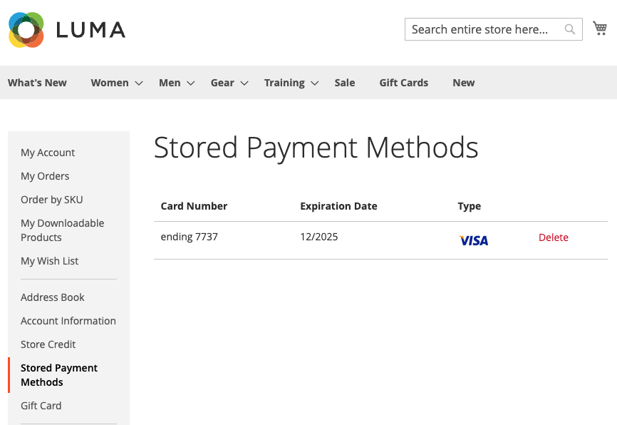

# Kreditkartenausfall

Konvertieren von einmaligen Kunden in treue Kunden mit Kreditkartenausfall. Käufer können ihre Kreditkartenanmeldeinformationen während des Checkout speichern - oder &quot;Vault&quot;- um sie bei einem späteren Kauf für denselben oder einen anderen, innerhalb desselben Händlerkontos zu verwenden.

{width="400" zoomable="yes"}

Käufer verwenden das gespeicherte Token, um einen zukünftigen Checkout mit ihren gespeicherten Kreditkarteninformationen abzuschließen.

{width="400" zoomable="yes"}

Außerdem können sie ihre Kreditkarten einfach aus den [gespeicherten Zahlungsmethoden](https://experienceleague.adobe.com/en/docs/commerce-admin/stores-sales/payments/stored-payment-methods) in ihrem Konto löschen.

{width="400" zoomable="yes"}

>[!WARNING]
>
>PayPal kann derzeit maximal fünf gewölbte Karten speichern.

## Validierung aktivieren

Sie können die Kreditkartenüberprüfung für Kunden _und_, die Händler in der Admin-Konsole sind, für Ihre Geschäfte in [!DNL Payment Services] [Einstellungen](settings.md#card-vaulting) aktivieren.

## Use vaulting in the Admin

Wenn ein Kunde über eine zuvor gültige Kreditkarte verfügt, kann ein Händler mithilfe seiner gültigen Zahlungsmethoden eine nachfolgende Bestellung für diesen Kunden im Admin erstellen.

Sie können im Admin nur dann gültige Karten verwenden, wenn der Kunde über ein bestehendes Konto und ein gültiges Token verfügt, das im System von einer zuvor abgeschlossenen Zahlung gespeichert ist.

So erstellen Sie im Admin eine Bestellung für einen Kunden mit seiner gültigen Kreditkarte:

1. [Erstellen Sie eine Bestellung und fügen Sie Produkte hinzu](https://experienceleague.adobe.com/docs/commerce-admin/stores-sales/point-of-purchase/assist/customer-account-create-order.html).
1. Wählen Sie in _[!UICONTROL Payment & Shipping Information]_**[!UICONTROL Stored Cards]**als Zahlungsmethode aus.
1. Wählen Sie die gewünschte Kreditkartenzahlmethode aus.
1. Nachdem Sie alle weiteren erforderlichen Schritte für die Bestellung ausgeführt haben, senden Sie [sie](https://experienceleague.adobe.com/docs/commerce-admin/stores-sales/point-of-purchase/assist/customer-account-create-order.html?lang=en#step-3%3A-submit-the-order).

   {width="600" zoomable="yes"}

## Sicherheit

Minimale Kreditkarteninformationen werden für den Käufer freigegeben. Er sieht nur die letzten vier Ziffern, das Ablaufdatum und die Marke seiner ausgefüllten Kreditkarte. Kreditkarteninformationen werden beim Zahlungsdienstleister gespeichert, um die [PCI](security.md#PCI-compliance)-Compliance-Standards zu erfüllen.
