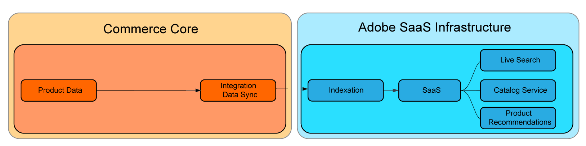

# SaaS-Preisindizierung

Die SaaS-Preisindizierung beschleunigt die Zeit, die für Preisänderungen benötigt wird, um sie widerzuspiegeln. [Commerce-Services](../landing/saas.md) nachdem sie eingereicht wurden. So können Händler mit großen, komplexen Katalogen oder mit mehreren Websites oder Kundengruppen Preisänderungen kontinuierlich verarbeiten.
Wenn Sie eine Headless-Storefront haben oder die [catalog-adapter](./catalog-adapter.md) -Erweiterung verwenden, können Kunden den Adobe Commerce-Core-Preisindex deaktivieren.

Rechenintensive Prozesse wie Indizierung und Preisberechnung wurden vom Commerce-Kern in die Adobe Cloud-Infrastruktur verschoben. Dadurch können Händler Ressourcen schnell skalieren, um die Indexierungszeiten zu erhöhen und diese Änderungen schneller widerzuspiegeln.

Der Datenfluss der Core-Indizierung zu SaaS-Diensten sieht wie folgt aus:


Bei SaaS-Preisindizierung lautet der Fluss:



Alle Händler können von diesen Verbesserungen profitieren, aber diejenigen, die die größten Gewinne erzielen, sind Kunden mit:

* Konstante Preisänderungen: Händler, die wiederholte Preisänderungen erfordern, um strategische Ziele wie häufige Promotions, saisonale Rabatte oder Inventarmarkdowns zu erreichen.
* Mehrere Websites und/oder Kundengruppen: Händler mit freigegebenen Produktkatalogen über mehrere Websites (Domänen/Marken) und/oder Kundengruppen hinweg.
* Große Anzahl einzigartiger Preise für Websites oder Kundengruppen: Händler mit umfangreichen gemeinsam genutzten Produktkatalogen, die individuelle Preise für Websites oder Kundengruppen enthalten, wie B2B-Händler mit vorab ausgehandelten Preisen, Marken mit unterschiedlichen Preisstrategien.

Die SaaS-Preisindizierung ist für Kunden, die Adobe Commerce-Dienste verwenden, kostenlos verfügbar und unterstützt die Preisberechnung für alle integrierten Adobe Commerce-Produktarten.

In diesem Handbuch wird beschrieben, wie die SaaS-Preisindizierung funktioniert und wie sie aktiviert wird.

## Voraussetzungen

* Adobe Commerce 2.4.4+
* Mindestens einer der folgenden Commerce-Dienste mit der neuesten Version der Adobe Commerce-Erweiterung:

   * [Catalog Service](../catalog-service/overview.md)
   * [Live Search](../live-search/guide-overview.md)
   * [Produkt-Recommendations](../product-recommendations/guide-overview.md)

Benutzer von Luma und Adobe Commerce Core GraphQL können die [`catalog-adapter`](catalog-adapter.md) -Erweiterung, die Luma- und Core-GraphQl-Kompatibilität bietet und den Adobe Commerce Product Price-Indexer deaktiviert.

## Nutzung

Synchronisieren Sie nach dem Upgrade Ihrer Adobe Commerce-Instanz mit SaaS-Preisindizierungsunterstützung die neuen Feeds:

```bash
bin/magento saas:resync --feed=scopesCustomerGroup
bin/magento saas:resync --feed=scopesWebsite
bin/magento saas:resync --feed=prices
```

## Preise für benutzerdefinierte Produktarten

Preisberechnungen werden für benutzerdefinierte Produktarten wie Basispreis, Sonderpreis, Gruppenpreis, Katalogregelpreis usw. unterstützt.

Wenn Sie über einen benutzerdefinierten Produkttyp verfügen, der eine bestimmte Formel zur Berechnung des Endpreises verwendet, können Sie das Verhalten des Produktpreis-Feeds erweitern.

1. Erstellen Sie ein Plug-in im `Magento\ProductPriceDataExporter\Model\Provider\ProductPrice` -Klasse.

   ```xml
   <config xmlns:xsi="http://www.w3.org/2001/XMLSchema-instance"
           xsi:noNamespaceSchemaLocation="urn:magento:framework:ObjectManager/etc/config.xsd">
       <type name="Magento\ProductPriceDataExporter\Model\Provider\ProductPrice">
           <plugin name="custom_type_price_feed" type="YourModule\CustomProductType\Plugin\UpdatePriceFromFeed" />
       </type>
   </config>
   ```

1. Erstellen Sie eine Methode mit der benutzerdefinierten Formel:

   ```php
   class UpdatePriceFromFeed
   {
       /**
       * @param ProductPrice $subject
       * @param array $result
       * @param array $values
       *
       * @return array
       */
       public function afterGet(ProductPrice $subject, array $result, array $values) : array
       {
           // Override the output $result with your data for the corresponding products (see original method for details) 
           return $result;
       }
   }
   ```
