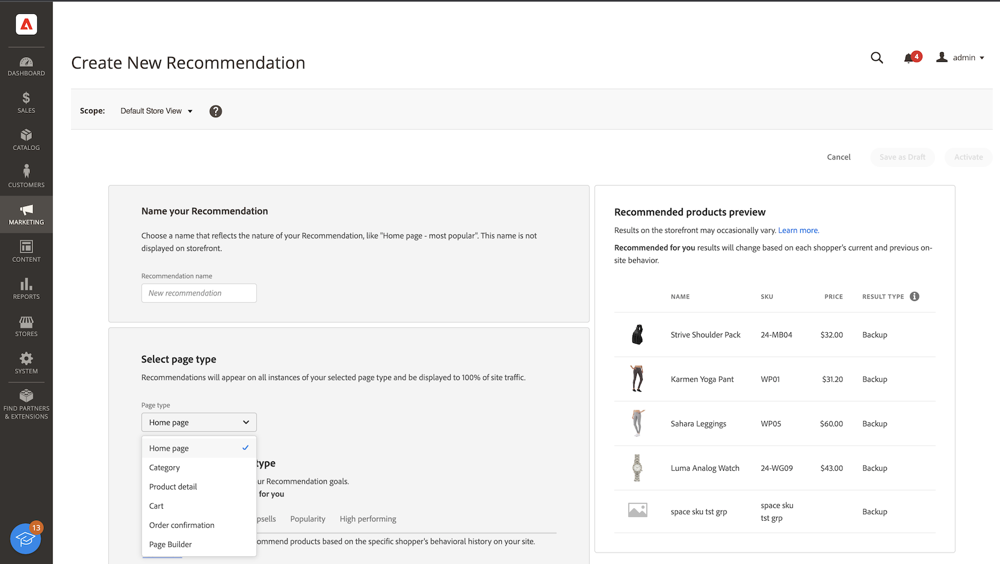

# Neue Empfehlung erstellen

Wenn Sie eine Empfehlung erstellen, erstellen Sie eine _Empfehlungseinheit_ oder ein Widget, die das empfohlene Produkt _Artikel_ enthält.

_Empfehlungseinheit_

Wenn Sie die Empfehlungseinheit aktivieren, beginnt Adobe Commerce mit [Datenerfassung](workspace.md), um Impressionen, Ansichten, Klicks usw. zu messen. Die Tabelle [!DNL Product Recommendations] enthält die Metriken für jede Empfehlungseinheit, damit Sie fundierte Geschäftsentscheidungen treffen können.

>[!NOTE]
>
>Die Metriken zur Produktempfehlung sind für Luma-Storefronts optimiert. Wenn Ihre Storefront nicht auf Luma basiert, hängt die Art und Weise, wie die Metriken Daten verfolgen, davon ab, wie Sie [die Ereigniskollektion implementieren](events.md).

1. Wechseln Sie in der Seitenleiste _Admin_ zu **Marketing** > _Promotions_ > **Produkt-Recommendations** , um den Arbeitsbereich _Produkt-Recommendations_ anzuzeigen.

1. Geben Sie die [Store-Ansicht](https://experienceleague.adobe.com/en/docs/commerce-admin/start/setup/websites-stores-views) an, in der die Empfehlungen angezeigt werden sollen.

   >[!NOTE]
   >
   > Die Empfehlungseinheiten für den Seitenaufbau müssen in der standardmäßigen Store-Ansicht erstellt werden, können dann jedoch überall verwendet werden. Weitere Informationen zum Erstellen von Produktempfehlungen mit Page Builder finden Sie unter [Content hinzufügen - Product Recommendations](https://experienceleague.adobe.com/en/docs/commerce-admin/page-builder/add-content/recommendations).

1. Klicken Sie auf **Empfehlung erstellen**.

1. Geben Sie im Abschnitt _Ihre Empfehlung benennen_ einen beschreibenden Namen für die interne Referenz ein, z. B. `Home page most popular`.

1. Wählen Sie im Abschnitt _Seitentyp auswählen_ die Seite aus, auf der die Empfehlung aus den folgenden Optionen angezeigt werden soll:

   >[!NOTE]
   >
   > Produkt-Recommendations wird auf der Warenkorbseite nicht unterstützt, wenn Ihr Store so konfiguriert ist, dass [die Warenkorbseite unmittelbar nach dem Hinzufügen eines Produkts zum Warenkorb angezeigt wird](https://experienceleague.adobe.com/en/docs/commerce-admin/stores-sales/point-of-purchase/cart/cart-configuration).

   * Startseite
   * Kategorie
   * Produktdetails
   * Warenkorb
   * Bestätigung
   * [Seitenaufbau](https://experienceleague.adobe.com/en/docs/commerce-admin/page-builder/add-content/recommendations)

   Sie können bis zu fünf aktive Empfehlungseinheiten für jeden Seitentyp und bis zu 25 für Page Builder erstellen. Der Seitentyp ist grau ausgeblendet, wenn die Grenze erreicht ist.

   
   _Empfehlungsname und Seitenplatzierung_

1. Geben Sie im Abschnitt _Empfehlungstyp auswählen_ den [Empfehlungstyp](type.md) an, der auf der ausgewählten Seite angezeigt werden soll. Bei einigen Seiten ist die [Platzierung](placement.md) von Empfehlungen auf bestimmte Typen beschränkt.

1. Geben Sie im Abschnitt _Schaufenster-Anzeigetitel_ den für Ihre Kunden sichtbaren [Titel](placement.md#recommendation-labels) ein, z. B. &quot;Topverkäufe&quot;.

1. Verwenden Sie im Abschnitt _Anzahl der Produkte auswählen_ den Schieberegler, um festzulegen, wie viele Produkte in der Empfehlungseinheit angezeigt werden sollen.

   Der Standardwert ist `5`, mit einem Maximalwert von `20`.

1. Geben Sie im Abschnitt _Platzierung auswählen_ an, wo die Empfehlungseinheit auf der Seite angezeigt werden soll.

   * Am unteren Rand des Hauptinhalts
   * Oben im Hauptinhalt

1. (Optional) Um die Reihenfolge der Empfehlungen zu ändern, wählen Sie die Zeilen in der Tabelle _Position auswählen_ aus und verschieben Sie sie.

   Im Abschnitt _Position auswählen_ werden alle Empfehlungen (falls vorhanden) angezeigt, die für den ausgewählten Seitentyp erstellt wurden.

   
   _Empfehlungsreihenfolge auf Seite_

1. (Optional) Wenden Sie im Abschnitt _Filter_ die Filter [an](filters.md), um zu steuern, welche Produkte in der Empfehlungseinheit angezeigt werden.

   
   _Empfehlungs-Produktfilter_

1. Klicken Sie nach Abschluss des Vorgangs auf eine der folgenden Optionen:

   * **Als Entwurf speichern**, um die Empfehlungseinheit später zu bearbeiten. Sie können den Seitentyp oder den Empfehlungstyp für eine Empfehlungseinheit nicht in einem Entwurfsstatus ändern.

   * **Aktivieren Sie** , um die Empfehlungseinheit in Ihrer Storefront zu aktivieren.

## Bereitschaftsindikatoren

Bereitschaftsindikatoren zeigen, welche Empfehlungstypen basierend auf dem verfügbaren Katalog und den verfügbaren Verhaltensdaten am besten funktionieren. Sie können Bereitschaftsindikatoren auch verwenden, um festzustellen, ob Sie Probleme mit Ihrem [Eventing](events.md) haben oder ob Sie nicht über ausreichend Traffic verfügen, um den Empfehlungstyp auszufüllen.

Bereitschaftsindikatoren werden entweder in [statisch-basiert](#static-based) oder in [dynamisch-basiert](#dynamic-based) kategorisiert. Statische Katalogdaten werden nur verwendet, während dynamische Verhaltensdaten von Ihren Käufern verwenden. Diese Verhaltensdaten werden verwendet, um [Modelle für maschinelles Lernen zu trainieren](events.md), um personalisierte Empfehlungen zu erstellen und deren Bereitschaftsbewertung zu berechnen.

### Berechnung der Bereitschaftsindikatoren

Die Bereitschaftsindikatoren geben an, wie viel das Modell trainiert wird. Indikatoren hängen von den erfassten Ereignistypen, der Breite der jeweils verwendeten Produkte und der Größe des Katalogs ab.

Der Prozentsatz des Bereitschaftsindikators wird aus einer Berechnung abgeleitet, die angibt, wie viele Produkte je nach Empfehlungstyp empfohlen werden könnten. Statistiken werden auf Produkte angewendet, die auf der Gesamtgröße des Katalogs, dem Interaktionsvolumen (wie Ansichten, Klicks, Add-zu-Warenkorb) und dem Prozentsatz der SKUs basieren, die diese Ereignisse innerhalb eines bestimmten Zeitfensters registrieren. Beispielsweise können die Bereitschaftsindikatoren während des Traffics in der Hochsaison höhere Werte aufweisen als in Zeiten normalen Volumens.

Infolge dieser Variablen kann der Prozentsatz des Bereitschaftsindikators schwanken. Dies erklärt, warum Sie möglicherweise feststellen, dass Empfehlungstypen &quot;bereit zur Bereitstellung&quot;ein- und ausgehen.

Die Indikatoren für die Bereitschaft werden anhand von zwei Faktoren berechnet:

* Ausreichende Ergebnissatzgröße: Gibt es in den meisten Szenarien genügend Ergebnisse, um die Verwendung von [Reserveempfehlungen](events.md#backuprecs) zu vermeiden?

* Ausreichende Ergebnismenge: Stellen die zurückgegebenen Produkte eine Vielzahl von Produkten aus Ihrem Katalog dar? Mit diesem Faktor soll verhindert werden, dass eine Minderheit von Produkten die einzigen Artikel ist, die auf der gesamten Site empfohlen werden.

Basierend auf den oben genannten Faktoren wird ein Bereitschaftswert wie folgt berechnet und angezeigt:

* 75 % oder mehr bedeutet, dass die für diesen Empfehlungstyp vorgeschlagenen Empfehlungen von höchster Relevanz sein werden.
* Mindestens 50 % bedeutet, dass die für diesen Empfehlungstyp vorgeschlagenen Empfehlungen weniger relevant sind.
* Weniger als 50 % bedeutet, dass die für diesen Empfehlungstyp vorgeschlagenen Empfehlungen möglicherweise nicht relevant sind. In diesem Fall werden [Reserveempfehlungen](events.md#backuprecs) verwendet.

Erfahren Sie mehr über [warum Bereitschaftsindikatoren niedrig sein könnten](#what-to-do-if-the-readiness-indicator-percent-is-low).

### Statisch

Die folgenden Empfehlungstypen sind statisch, da sie nur Katalogdaten erfordern. Es werden keine Verhaltensdaten verwendet.

* _Mehr wie dieser_
* _Visuelle Ähnlichkeit_

### Dynamisch-basiert

Die folgenden Empfehlungstypen sind dynamisch, da sie Verhaltensdaten aus Storefront verwenden.

Letzte sechs Monate mit Storefront-Verhaltensdaten:

* _Betrachtet dies, hat diesen_ angesehen
* _Betrachtet dies, kaufte diesen_
* _kaufte dies, kaufte diesen_
* _Für Sie empfohlen_

Letzte sieben Tage mit Storefront-Verhaltensdaten:

* _Am häufigsten angezeigt_
* _Am häufigsten gekauft_
* _Am meisten zum Warenkorb hinzugefügt_
* _Trending_
* _Zur Kaufkonversion anzeigen_
* _Zur Warenkorbkonvertierung anzeigen_

Letzte Verhaltensdaten von Kunden (nur Ansichten):

* _Kürzlich angezeigt_

### Fortschritt visualisieren

Um Ihnen bei der Visualisierung des Trainings-Fortschritts für jeden Empfehlungstyp zu helfen, zeigt der Abschnitt _Empfehlungstyp auswählen_ ein Maß an Bereitschaft für jeden Typ an.

_Empfehlungstyp_

>[!NOTE]
>
>Die Indikatoren dürfen niemals 100 % erreichen.

Der Prozentsatz des Bereitschaftsindikators für Empfehlungstypen, die von Katalogdaten abhängen, ändert sich nicht besonders, da sich der Katalog des Händlers nicht häufig ändert. Der Prozentsatz des Bereitschaftsindikators für Empfehlungstypen, der auf Verhaltensdaten von Käufern basiert, kann sich jedoch je nach täglicher Aktivität des Käufers häufig ändern.

#### Was zu tun ist, wenn der Bereitschaftsindikator-Prozentsatz niedrig ist?

Ein geringer Prozentsatz an Bereitschaft zeigt an, dass nicht viele Produkte aus Ihrem Katalog in Empfehlungen für diesen Empfehlungstyp aufgenommen werden können. Dies bedeutet, dass mit hoher Wahrscheinlichkeit [Reserveempfehlungen](events.md#backuprecs) zurückgegeben werden, wenn Sie diesen Empfehlungstyp trotzdem bereitstellen.

Im Folgenden werden mögliche Gründe und Lösungen für häufige niedrige Bereitschaft-Bewertungen aufgelistet:

* **Statisch-basiert** - Geringe Prozentwerte für diese Indikatoren können durch fehlende Katalogdaten für die anzeigbaren Produkte verursacht werden. Wenn sie niedriger sind als erwartet, kann dieses Problem durch eine vollständige Synchronisierung behoben werden.
* **Dynamisch-basiert** - Geringe Prozentwerte für dynamische Indikatoren können durch Folgendes verursacht werden:

   * Fehlende Felder in den erforderlichen [storefront-Ereignissen](events.md) für die jeweiligen Empfehlungstypen (requestId, product context usw.)
   * Geringer Traffic auf dem Store, sodass das Volumen der verhaltensbezogenen Ereignisse, die wir empfangen, gering ist.
   * Die Vielfalt der verhaltensbezogenen Ereignisse in Storefront in verschiedenen Produkten in Ihrem Geschäft ist gering. Wenn beispielsweise nur zehn Prozent Ihrer Produkte mehrmals angezeigt oder gekauft werden, sind die entsprechenden Bereitschaftsindikatoren gering.

## Recommendations-Vorschau {#preview}

Das Bedienfeld &quot;_Empfohlene Produktvorschau_&quot;ist immer mit einer Beispielauswahl von Produkten verfügbar, die in der Empfehlungseinheit angezeigt werden, wenn sie auf der Storefront bereitgestellt wird.

Um eine Empfehlung bei der Arbeit in einer Nicht-Produktionsumgebung zu testen, können Sie Empfehlungsdaten aus einer [anderen Quelle](settings.md) abrufen. Auf diese Weise können Händler mit Regeln experimentieren und die Empfehlungen in der Vorschau anzeigen, bevor sie in der Produktion bereitgestellt werden.

| Feld | Beschreibung |
|---|---|
| Name | Der Name des Produkts. |
| SKU | Lagereinheit, die dem Produkt zugewiesen ist |
| Preis | Der Preis des Produkts. |
| Ergebnistyp | Primär - gibt an, dass ausreichend Schulungsdaten gesammelt wurden, um eine Empfehlung anzuzeigen. Backup - gibt an, dass nicht genügend Schulungsdaten erfasst wurden, sodass eine Reserveempfehlung zum Ausfüllen des Slots verwendet wird. Navigieren Sie zu [Verhaltensdaten](events.md) , um mehr über Modelle für maschinelles Lernen und Reserveempfehlungen zu erfahren. |

Experimentieren Sie beim Erstellen Ihrer Empfehlungseinheit mit dem Seitentyp, Empfehlungstyp und Filtern, um sofort Echtzeit-Feedback zu den einzuschließenden Produkten zu erhalten. Sobald Sie wissen, welche Produkte angezeigt werden, können Sie die Empfehlungseinheit entsprechend Ihren Geschäftsanforderungen konfigurieren.

Adobe Commerce [filtert ](filters.md) -Empfehlungen, um zu verhindern, dass doppelte Produkte angezeigt werden, wenn mehrere Empfehlungseinheiten auf einer Seite bereitgestellt werden. Daher unterscheiden sich die im Vorschaufenster angezeigten Produkte möglicherweise von denen, die in der Storefront angezeigt werden.

>[!NOTE]
>
> Sie können keine Vorschau des Empfehlungstyps `Recently viewed` anzeigen, da die Daten nicht im Admin verfügbar sind.
