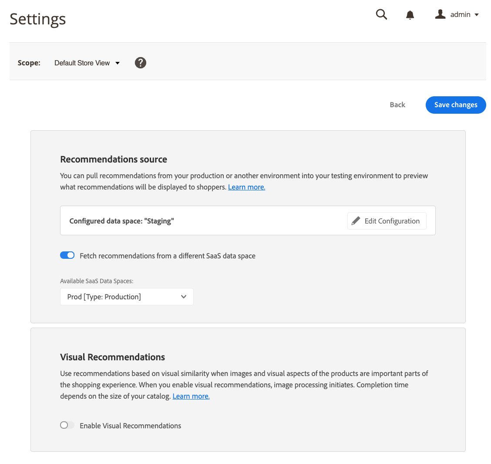

# Einstellungen

Wenn Sie [ einen SaaS-Datenraum für Recommendations konfigurieren, erfasst der SaaS-Datenraum Katalogdaten und Storefront-Verhaltensdaten. ](../landing/saas.md#saas-configuration) [Adobe Sensei](https://www.adobe.com/sensei.html) analysiert diese Daten und berechnet Produktzuordnungen, die für die Bereitstellung von Product Recommendations verwendet werden.

Nicht-Produktionsumgebungen für Tests oder Staging verfügen in der Regel nicht über die Menge oder Qualität der Storefront-Verhaltensdaten, um realistische Produktempfehlungen zu erhalten. Das tatsächliche Kaufverhalten in großem Maßstab kann nur in einer Produktionsumgebung erfasst werden. Um dieses Problem zu beheben, können Sie mit Adobe Commerce Produktempfehlungen aus Ihrer Produktionsumgebung mit anderen SaaS-Datenräumen ohne Produktionsumgebung verwenden. Durch die Verwendung der tatsächlichen Storefront-Daten in einer Nicht-Produktionsumgebung können Sie die Empfehlungen, die Ihre Kunden sehen, in der Vorschau anzeigen und mit verschiedenen Empfehlungstypen und Platzierungsorten experimentieren. Recommendations aus einem anderen SaaS-Datenraum kann von Käufern in der Vorschau angezeigt, aber nicht angeklickt werden.

Staging-Bestellungen werden mit dem Staging `environmentId` aufgezeichnet. Produktionsdaten sind davon nicht betroffen. Die Produktionsdaten werden mit dem `alternateEnvironmentId` abgerufen.

>[!NOTE]
>
>Bei Verwendung von Product Recommendations über REST kann der Parameter `alternateEnvironmentId` verwendet werden, um andere Datenbereiche anzugeben. Bei Verwendung von Product Recommendations über GraphQL ist dieser Parameter nicht verfügbar.

## Empfehlungsquelle auswählen

Um die Quelle Ihrer Produktempfehlungsdaten zu ändern, wählen Sie den SaaS-Datenraum mit den gewünschten Verhaltensdaten aus. Bevor Sie beginnen, stellen Sie Folgendes sicher:

- Die Storefront-Datenerfassung muss [konfiguriert und aktiviert](install-configure.md) für Ihre Produktionsumgebung sein und [überprüft](verify.md), ob Verhaltensdaten an Adobe Commerce gesendet werden.
- Ihr Nicht-Produktions-Umgebungs-Katalog sollte im Wesentlichen mit Ihrem Produktionskatalog übereinstimmen. Durch die Verwendung ähnlicher Kataloge wird sichergestellt, dass die zurückgegebenen Produktempfehlungseinheiten die in der Produktion ähneln.

1. Melden Sie sich beim Administrator Ihrer Nicht-Produktions-Adobe Commerce-Umgebung an.

1. Wechseln Sie in der Seitenleiste _Admin_ zu **Marketing** > _Promotions_ > **Produkt-Recommendations**.

1. Klicken Sie auf **Einstellungen**.

   
   _Einstellungen_

1. Aktivieren Sie im Abschnitt _Recommendations source_ die Option **Empfehlungen aus einem anderen SaaS-Datenraum abrufen** . Der Abschnitt &quot;_Recommendations source_&quot; wird nur in einer Nicht-Produktionsumgebung angezeigt.

   Eine Liste mit den verfügbaren SaaS-Datenräumen _wird angezeigt._

   
   _Einstellungen_

1. Wählen Sie den SaaS-Datenraum aus, der über die zu verwendenden Kundendaten verfügt.

1. Klicken Sie auf **Änderungen speichern**.

   Adobe Commerce ruft jetzt Empfehlungen aus dem ausgewählten Datenraum ab.

   >[!NOTE]
   >
   > Sie können zwar Empfehlungen anzeigen, die aus einem anderen SaaS-Datenraum außerhalb des Produktions-Storefront abgerufen wurden, aber Sie können nicht auf die Empfehlungen klicken.

### Neuen SaaS-Datenraum konfigurieren

1. Klicken Sie im Recommendations-Quellabschnitt auf **Konfiguration bearbeiten** .

1. Befolgen Sie die Anweisungen zum Konfigurieren eines neuen [[!DNL Commerce] Dienstes](/help/landing/saas.md).

## Visuelle Empfehlungen aktivieren

Wenn das Modul [Visual Product Recommendations](install-configure.md) installiert ist, müssen Sie Visual Recommendations aktivieren, um den Empfehlungstyp [Visuelle Ähnlichkeit](type.md#visualsim) zu verwenden.

Setzen Sie im Abschnitt _Visual Recommendations_ **Visual Recommendations aktivieren** auf die aktive Position.
