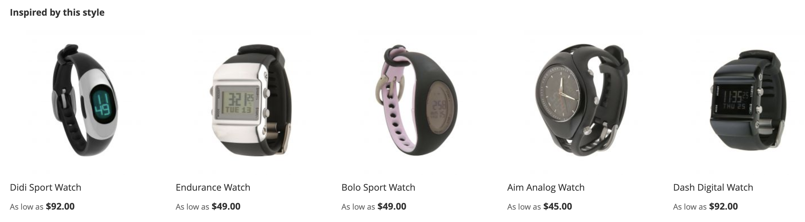

# Empfehlungstypen

Adobe Commerce bietet eine große Auswahl an Empfehlungen, die Sie auf verschiedenen Seiten Ihrer Site bereitstellen können. Alle Empfehlungstypen sind datengesteuert. Sie basieren auf Verhaltensdaten, Produktattributdaten und Metriken. Empfehlungstypen werden zur einfachen Referenz wie folgt gruppiert:

- [Personalisierte](#personalized)
- [Cross-Sells und Up-Sells](#crossup)
- [Beliebtheit](#popularity)
- [Leistungsstark](#highperf)

Als Best Practice empfiehlt Adobe bei der Verwendung von Empfehlungen die folgenden Richtlinien:

- Diversifizieren Sie Ihre Empfehlungstypen. Kunden beginnen Empfehlungen zu ignorieren, wenn sie dieselben Produkte immer wieder vorschlagen.

- Stellen Sie nicht dieselben Empfehlungen auf Ihrer Warenkorbseite und Ihrer Bestellbestätigungsseite bereit. Verwenden Sie `Most Added to Cart` für die Warenkorbseite und `Bought This, Bought That` für die Bestellbestätigungsseite.

- Halten Sie Ihre Site aufgeräumt. Stellen Sie nicht mehr als drei Empfehlungseinheiten auf derselben Seite bereit.

- Wenn Ihr Geschäft Kleidung verkauft, wird die `More like this` -Empfehlung kann geschlechtsspezifische Produkte vorschlagen, die nicht mit dem Geschlecht des angezeigten Produkts übereinstimmen. Erwägen Sie die Verwendung dieses Empfehlungstyps nur für Nicht-Bekleidungskategorien.

## Personalisierte {#personalized}

Diese Empfehlungstypen empfehlen Produkte, die auf dem Verhaltensverlauf des jeweiligen Käufers auf Ihrer Site basieren.

| Typ | Beschreibung |
|---|---|
| Empfohlen für Sie | Empfiehlt Produkte auf Grundlage des aktuellen und vorherigen Verhaltens der einzelnen Kunden vor Ort. Zeigt hochrelevante Empfehlungen basierend auf dem Browser- und Kaufverlauf des Käufers an. Dieser Empfehlungstyp ist auf der Startseite wirksam, auf der die meisten Käufer ihre Journey auf einer Site beginnen. Für Erstkäufer Ihrer Site, die kein Signal zur Personalisierung ihres Erlebnisses generiert haben, zeigt Adobe Commerce Produkte basierend auf dem am häufigsten angezeigten Empfehlungstyp an. Wenn der Kunde beginnt, mit den Produkten auf der Site zu interagieren, passen sich die empfohlenen Produkte jedoch in Echtzeit an sein Verhalten an.  **Gegebenenfalls:** - Startseite - Kategorie   **Vorgeschlagene Beschriftungen:**  - Nur für Sie - Empfohlen für Sie - Inspiriert von Ihren Einkaufstrends |
| Zuletzt angezeigt | Zeigt Produkte an, die der Kunde zuletzt angesehen hat, basierend auf dem Browserverlauf. Alle gelöschten Produkte werden von der Empfehlungseinheit entfernt. Die Empfehlungseinheit wird nicht angezeigt, wenn kein Browser-Verlauf vorhanden ist oder wenn bei der Anwendung von Filterregeln nicht genügend Verlauf vorhanden ist. Wenn die Ergebnisse weniger Produkte enthalten, als konfiguriert sind, zeigt die Empfehlungseinheit nur die zurückgegebenen Produkte an.  **Gegebenenfalls:** - Startseite - Kategorie - Produktdetails - Warenkorb - Bestätigung   **Vorgeschlagene Beschriftungen:** - Zuletzt angesehen - Sehen Sie sich das noch einmal an |

## Cross-Sells und Up-Sells {#crossup}

Diese Empfehlungstypen sind sozial unbedenklich, um Kunden zu helfen, herauszufinden, was andere mögen oder produktgesteuert sind, um sie bei der Suche nach anderen ähnlichen Produkten zu unterstützen

| Typ | Beschreibung |
|---|---|
| Anzeige, Anzeige, | Empfiehlt Produkte, die Kunden mit dem derzeit angezeigten Produkt überproportional häufiger betrachten.  **Gegebenenfalls:** - Produktdetails - Warenkorb - Bestätigung   **Vorgeschlagene Beschriftungen:** - Kunden, die dieses Produkt angesehen haben, haben auch (PDP) angezeigt. |
| Anzeige: , gekauft als | Empfiehlt Produkte, die Kunden nach der Anzeige des aktuellen Produkts in der Regel unverhältnismäßig häufiger kaufen. Hilft Kunden, Produkte zu entdecken, die sie sonst möglicherweise nicht bemerkt haben.  **Gegebenenfalls:** - Produktdetails - Warenkorb - Bestätigung   **Vorgeschlagene Beschriftungen:** - Kunden, die diesen ultimativen Kauf erhalten haben - Kunden, die letztlich gekauft haben - Was kaufen andere nach der Anzeige dieses Produkts? |
| kaufte das, kaufte es | Empfiehlt Produkte, die Käufer unverhältnismäßig häufiger mit dem aktuell angezeigten Produkt kaufen. Die meisten werden häufig auf der Einkaufswagen- oder Produktdetailseite verwendet, um die Exposition gegenüber verwandten Querverkaufsprodukten zu erhöhen und so den durchschnittlichen Bestellwert zu erhöhen. Zeigt hochrelevante Produkte an, die Kunden zum Warenkorb hinzufügen können, indem sie zusammenfassen, was andere Käufer mit dem aktuellen Produkt gekauft haben.  **Gegebenenfalls:** - Produktdetails - Warenkorb - Bestätigung   **Vorgeschlagene Beschriftungen:** - Holen Sie sich alles, was Sie benötigen - Vergessen Sie diese nicht - Häufig zusammen gekauft |
| Mehr dazu | Empfiehlt Produkte auf Grundlage ähnlicher Metadaten wie Name, Beschreibung, Kategoriezuweisung und Attribute. empfiehlt, ähnliche Produkte derselben Kategorie zu bewerten, indem die Attribute für die angezeigten Produkte ausgewertet werden. Wenn beispielsweise ein Käufer Yoga-Matten durchsucht, werden andere Produkte der Gerätegruppe empfohlen. Da dieser Empfehlungstyp keine Geschlechter unterscheidet, wird er nicht für Bekleidung, Mode oder andere geschlechtsspezifische Vertikale empfohlen.  **Gegebenenfalls:** - Produktdetails - Warenkorb - Bestätigung   **Vorgeschlagene Beschriftungen:**  - Weitere Produkte wie diese - Ähnlich wie hier |
| [Visuelle Ähnlichkeit](#visualsim) | Empfiehlt ähnlich aussehende Produkte dem angezeigten Produkt. Dieser Empfehlungstyp ist am nützlichsten, wenn Bilder und visuelle Aspekte von Produkten für das Einkaufserlebnis wichtig sind. |

## Beliebtheit {#popularity}

Diese Empfehlungstypen empfehlen Produkte, die innerhalb der letzten sieben Tage am beliebtesten oder beliebtesten sind.

| Typ | Beschreibung |
|---|---|
| Am häufigsten angezeigt | Empfiehlt Produkte, die am häufigsten angezeigt wurden, indem die Anzahl der Sitzungen gezählt wird, in denen eine Ansichtsaktion in den letzten sieben Tagen stattgefunden hat.  **Gegebenenfalls:** - Startseite - Kategorie - Produktdetails - Warenkorb - Bestätigung   **Vorgeschlagene Beschriftungen:** - Am beliebtesten - Trends - Derzeit beliebt - Zuletzt beliebt - Von diesem Produkt inspirierte beliebte Produkte (PDP) - Topverkäufe |
| Am häufigsten gekauft | Empfiehlt Produkte, die von Käufern in den letzten sieben Tagen am häufigsten gekauft wurden.  **Gegebenenfalls:** - Startseite - Kategorie - Produktdetails - Warenkorb - Bestätigung   **Vorgeschlagene Beschriftungen:**  - Am beliebtesten - Trends - Derzeit beliebt - Zuletzt beliebt - Von diesem Produkt inspirierte beliebte Produkte (PDP) - Topverkäufe |
| Am häufigsten zum Warenkorb hinzugefügt | Empfiehlt Produkte, die von Käufern innerhalb der letzten sieben Tage am häufigsten zu Warenkörben hinzugefügt wurden. Dieser Empfehlungstyp kann auf allen Seiten verwendet werden.  **Gegebenenfalls:** - Startseite - Kategorie - Produktdetails - Warenkorb - Bestätigung   **Vorgeschlagene Beschriftungen:**  - Am beliebtesten - Trends - Derzeit beliebt - Zuletzt beliebt - Von diesem Produkt inspirierte beliebte Produkte (PDP) - Topverkäufe |
| Trends | Empfiehlt Produkte auf Grundlage der aktuellen Dynamik der Beliebtheit eines Produkts auf Ihrer Site.  Adobe Sensei aggregiert Daten zum Surfen und Kauf auf Ihrer Site, um zu ermitteln und zu bewerten, welche Produkte bei Ihren Kunden am häufigsten verwendet werden. Da Trending die aktuelle Produktdynamik analysiert, ist es ein effektiver Empfehlungstyp für Kataloge mit hohem Umsatz. Wenn Ihr Katalog statischer ist, ist er möglicherweise nicht so nützlich, es sei denn, die Einkaufsmuster Ihrer Zielgruppe sind stark variabel.  Bei Verwendung auf der Startseite empfiehlt Trending Produkte, die kürzlich auf der gesamten Site beliebt sind. Die Trends zeigen keine Produkte an, die durchweg beliebt sind, sondern Produkte, die in letzter Zeit beliebt geworden sind. Wenn Sie beispielsweise eine E-Mail-Marketing-Kampagne haben, die bestimmte Produkte fördert, erhöht die durch die E-Mail generierte Popularität die Wahrscheinlichkeit, dass die beworbenen Produkte als Trends klassifiziert werden.  **Gegebenenfalls:** - Startseite - Kategorie - Produktdetails - Warenkorb - Bestätigung   **Vorgeschlagene Beschriftungen:** - Trends - Trend jetzt - Kürzliche Trends - Heißprodukte - Trendbezogene Produkte (PDP) |

## Hohe Leistung {#highperf}

Diese Empfehlungstypen empfehlen leistungsfähigste Produkte basierend auf Erfolgskriterien wie Add-to-Warenkorb- oder Konversionsraten.

| Typ | Beschreibung |
|---|---|
| Ansicht zur Kaufkonversion | Empfiehlt Produkte mit der höchsten Konversionsrate zwischen Ansicht und Kauf. Wie hoch ist der Anteil aller Käufersitzungen, in denen eine Produktansicht registriert wurde, der schließlich vom Käufer registriert wurde?  **Gegebenenfalls:** - Startseite - Kategorie - Produktdetails - Warenkorb - Bestätigung   **Vorgeschlagene Beschriftungen:**  -Topverkäufe - Beliebte Produkte - Sie können an |
| Konvertierung in den Warenkorb anzeigen | Empfiehlt Produkte mit der höchsten Konversionsrate von Ansicht zu Warenkorb. Wie hoch ist der Anteil aller Käufersitzungen, in denen eine Produktansicht registriert wurde, der schließlich vom Käufer erfasst und zum Warenkorb hinzugefügt wurde?  **Gegebenenfalls:** - Startseite - Kategorie - Produktdetails - Warenkorb - Bestätigung   **Vorgeschlagene Beschriftungen:**  - Topverkäufe - Beliebte Produkte - Sie können an |
| Am häufigsten gekauft | Dieser Empfehlungstyp, der häufig als &quot;Topverkäufe&quot;bezeichnet wird, zählt die Anzahl der Sitzungen, in denen innerhalb der letzten sieben Tage eine Ortungsaktion stattgefunden hat. Dieser Empfehlungstyp kann auf allen Seiten verwendet werden.  **Gegebenenfalls:** - Startseite - Kategorie - Produktdetails - Warenkorb - Bestätigung   **Vorgeschlagene Beschriftungen:**  - Am beliebtesten - Trends - Derzeit beliebt - Zuletzt beliebt - Von diesem Produkt inspirierte beliebte Produkte (PDP) - Topverkäufe |
| Am häufigsten zum Warenkorb hinzugefügt | Empfiehlt Produkte, die von Käufern innerhalb der letzten sieben Tage am häufigsten zu Warenkörben hinzugefügt wurden. Dieser Empfehlungstyp kann auf allen Seiten verwendet werden.  **Gegebenenfalls:** - Startseite - Kategorie - Produktdetails - Warenkorb - Bestätigung   **Vorgeschlagene Beschriftungen:**  - Am beliebtesten - Trends - Derzeit beliebt - Zuletzt beliebt - Von diesem Produkt inspirierte beliebte Produkte (PDP) - Topverkäufe |

## Visuelle Ähnlichkeit {#visualsim}

Die _Visuelle Ähnlichkeit_ Empfehlungstyp empfiehlt, ähnlich aussehende Produkte wie das angezeigte Produkt zu verwenden. Dieser Empfehlungstyp ist am nützlichsten, wenn Bilder und visuelle Aspekte der Produkte wichtige Teile des Einkaufserlebnisses sind.

### Funktionsweise

Die _Visuelle Ähnlichkeit_ Empfehlungstyp bietet Empfehlungen für andere Produkte in Ihrem Katalog, die eine visuelle Ähnlichkeit mit den aktuell angezeigten Bildern aufweisen. Die visuelle Ähnlichkeit umfasst Aspekte wie:

- Farbe
- Form
- Größe
- Textur
- Material
- Stil

Adobe Sensei verwendet AI, um die Bilder in Ihrem Katalog zu verarbeiten und zu analysieren und Attribute zu erstellen, mit denen visuelle Ähnlichkeiten ermittelt werden.

>[!NOTE]
>
> Wenn Sie diesen Empfehlungstyp in einer Nicht-Produktionsumgebung testen, stellen Sie sicher, dass Ihre Bild-URLs öffentlich zugänglich sind.

>[!NOTE]
>
> Derzeit müssen Produktbilder eine Größe von 10 MB oder weniger haben.

Da dieser Empfehlungstyp nicht auf die meisten Kataloge anwendbar ist, ist er standardmäßig nicht aktiviert. Sie müssen diesen Empfehlungstyp explizit aktivieren.

### Aktivieren des Empfehlungstyps für visuelle Ähnlichkeit

>[!NOTE]
>
> Die _Visuelle Ähnlichkeit_ Der Empfehlungstyp ist verfügbar, wenn Sie [install](install-configure.md) als optionales Modul.

1. Im _Admin_ Seitenleiste, navigieren Sie zu **Marketing** > _Promotions_ > **Produkt-Recommendations** , um _Produkt-Recommendations_ Dashboard.

1. Klicks **Einstellungen** (Zahnradsymbol), um die _Einstellungen_ Seite.

1. Im _Visual Recommendations_ Abschnitt, wählen Sie **Aktivieren von Visual Recommendations**.

1. Klicks **Änderungen speichern** wenn Sie fertig sind.

   Die [Neue Empfehlung erstellen](create.md) Seite wird jetzt angezeigt **Visuelle Ähnlichkeit** als auswählbarer Empfehlungstyp, wenn der Seitentyp **Produktdetails**.

Nachdem Sie visuelle Empfehlungen aktiviert haben, startet Adobe Sensei die Bildverarbeitung. Wie lange es dauert, hängt von der Größe Ihres Katalogs ab.

### Verwendet

- Produktdetails

### Vorgeschlagene Storefront-Beschriftungen

- Sie können auch
- Wir haben andere Produkte gefunden, die Sie mögen
- Inspiriert von diesem Stil

### Beispiel

Die folgende Abbildung zeigt die Produktdetailseite für die _Clamber Watch_:

Die folgende Abbildung zeigt die _Visuelle Ähnlichkeit_ Empfehlungseinheit für _Clamber Watch_:

