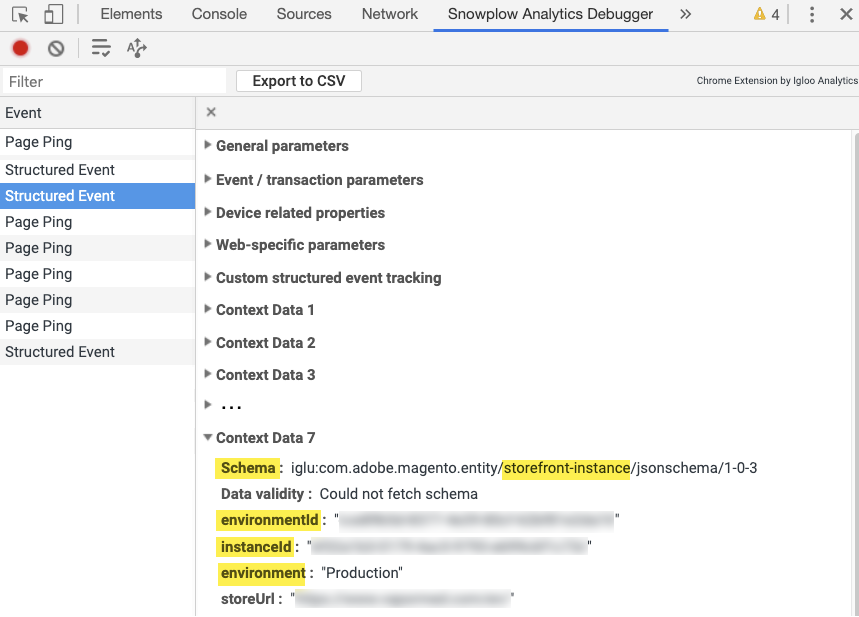

# Ereigniskollektion überprüfen

Nachdem Sie [das `magento/product-recommendations` -Modul installiert und konfiguriert haben, können Sie überprüfen, ob die Verhaltensdaten an Adobe Commerce gesendet werden. ](install-configure.md) Sie können in Chrome verfügbare Entwicklertools verwenden oder die Snowplow Chrome-Erweiterung installieren. Weitere Informationen finden Sie unter [Fehlerbehebung für [!DNL Product Recommendations] Modul](https://experienceleague.adobe.com/docs/commerce-knowledge-base/kb/troubleshooting/miscellaneous/troubleshoot-product-recommendations-module-in-magento-commerce.html) in der Support-Wissensdatenbank.

## Überprüfen mit Entwicklertools in Chrome

So stellen Sie sicher, dass die JS-Datei für den Ereignissammler auf allen Seiten der Website geladen wird:

1. Wählen Sie in Chrome **Google Chrome anpassen und steuern** und dann **Weitere Tools** > **Entwicklertools**.
1. Wählen Sie die Registerkarte **Netzwerk** und dann den Typ **JS** aus.
1. Filter nach `ds.`
1. Laden Sie die Seite neu.
1. Sie sollten `ds.js` oder `ds.min.js` in der Spalte **Name** sehen.

_Ereignis-Collector JS_

So stellen Sie sicher, dass Ereignisse auf Seiten Ihrer Site (Startseite, Produkt, Checkout usw.) ausgelöst werden:

1. Stellen Sie sicher, dass Sie alle Anzeigensperren in Ihrem Browser deaktivieren und Cookies auf der Site akzeptieren.
1. Wählen Sie in Chrome **Google Chrome anpassen und steuern** (die drei vertikalen Punkte oben rechts im Browser) und dann **Weitere Tools** > **Entwicklertools**.
1. Wählen Sie die Registerkarte **Netzwerk** aus und filtern Sie nach `tp2`.
1. Laden Sie die Seite neu.
1. Aufrufe unter `tp2` sollten in der Spalte **Name** angezeigt werden.

_Sicherstellen, dass Ereignisse ausgelöst werden_

## Überprüfen mit der Snowplow Chrome-Erweiterung

Installieren Sie die Erweiterung &quot;[Snowplow Analytics Debugger&quot;für Chrome](https://chrome.google.com/webstore/detail/snowplow-analytics-debugg/jbnlcgeengmijcghameodeaenefieedm). Diese Erweiterung zeigt die Ereignisse an, die erfasst und an Adobe Commerce gesendet werden.

1. Stellen Sie sicher, dass Sie alle Anzeigensperren in Ihrem Browser deaktivieren und Cookies auf der Site akzeptieren.

1. Wählen Sie in Chrome **Google Chrome anpassen und steuern** (die drei vertikalen Punkte oben rechts im Browser) und dann **Weitere Tools** > **Entwicklertools**.

1. Wählen Sie die Registerkarte **Snowplow Analytics Debugger** aus.

1. Wählen Sie unter der Spalte **Ereignis** die Option **Strukturiertes Ereignis** aus.

1. Scrollen Sie nach unten, bis **Kontextdaten _n_**angezeigt wird. Suchen Sie nach der Storefront-Instanz im **Schema**.

1. Stellen Sie sicher, dass die [SaaS-Datenraum-ID](https://experienceleague.adobe.com/docs/commerce-admin/config/services/saas.html) korrekt festgelegt ist.

_Snowplofilter_

>[!NOTE]
>
> Der Wert `Data validity : NOT FOUND` im Debugger zeigt ein internes Schema an. Das Snowplow Chrome-Plug-in kann die Ereignisse nicht mit einem internen Schema validieren. Dies hat keine Auswirkungen auf die tatsächliche Funktionalität.

## Sicherstellen, dass Ereignisse ordnungsgemäß ausgelöst werden

Um sicherzustellen, dass die für Metriken verwendeten Ereignisse ordnungsgemäß ausgelöst werden, suchen Sie im Snowploanalytics-Debugger nach den Ereignissen `impression-render`, `view` und `rec-click` . Siehe die vollständige Liste der Ereignisse [.](https://experienceleague.adobe.com/docs/commerce-merchant-services/product-recommendations/developer/events.html)

>[!NOTE]
>
> Wenn der [Cookie-Beschränkungsmodus](https://experienceleague.adobe.com/docs/commerce-admin/start/compliance/privacy/compliance-cookie-law.html) aktiviert ist, erfasst Adobe Commerce erst dann Verhaltensdaten, wenn der Käufer zustimmt. Wenn der Cookie-Beschränkungsmodus deaktiviert ist, werden standardmäßig Verhaltensdaten erfasst.
