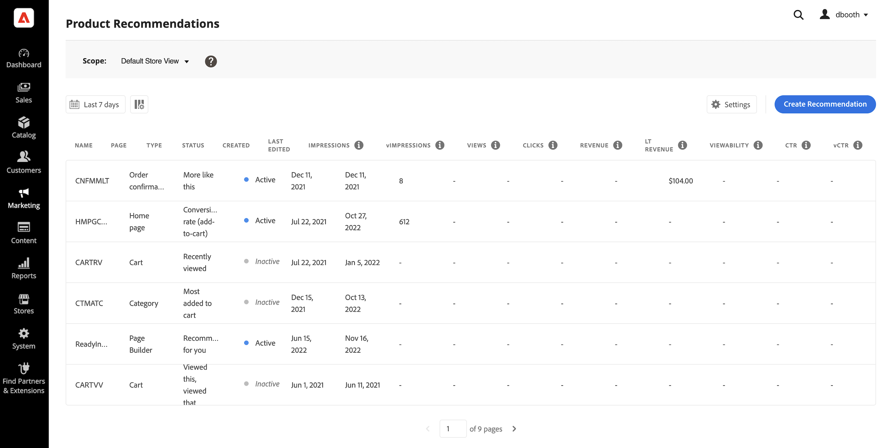

# [!DNL Product Recommendations] Workspace

Der Arbeitsbereich &quot;[!DNL Product Recommendations]&quot; zeigt eine Liste der zuvor konfigurierten Empfehlungen mit Metriken an, mit denen Sie den Erfolg jeder Empfehlung verfolgen können. Die Liste kann so konfiguriert werden, dass sie Metriken für den letzten Tag, die letzte Woche oder den letzten Monat berechnet. Sie können die Metriken verwenden, um praktische Einblicke darauf zu erhalten, wie häufig eine Empfehlungseinheit angezeigt oder angeklickt wird, oder um zu analysieren, wie gut Ihre Empfehlungen funktionieren.

>[!INFO]
>
>Eine Empfehlungseinheit ist ein Widget, das das empfohlene Produkt _items_ enthält.

_Recommendations Workspace_

## Festlegen des Umfangs

Zunächst ist der [Bereich](https://experienceleague.adobe.com/docs/commerce-admin/start/setup/websites-stores-views.html) aller Empfehlungseinstellungen auf `Default Store View` eingestellt. Wenn Ihre Commerce-Installation mehrere Store-Ansichten enthält, setzen Sie **Umfang** auf die [Store-Ansicht](https://experienceleague.adobe.com/docs/commerce-admin/start/setup/websites-stores-views.html#scope-settings), in der Ihre Empfehlungen gelten.

## Festlegen des Datumsbereichs von Metriken

1. Klicken Sie auf das Steuerelement **Kalender**  .

1. Wählen Sie eine der folgenden Optionen aus:

   - Letzte 24 Stunden
   - Letzte 7 Tage
   - Letzte 30 Tage

   Die berechneten Werte in den Metrikspalten ändern sich entsprechend dem aktuellen Datumsbereich.

   >[!NOTE]
   >
   >Die Metriken zur Produktempfehlung sind für Luma-Storefronts optimiert. Wenn Ihre Storefront nicht auf Luma basiert, hängt die Art und Weise, wie die Metriken Daten verfolgen, davon ab, wie Sie [die Ereigniskollektion implementieren](events.md).

## Spalten ein-/ausblenden

1. Klicken Sie oben links auf die Spalten **Anzeigen/Ausblenden**  .

   Die sichtbaren Spalten haben ein blaues Häkchen.

1. Führen Sie im Menü einen der folgenden Schritte aus:

   - Um eine ausgeblendete Spalte anzuzeigen, klicken Sie auf einen beliebigen Spaltennamen ohne Häkchen.
   - Um eine sichtbare Spalte auszublenden, klicken Sie auf einen beliebigen Spaltennamen mit einem Häkchen.

   Die Tabelle wird aktualisiert und enthält jetzt nur die ausgewählten Spalten.

   
   _Spalten ein-/ausblenden_

## Einstellungen

Die Einstellungen bestimmen den SaaS-Datenraum, der die Recommendations-Verhaltensdaten bereitstellt.

- Wählen Sie einen anderen SaaS-Datenraum aus, um zu ändern, woher Recommendations-Verhaltensdaten stammen.

- Um einen neuen SaaS-Datenraum zu konfigurieren, klicken Sie auf **Konfiguration bearbeiten** . Weitere Informationen finden Sie unter [Einstellungen](settings.md).

_Recommendations-Einstellungen_

## Details anzeigen

1. Klicken Sie in der Tabelle auf die Empfehlung, die Sie untersuchen möchten.

   
   _Details zur Konversionsrate der Homepage_

1. Um den Status der Empfehlung zu ändern, klicken Sie auf **Aktivieren** oder **Deaktivieren**.

## Empfehlung bearbeiten

Klicken Sie auf der Seite mit den Empfehlungsdetails auf **Bearbeiten**. Weitere Informationen finden Sie unter [Recommendations bearbeiten](edit.md).

## Empfehlung erstellen

Klicken Sie auf der Seite mit den Empfehlungsdetails auf **Erstellen**. Weitere Informationen finden Sie unter [Recommendations erstellen](create.md).

## Workspace-Steuerelemente

| Kontrolle | Beschreibung |
|---|---|
|  | Bestimmt den Zeitraum, der für Metrikberechnungen verwendet wird. Optionen: 24 Stunden / 7 Tage / 30 Tage |
|  | Bestimmt die Spalten, die in der Tabelle [!DNL Product Recommendations] angezeigt werden. |
| Einstellungen | Bestimmt den SaaS-Datenraum, aus dem Recommendations-Verhaltensdaten abgerufen werden, und ermöglicht auch den Empfehlungstyp für visuelle Ähnlichkeit. |
| Empfehlung erstellen | Öffnet die Seite [Neue Empfehlung erstellen](create.md) . |

## Spaltenbeschreibungen

| Spalte | Beschreibung |
|---|---|
| Name | Der Name der Empfehlung. |
| Seite | Die Seite, auf der die Empfehlung angezeigt wird. |
| Typ | Der Empfehlungstyp. |
| Status | Der Empfehlungsstatus. Optionen: inaktiv/aktiv/Entwurf |
| Erstellt | Das Datum der Erstellung der Empfehlung. |
| Zuletzt bearbeitet | Das Datum, an dem die Empfehlung zuletzt bearbeitet wurde. |
| Impressionen | Die Häufigkeit, mit der eine Empfehlungseinheit auf einer Seite geladen und gerendert wird. Eine Empfehlungseinheit, die sich unterhalb des Darstellungsbereichs des Browsers befindet, wird auf der Seite gerendert, auch wenn sie nicht vom Käufer angezeigt wird. In diesem Fall wird die gerenderte Einheit als Impression gezählt, eine Ansicht wird jedoch nur gezählt, wenn der Käufer die Einheit in die Ansicht scrollt. |
| vImpressions | (Sichtbare Impressionen) Die Anzahl der Empfehlungseinheiten, die mindestens eine Ansicht registrieren. Wenn die Empfehlungseinheit beispielsweise zwei Zeilen hat, von denen jede zwei Produkte enthält und die letzten beiden Produkte vom Käufer nicht gesehen werden, die ersten beiden jedoch, zählt die Aktivität weiterhin als Impression. |
| Ansichten | Die Anzahl der Empfehlungseinheiten, die im Viewport des Browsers des Kunden angezeigt werden. Wenn der Käufer die Seite mehrmals nach oben oder unten scrollt, wird das Ereignis mehrmals ausgelöst, sobald die Einheit sichtbar ist. |
| Klicks | Die Summe der Klicks eines Käufers auf einen Artikel in der Empfehlungseinheit und der Anzahl der Klicks des Käufers auf die Schaltfläche **Zum Warenkorb hinzufügen** in der Empfehlungseinheit |
| Umsatz | Der Umsatz, der durch die Empfehlung für den aktuellen Zeitraum bedingt ist. |
| LT Umsatz | (Lebensdauerumsatz) Der durch eine Empfehlung generierte Lebensdauerumsatz. |
| Sichtbarkeit | Der Prozentsatz der Empfehlungseinheiten, die sich für die Ansicht registrieren. |
| CTR | (Clickthrough-Rate) Der Prozentsatz der Einheitenimpressionen für die Empfehlung, die einen Klick registriert. CTR zählt alle Impressionen, auch wenn das Gerät nicht in die Ansicht des Käufers gelangt. Wird die Empfehlungseinheit nicht angezeigt, wird sie wahrscheinlich nicht angeklickt. Diese unsichtbaren Impressionen zählen jedoch zum CTR-Wert und reduzieren den gesamten CTR-Prozentsatz. |
| vCTR | (Sichtbare Clickthrough-Rate) misst Klicks nur auf Grundlage sichtbarer Impressionen (Empfehlungen, die tatsächlich im sichtbaren Teil des Bildschirms des Käufers angezeigt wurden) und liefert so eine genauere Messung der Kundeninteraktion. |
