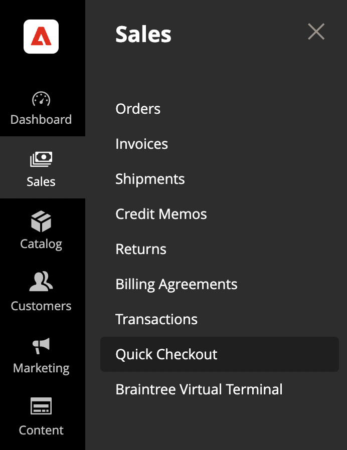

# Einführung in die [!DNL Quick Checkout] Admin-Bereich

[!DNL Quick Checkout] für Adobe Commerce und Magento Open Source bietet eine Admin-Bedienfeldansicht mit allen erforderlichen Informationen zum Einrichten und Verwenden der Erweiterung.

1. Im _Admin_ Seitenleiste, navigieren Sie zu **[!UICONTROL Sales]** > **[!UICONTROL Quick Checkout]**:

   

1. In dieser Ansicht können Sie auf die _Admin-Bereich_ Übersicht, _Ressourcen_ about [!DNL Quick Checkout], get _Hilfe und Support_ oder konfigurieren Sie die Erweiterung über _Einstellungen_.

   

Vergewissern Sie sich, dass dem Benutzer die richtigen Rollen und Berechtigungen zugewiesen wurden, damit er [!DNL Quick Checkout] Admin-Bereich, der angezeigt werden soll. Siehe [Benutzerrollen und -berechtigungen](../quick-checkout/user-roles-setup.md) für weitere Informationen.

Siehe Abschnitt [Onboarding](../quick-checkout/onboarding.md) Thema für weitere Informationen zur Konfiguration der [!DNL Quick Checkout] für Adobe Commerce.

## Startseite

| Feld | Beschreibung |
|---|---|
| [!UICONTROL Overview] | Auf der Registerkarte Übersicht werden alle Ressourcen für die Verwendung von [!DNL Quick Checkout]. |
| [!UICONTROL Reports] | Die Registerkarte Berichte zeigt eine umfassende [!DNL Quick Checkout] Informationen. |

## Hilfe und Support

| Feld | Beschreibung |
|---|---|
| [!UICONTROL Troubleshooting guide] | Das Adobe Commerce Help Center enthält [!DNL Quick Checkout] Artikel zur Fehlerbehebung. |
| [!UICONTROL Feedback] | Feedback für das Team geben. |

## Ressourcen

| Feld | Beschreibung |
|---|---|
| [!UICONTROL Open documentation] | Aktuelle Dokumente finden Sie unter [!DNL Quick Checkout]. |
| [!UICONTROL [!DNL Bolt] merchant dashboard] | Zugriff auf [!DNL Bolt] Händlerkonto und Dashboard. |
| [!UICONTROL Release notes] | Erfahren Sie mehr über die neuesten Änderungen für [!DNL Quick Checkout]. |

## Einstellungen

Klicken Sie in der Ansicht des Admin-Bedienfelds auf **[!UICONTROL Settings]** , um auf die [!DNL Quick Checkout] Konfiguration. Siehe [Admin-Konfiguration](onboarding.md#complete-admin-configuration) für weitere Informationen.