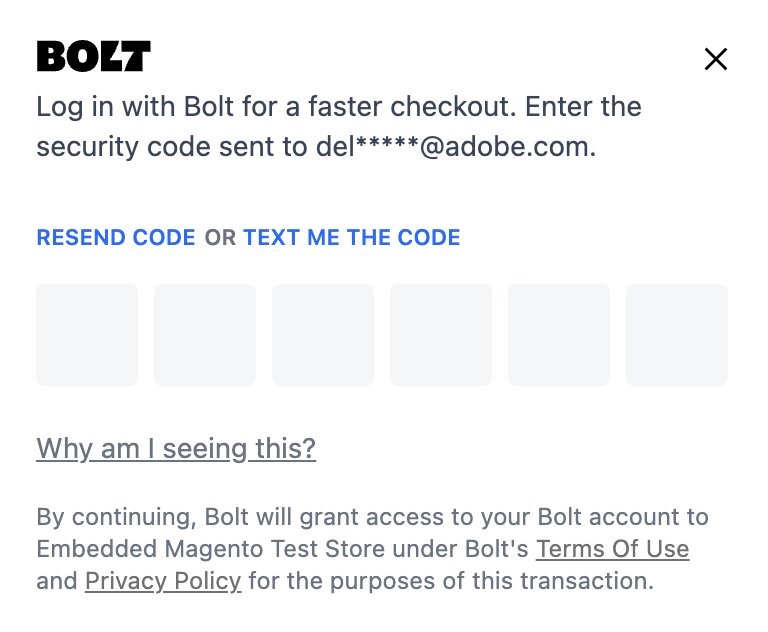

# Ein bestehender Adobe Commerce-Benutzer: Funktionsweise

Ein bestehender Adobe Commerce-Benutzer kann gespeicherte Versand- und Zahlungsdetails auswählen, wenn er eine Bestellung bei der [!DNL Quick Checkout] für ein schnelleres Auschecken.

Wenn ein Käufer seine E-Mail-Adresse beim Checkout eingibt, wird die [!DNL Quick Checkout] validiert es und findet ein vorhandenes [!DNL Bolt] -Konto.

## Registrierter Benutzer in Adobe Commerce und [!DNL Bolt]

Wenn ein Käufer ein registrierter Benutzer in Adobe Commerce und [!DNL Bolt] Netzen, werden beide Netze mit gespeicherten Versand- und Zahlungsdetails bereitgestellt.

Wenn eine [!DNL Bolt] -Konto beim Checkout gefunden werden, können Käufer ihre [!DNL Quick Checkout] nahtloses Auschecken:

1. Geben Sie das einmalige Kennwort (OTP) ein, das an dieses gesendet wird. [!DNL Bolt] E-Mail-Adresse des Kontos oder Mobilgerät, je nach [Benutzereinstellungen in der [!DNL Bolt] account](https://help.bolt.com/shoppers/account/account-settings/#how-to-set-preferred-login-method){target=_blank}.

1. Nach der Anmeldung bei Ihrem [!DNL Bolt] -Konto hinzugefügt werden, werden die Details automatisch hinzugefügt:

   - Versandinformationen
   - Zahlungsmethode

1. Bestellung aufgeben.

>[!NOTE]
>
> Das Popup &quot;Bolt OTP&quot;wird nur angezeigt, wenn sich der Käufer auf der Checkout-Seite befindet. Der Käufer kann sich von der Anmeldung bei Bolt abmelden, indem er dieses Popup-Fenster schließt.

Wenn der Käufer vor dem Checkout bei Adobe Commerce angemeldet ist, wird die [!DNL Bolt] Das OTP-Popup wird beim Checkout nicht angezeigt, aber es erscheint eine Meldung, die den Käufer anweist, sich anzumelden, um auf seine &quot;Bolt Wallet&quot; zuzugreifen.

Wenn Sie Probleme haben, wenn Sie eine Bestellung als bestehenden Adobe Commerce-Benutzer aufgeben, lesen Sie den Abschnitt [Fehlerbehebung bei Problemen mit dem Schnellcheckout](https://experienceleague.adobe.com/docs/commerce-knowledge-base/kb/troubleshooting/miscellaneous/quick-checkout-issues.html) Artikel im Adobe Commerce Help Center.

## Automatische Anmeldung

Die Komponente &quot;Automatische Anmeldung&quot;erkennt, wenn ein Käufer über eine aktive Bolt-Sitzung verfügt, und protokolliert den Käufer automatisch. Dadurch werden die Schritte zur Kontoerkennung und zum einmaligen Kenncode (OTP) übersprungen, da der Käufer sie in einer vorherigen Sitzung abgeschlossen hat.

Es ist möglich, eine automatische Anmeldung für [!DNL Quick Checkout] Benutzer. Sie können eine Konfiguration aktivieren, um einen Benutzer während des Checkout automatisch anzumelden.

1. Im _Admin_ Seitenleiste, navigieren Sie zu **Stores** > **Konfiguration** > **Checkout** , um auf die allgemeine Checkout Admin-Konfigurationsseite zuzugreifen.
1. Im _Diensteinstellungen_ Abschnitt für [!DNL Quick Checkout], geben Sie alle Details an, die für die Einrichtung der automatischen Anmeldung erforderlich sind.

Siehe [[!DNL Quick Checkout] Diensteinstellungen konfigurieren](../quick-checkout/onboarding.md#configure-service-settings) für weitere Informationen.

>[!NOTE]
>
> Erstmalige Anmeldung bei **automatische Anmeldung** aktiviert ist, erfordert die Zustimmung des Benutzers zur Autorisierung durch Akzeptieren eines Popup-Fensters.

## Neu [!DNL Bolt] account

Wenn nicht [!DNL Bolt] -Konto gefunden wird, haben die Käufer weiterhin den standardmäßigen Adobe Commerce-Checkout und der Käufer wählt alle erforderlichen Details aus den gespeicherten Informationen aus, um die Bestellung aufzugeben:

- Versand- und Rechnungsinformationen
- Versandmethode
- Überprüfungszahlmethode
- Die Option zur Registrierung in [!DNL Bolt] für schnellere Checkouts, bevor die Bestellung erscheint. Der Käufer kann den Geschäftsbedingungen zustimmen, um seine [!DNL Bolt] -Konto.

  ![Angaben [!DNL Bolt]](assets/checkbox-remember-bolt.png)
