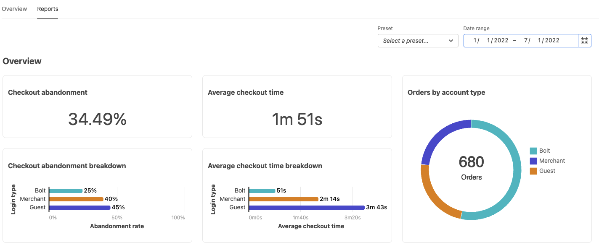

# Berichte

[!DNL Quick Checkout] für Adobe Commerce und Magento Open Source bietet Ihnen umfassende Berichte, sodass Sie detaillierte Informationen zu den Erlebnisstatistiken Ihres Stores erhalten können.

>[!WARNING]
>
> Sie müssen [**Checkout-Tracking**](../quick-checkout/settings-quick-checkout.md) in Ihrem Admin-Bedienfeld, damit Adobe Commerce Checkout-Informationen für Bolt freigeben kann. Standardmäßig ist diese Konfigurationsoption auf **Ja**. Wenn diese Option deaktiviert ist (setzen Sie auf **Nein**), wirkt sich dies auf die Berichterstellung aus.

## Übersichtsberichte

Die Diagramme im Abschnitt Übersicht zeigen detaillierte Informationen zur Checkout-Leistung Ihres Stores, einschließlich der durchschnittlichen Checkout-Zeit, neuer Konten, die beim Checkout oder beim Checkout erstellt wurden.

| Diagramm | Beschreibung |
|---|---|
| [!UICONTROL Checkout abandonment] | Der Prozentsatz der Besucher, die den Checkout-Prozess beenden, ohne einen Kauf abzuschließen. |
| [!UICONTROL Checkout abandonment breakdown] | Der Abbruch des Checkout dividiert durch den Typ des Besuchers. Optionen: [!UICONTROL Bolt] / [!UICONTROL Merchant] / [!UICONTROL Guest] |
| [!UICONTROL Average checkout time] | Die durchschnittliche Zeit, die ein Besucher benötigt, um den Checkout-Prozess abzuschließen. |
| [!UICONTROL Average checkout time breakdown] | Durchschnittliche Checkout-Zeit dividiert durch den Besuchertyp. Optionen: [!UICONTROL Bolt] / [!UICONTROL Merchant] / [!UICONTROL Guest] |
| [!UICONTROL Orders by account type] | Bestellungen dividiert durch den Besuchertyp. Optionen: [!UICONTROL Bolt] / [!UICONTROL Merchant] / [!UICONTROL Guest] |

## Trendberichte

Die Diagramme im Abschnitt Trends zeigen die Trends Ihres Checkout-Erlebnisses, die nach Kontotyp gefiltert wurden, oder neue Konten, die beim Checkout erstellt wurden.

| Diagramm | Beschreibung |
|---|---|
| [!UICONTROL Checkout abandonment by account type] | Der Trend zum Abbruch des Checkout dividiert durch den Typ des Besuchers. Optionen: [!UICONTROL Bolt] / [!UICONTROL Merchant] / [!UICONTROL Guest] |
| [!UICONTROL Orders by account type] | Platzierte Trends dividiert durch den Besuchertyp. Optionen: [!UICONTROL Bolt] / [!UICONTROL Merchant] / [!UICONTROL Guest] |
| [!UICONTROL New accounts on your store] | Neue Konten zu Ihrem Store-Trend. |

## Daten filtern

Sie können die angezeigten Ergebnisse nach Datum oder vorhandenen Vorgaben filtern, z. B. **Letzte 30 Tage**.

| Feld | Beschreibung |
|---|---|
| [!UICONTROL Preset] | Ein Dropdown-Menü mit Standardvorgaben, die zur Anzeige bestimmter Datenbereiche verwendet werden können. Standardmäßig: Letzte 30 Tage |
| [!UICONTROL Date range] | Ein Dropdown-Menü, in dem Sie je nach ausgewähltem Datum einen bestimmten Datenbereich auswählen können. |

