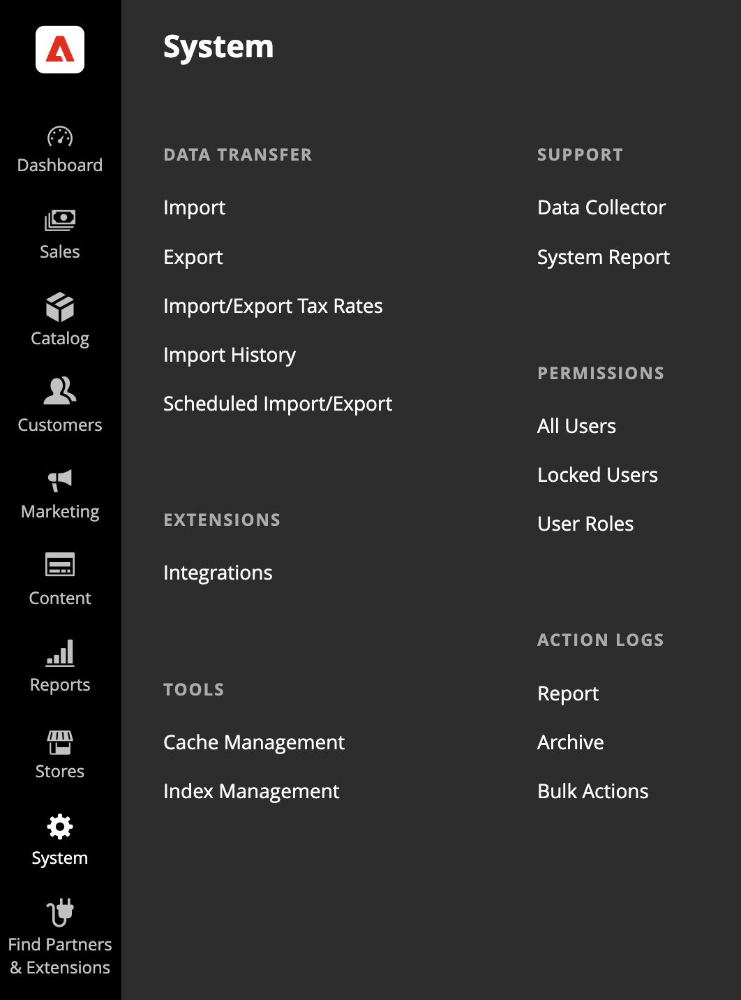

# [!DNL Quick Checkout] Benutzereinrichtung

[!DNL Quick Checkout] bietet einen Admin-Bereich mit allen erforderlichen Informationen, um mit dem Onboarding zu beginnen, die Erweiterung zu verwenden oder Ressourcen wie den Zugriff auf Dokumente einzuschließen; [!DNL Bolt] Händler-Dashboard oder Versionshinweise.

So greifen Sie auf die [!DNL Quick Checkout] Admin-Bereich:

1. Im _Admin_ Seitenleiste, navigieren Sie zu **[!UICONTROL Sales]** > **[!UICONTROL Quick Checkout]**.

   

Siehe Abschnitt [Onboarding](../quick-checkout/onboarding.md) Thema für weitere Informationen zur Konfiguration der [!DNL Quick Checkout] für Adobe Commerce.

So gewähren Sie dem Benutzer Zugriff und Sichtbarkeit auf die [!DNL Quick Checkout] Im Admin-Bereich müssen Sie überprüfen, ob dem Benutzer die entsprechenden Rollenressourcen zugewiesen wurden:

1. Im _Admin_ Seitenleiste, navigieren Sie zu **[!UICONTROL System]** > Berechtigungen > **[!UICONTROL User Roles]**.

   

1. Im _Rollen_ Ansicht, klicken Sie auf **Neue Rolle hinzufügen**
1. Wählen Sie die [!DNL Quick Checkout] Ressourcen:

   

1. Klicken **Speicherrolle**.

Siehe Abschnitt [Benutzerrollen](https://docs.magento.com/user-guide/system/permissions-user-roles.html) Seite finden Sie weitere Informationen zum Definieren einer Rolle oder zum Zuweisen einer Rolle zu einem Benutzer.
